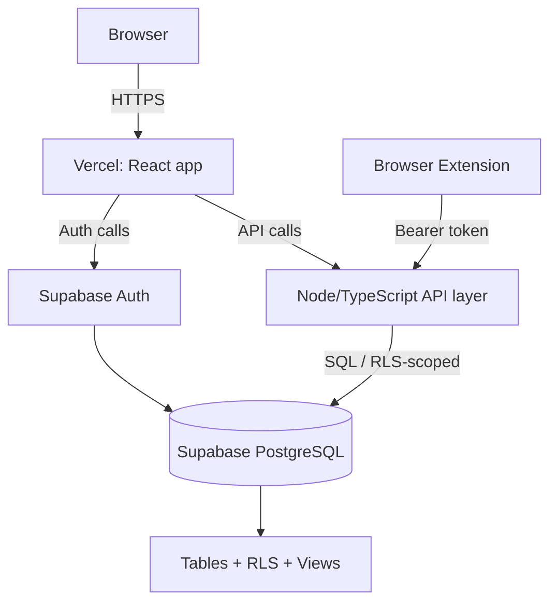

# CI/CD and Deployment

CURRENT STATE, from `.github/workflows/ci.yml` and `render.yaml` directly.

## Current CI (GitHub Actions, `.github/workflows/ci.yml`)

Triggers: `push` to `feature/upgrade-lovable-ui-reference`/`development`/`main`/
`master`; `pull_request` targeting `development`/`main`/`master`; manual
`workflow_dispatch`. Concurrency group cancels in-progress runs of the same
workflow+ref/PR.

5 parallel jobs, all on `ubuntu-latest`, Node 24:

| Job | Timeout | What it does |
|---|---|---|
| `static-quality` | 10m | `npm ci` → `migrate:check` (fresh-DB migration validation) → `lint` → `typecheck` → `build` → `build:frontend` (Vite) |
| `tests` (matrix: backend/frontend/integration/e2e/extension) | 10m each | Real `postgres:17-alpine` service container (except frontend/extension suites, which need no DB) → `migrate:postgres` → `npm run test:${suite}` |
| `security` | 10m | `npm audit --audit-level=high` (backend + frontend) → grep gate rejecting committed `.sqlite*`/`.env*` files and raw secret-shaped key/value assignments |
| `sqlite-postgres-migration` | 10m | Dedicated Postgres container → `migrate:postgres` → `node --test test/migration.test.js` |
| `browser-and-visual` | 20m | Dedicated Postgres container → `migrate:postgres` → `npx playwright install --with-deps chromium` → `npm run test:browser` (full functional/a11y/responsive/visual suite) → uploads `playwright-report`/`test-results` as artifacts on failure |

Note: `lint`/`typecheck`/`build` are all `node --check` syntax validation across
every backend/frontend/extension source file (the project is plain JavaScript, not
TypeScript — there is no real type-checker in this pipeline today, just parse
validation).

## Current deployment (Render, `render.yaml`)

```
Developer → feature/<round>-<slug> branch (off development)
    → Pull Request → GitHub Actions (5 jobs above)
    → PR approval → merge into development (regular merge commit, not squash)
    → [explicit, separate approval] → merge development into main
    → Render auto-deploys main:
        buildCommand: npm ci && npm run build:frontend
        preDeployCommand: npm run migrate:postgres   (runs before traffic switches)
        startCommand: npm start
        healthCheckPath: /api/health                  (fast, DB-independent)
```

Plus a **second migration path** added as a production hotfix: `server.js` also
runs `migratePostgres()` at process startup (not just `preDeployCommand`), because
one deploy did not reliably invoke `preDeployCommand` and left the database on an
older schema version (`extension_tokens` missing in production — see
`brain/AGENT_HANDOFF_LOG.md` "PRODUCTION HOTFIX"). Both mechanisms are active
simultaneously today; a target platform without an equivalent `preDeployCommand`
hook (most serverless/edge platforms) would need the startup-migration path to be
the *primary* mechanism, not a backup — factor this into `docs/IMPLEMENTATION_PLAN.md`.

Migration safety already enforced by `postgres-migrate.js`: refuses to run against
a database whose name doesn't end in `_test` unless
`NODE_ENV=production`/`RENDER` is set, or an explicit
`CONFIRM_PRODUCTION_MIGRATION=yes-migrate-jobquest` override is provided.

## Target CI/CD (GitHub Actions + Vercel + Supabase migrations)

```
Developer
    ↓
Feature Branch
    ↓
Pull Request
    ↓
GitHub Actions
    ├── install
    ├── lint (real TypeScript/ESLint, not just node --check)
    ├── typecheck (real tsc, since the target stack is TypeScript)
    ├── unit tests
    ├── integration tests (against an ephemeral/branched Supabase instance)
    ├── frontend build (Vite/Next, whichever the TRD selects)
    ├── backend build
    ├── Supabase migration validation (apply to a clean/branch DB, verify no drift)
    └── Playwright smoke (+ a11y + visual regression, carried forward)
    ↓
PR Approval
    ↓
development (or the target repo's equivalent integration branch — see `docs/PRD.md` §Out of Scope on branch-naming decisions)
    ↓
Preview deployment (Vercel preview URL per PR — genuinely new capability vs. today, since today has no preview environment at all)
    ↓
main
    ↓
Vercel production deployment (frontend) + Supabase migration apply (backend/DB, via `supabase db push` or an equivalent CI step — explicit, gated, never automatic-on-every-push without a review step)
```

Every principle from the current pipeline should carry forward: migrations are
schema-versioned and CI-validated before merge; no manual production schema
changes; security audit gate (dependency + secret scan) on every PR; the full
existing Playwright accessibility/visual-regression suite is a **preservation
requirement**, not optional — it is what proves feature parity during the
migration (see `TESTING_STRATEGY.md`).

## Target deployment architecture



Whether the Node/TypeScript API layer is a separate deployable (e.g. Vercel
Serverless/Edge Functions colocated with the frontend, or Supabase Edge
Functions) or the frontend talks to Supabase directly for most CRUD (with RLS as
the sole authorization layer) and only routes through a thin API for
manager-cross-user RPCs and the extension's bearer-token endpoints, is a real
architectural decision — see `docs/TRD.md` §Target Architecture and
`OPEN_QUESTIONS.md`.

## Supabase migration policy (target)

- Schema changes only through versioned Supabase migrations (`supabase/
  migrations/*.sql` or the CLI-generated equivalent) — never a manual dashboard
  schema edit in any environment past local dev.
- CI validates every migration applies cleanly to a fresh database before merge
  (direct equivalent of today's `migrate:check` job).
- Migrations are forward-only/additive by the same policy already in force today
  (see `docs/BACKEND_SCHEMA.md` §Migration history) — carry the policy forward
  verbatim, don't relax it just because the tooling changed.
