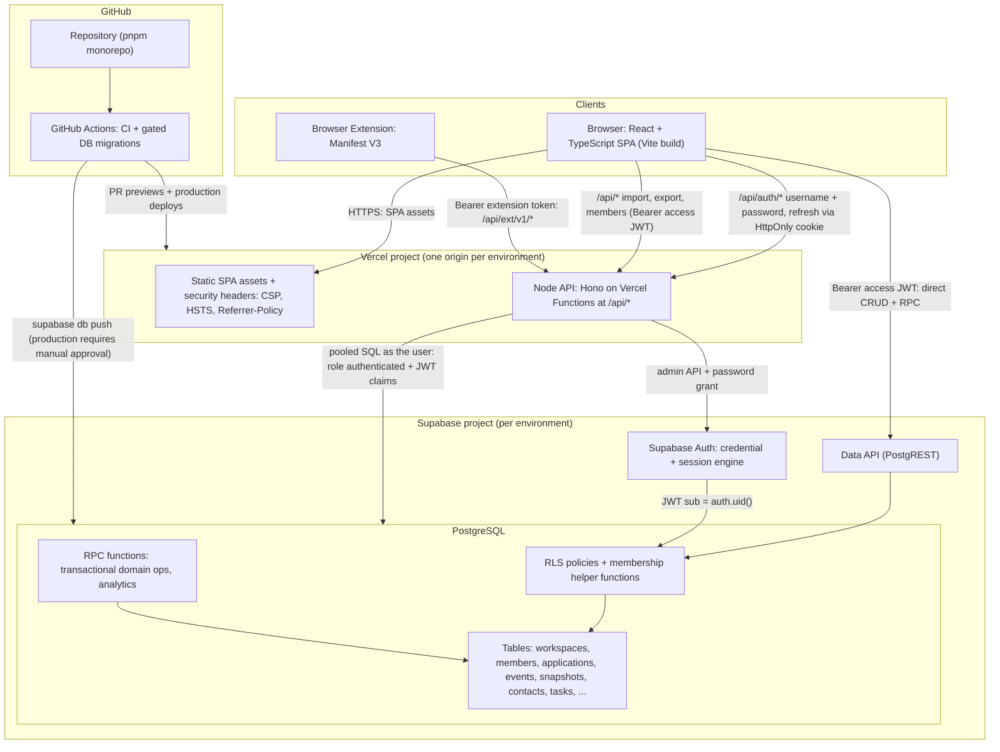
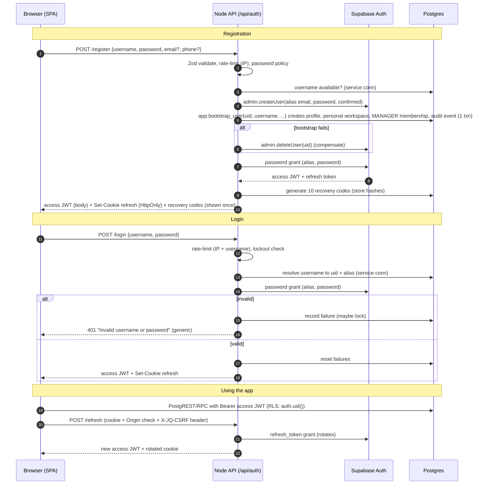
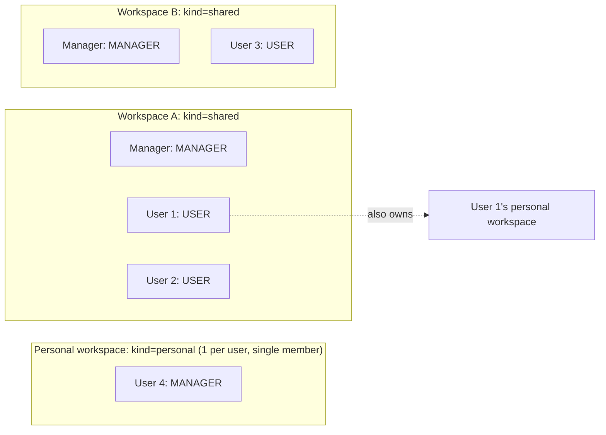
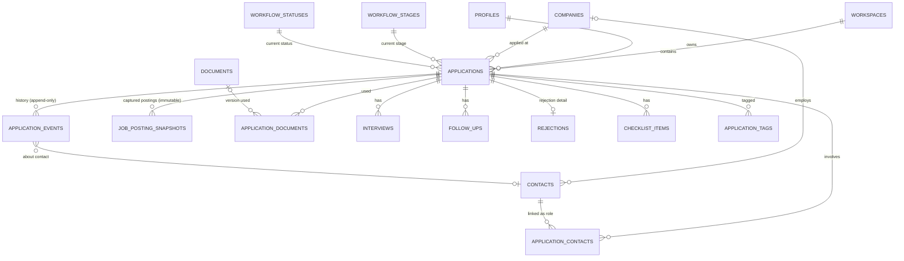
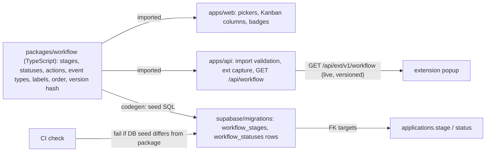
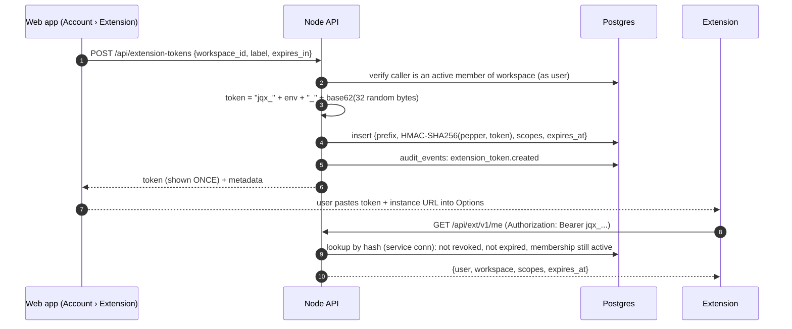
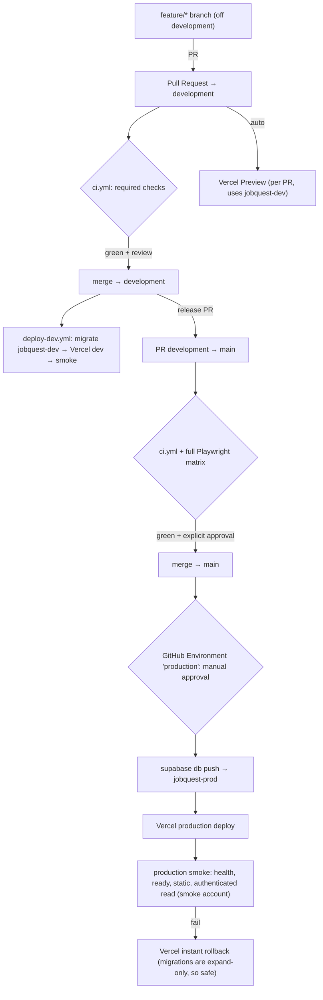

# JOBQUEST 2.0 — GATE 01 ARCHITECTURE PROPOSAL

| | |
|---|---|
| **Status** | **PROPOSED**. Awaiting user review. Nothing in this document is approved. |
| **Gate** | Gate 01: Architecture Planning (planning only; no code, no infrastructure) |
| **Date** | 2026-09-23 |
| **Inputs** | The Gate 01 prompt (highest authority), the whole `migration-upgrade/` package, and targeted read-only checks of `../JobQuest1.0/` |
| **Next gate** | Gate 02, UI/UX Design + Mockups. It starts only after Gate 01 is explicitly approved. |

Every decision below is **PROPOSED**. Where this document conflicts with older
package docs (for example `docs/TRD.md` §3–5 or `docs/IMPLEMENTATION_PLAN.md`),
this document is the newer proposal. The older text stays as the historical baseline.

---

## 0. Verification findings from this gate (read first)

Gate 01 checked several package claims against JobQuest1.0 source. These
findings change the plan:

| # | Finding | Evidence | Impact |
|---|---|---|---|
| F-1 | **The legacy schema has 33 tables, not 23.** The package's "23 tables" count is wrong. `BACKEND_SCHEMA.md` itself documents all 33. | `grep "CREATE TABLE"` over `backend/jobsearch/migrations/*.sql` → 33 unique names | §10 maps all 33. |
| F-2 | **Analytics counts current stage, not "ever reached".** Source/resume analytics and dashboard KPIs use `stage IN ('Interview','Final Interview','Offer','Accepted')` on the *current* row. An application that goes Interview → Rejected stops counting as "interviewed". `FEATURE_CATALOG.md` wrongly says "ever reached". | `advanced.js:1368`, `advanced.js:1383`, `advanced.js:879`, `service.js:763` | This is a legacy analytics flaw, and a decision is required (D-15). |
| F-3 | **Legacy `stage` mixes pipeline position with outcome.** Five of the 13 values (`Rejected`, `Withdrawn`, `Ghosted`, `Position Closed`, `Accepted`) are outcomes. The code already treats them as a separate class (`CLOSED_STAGES`). | `feature-upgrade.js:5-11`, `app.js:1171` (`CONSEQUENTIAL_STAGES`) | This is the root cause of F-2. The Stage ≠ Status split (§9) fixes it by design. |
| F-4 | **OQ-009 is resolved.** `ui-upgrade` has one commit not in `main` (`29624a6`). It only adds agent tooling (`AGENTS.md`, `CLAUDE.md`, `.claude/skills/*`) and no product code. | `git log ui-upgrade --not main` | `main` is the complete feature baseline. |
| F-5 | The extension's `workflow_actions` are just the 13 stages with label = value. No separate action vocabulary exists. | `extension.js:170-187` | The canonical Action vocabulary (§9) is new design, not a port. |
| F-6 | No CORS headers exist anywhere. The extension works because MV3 `host_permissions: ["<all_urls>"]` exempts it from CORS. | `grep -i access-control backend/src/*.js` → none | This carries over. The web app stays same-origin with `/api`. |
| F-7 | Dashboard KPIs include archived applications (no `archived_at` filter). The applications list excludes them by default. | `service.js:763` vs `service.js:554-555` | Preserve as parity and document it. See D-14. |
| F-8 | The manifest requests `tabs` in addition to `activeTab`. `chrome.tabs.create` does not need `tabs`. | `extension/manifest.json:23-27` | Least-privilege check in the extension milestone. |

---

## 1. EXECUTIVE ARCHITECTURE SUMMARY

**Recommendation: a hybrid, same-origin architecture on one Vercel project and one
Supabase project per environment, organized as a pnpm TypeScript monorepo.**

- **Frontend.** A React 19 + TypeScript + Vite single-page app (no SSR; the app is
  authenticated and has no SEO needs). It uses TanStack Router (typed URL state for
  the heavy filter/sort/deep-link needs), TanStack Query (server state and
  optimistic updates), React Hook Form + Zod, Tailwind CSS v4 over semantic CSS
  variables, shadcn/ui (Radix primitives), and Lucide. There is no global client
  store.
- **Node API.** A thin Hono app deployed as Vercel Functions under `/api/*` on the
  same origin as the SPA. It owns only what must be server-side:
  username/password authentication, extension-token endpoints, import/export,
  workspace membership operations, and any operation needing secrets.
- **Supabase.** PostgreSQL is the system of record. **RLS keyed on workspace
  membership plus record ownership is the primary authorization layer** for every
  access path. Simple CRUD goes **direct from the browser through the Supabase
  Data API**. Multi-table domain operations (stage/status changes, application
  creation, event emission, analytics) are **transactional Postgres functions
  (RPC)**. The web app (direct RPC) and the Node API (for the extension and
  imports) call the **same** functions.
- **Authentication.** Username + password is first-class. Supabase Auth is the
  credential and session engine. The browser never sees the internal identity:
  users sign in through a Node auth façade that maps
  `username → internal Supabase identity`, and stores the refresh token in an
  HttpOnly cookie. Email and phone stay optional profile data. Recovery works
  without either through single-use recovery codes. PIN auth is retired. Legacy
  users reclaim their accounts with operator-issued claim codes and set a new
  password.
- **Workspaces.** Workspaces exist from day one. Every business row carries
  `workspace_id` + `owner_id`. Registration creates a personal workspace with the
  user as `MANAGER`. Because manager access is now **workspace-scoped** (a
  Gate 01 requirement), it is directly expressible in RLS. OQ-003's hardest
  problem disappears.
- **Application domain.** Current state (stage, status, next action, priority,
  last activity) sits on `applications`. An append-only `application_events`
  table holds the full lifecycle history, replacing three overlapping legacy
  tables. An immutable `job_posting_snapshots` table preserves the posting as
  captured.
- **Workflow.** A single `@jobquest/workflow` package defines stages, statuses,
  actions and event types. It is seeded into reference tables by migration
  (checked in CI), served by `GET /api/workflow`, and fetched live by the
  extension.
- **Extension.** Incremental migration. Keep the proven extractors and fixtures.
  Replace the API client, auth and workflow integration with a versioned
  `/api/ext/v1` using scoped, expiring, hashed, workspace-bound tokens.
- **Delivery.** GitHub Actions runs format, lint, typecheck, unit, DB/RLS (pgTAP),
  API integration, build, Playwright + axe, and security checks. Every PR gets a
  Vercel preview. Supabase migrations are forward-only, and production applies
  are gated behind manual approval.
- **Migration.** The ETL runs from a *copy* of the legacy database into staging.
  It is idempotent by `legacy_id` and verified against parity checks per domain.
  The ETL is built **incrementally inside each domain milestone** against a
  synthetic legacy fixture database, so no real data is needed until the
  Gate 6-equivalent approval.

Guiding principles: parity by default; intentional changes only through
`CHANGE_REQUESTS.md`; one implementation of every business rule; the database as
the last line of defence (constraints + RLS), since some writes skip the Node
layer; no speculative infrastructure (no Redis, no microservices, no global
client store).

---

## 2. ARCHITECTURE DIAGRAM



**Trust boundaries**
1. Browser ↔ Vercel/Supabase: every request is authenticated by a Supabase access
   JWT or an extension token. Hiding things in the frontend is never treated as
   security.
2. Node API ↔ Postgres: by default, Node runs SQL **as the calling user**
   (`SET LOCAL ROLE authenticated` + `request.jwt.claims`), so RLS still applies.
   A short, named list of *privileged operations* (§6.6) uses the service
   connection.
3. Postgres: RLS + CHECK constraints + composite foreign keys + triggers are the
   final guard for every write path, including direct browser writes that never
   touch Node.

---

## 3. FRONTEND DECISIONS

| Technology | Purpose | Alternatives | Recommendation | Reason | Approval needed? |
|---|---|---|---|---|---|
| **React 19 + TypeScript (strict)** | UI framework + type safety | Vue, Svelte, Solid | **Adopt** | Target stack. Largest ecosystem for accessible primitives. TypeScript is required for shared contracts. | Yes (D-04) |
| **Vite (SPA)** | Build/dev server | Next.js, Remix/React Router framework mode | **Adopt Vite SPA** | No SEO or SSR need (authenticated app). Same-origin `/api` is easy on Vercel. Avoids server components complicating the direct-Supabase access pattern. Legacy already uses Vite. | Yes (D-04) |
| **TanStack Router** | URL routing, typed search params, route-level data loading | React Router v7 | **Adopt (moderate preference)** | Applications has heavy URL state (view, quick filters, column filters, sort, page, saved view, preview). Typed, validated search params (with Zod) remove a class of bugs. Integrates with TanStack Query loaders. React Router v7 is an acceptable, more familiar fallback. | Yes (D-04) |
| **TanStack Query** | Server-state cache, invalidation, optimistic updates with rollback | SWR, RTK Query, hand-rolled | **Adopt** | Legacy relies on optimistic toggle + rollback + toast (checklist, tasks, habits). TanStack Query models this directly. Replaces most "global state". | Yes (D-04) |
| **React Hook Form** | Form state for ~20 multi-fieldset forms | Formik, TanStack Form, native | **Adopt** | Uncontrolled inputs, good performance on large forms, first-class Zod resolver, accessible error wiring (`aria-describedby`). | Yes (D-04) |
| **Zod (v4)** | Runtime validation + inferred types shared by web, Node, import, extension contracts | Valibot, ArkType, Yup | **Adopt** | One schema package (`@jobquest/contracts`) validates forms, API bodies and import rows. Valibot is smaller but Zod's ecosystem (RHF, Hono validator, TanStack Router search params) is decisive. | Yes (D-04) |
| **Tailwind CSS v4** | Styling on semantic design tokens | CSS Modules, vanilla-extract, Panda | **Adopt** | `@theme` maps utilities to CSS variables, so light/dark is a variable swap, not per-component logic. Compiled static CSS keeps a strict `style-src 'self'` CSP possible. | Yes (D-04) |
| **shadcn/ui (Radix primitives)** | Accessible Dialog, Drawer/Sheet, Tabs, Dropdown, Popover, Select, Tooltip, Toast | React Aria Components, Headless UI, Ark UI | **Adopt** | Owned source (no black-box upgrades), token-driven, WCAG-conformant primitives. Real Tabs close CR-003 by construction. React Aria is the strongest alternative (better date pickers/grids); choose it if Gate 02 favours those patterns. | Yes (D-04) |
| **Lucide (`lucide-react`)** | Icons | Heroicons, Phosphor | **Adopt** | Legacy already self-hosts Lucide icons, so this keeps visual continuity. Tree-shaken. | No (continuity) |
| **TanStack Table** | Headless table: 14 columns, sort, visibility, density, selection | AG Grid, custom | **Adopt** | Headless, so the accessibility patterns (`aria-sort`, focusable wrapper) are ours to keep. | No (implementation detail) |
| **dnd-kit** | Kanban and dashboard-layout drag + **keyboard sensors** | react-beautiful-dnd (deprecated), pragmatic-drag-and-drop | **Adopt** | Keyboard dragging supports WCAG 2.2 SC 2.5.7. Explicit "Move to…" buttons are kept as well (legacy parity). | No |
| **Charts: port legacy SVG primitives as React components** | `hBar`, `vBars`, `areaLineChart`, `radialProgress` | Recharts, visx, Chart.js | **Port, no chart library** | Zero dependencies, CSP-friendly, already audited for accessibility. Revisit only if Gate 02 designs need what they can't do. | Yes (D-26, UI gate) |
| **date-fns v4 + `@date-fns/tz`** | Date math, timezone, week-start | Day.js, Luxon, Temporal | **Adopt** | One shared date module in `@jobquest/domain` fixes the legacy `week_start` inconsistency (BL-013). | No |
| **Toasts** | Transient feedback (`role=status`) | Sonner, Radix Toast | **shadcn toast (Radix) or Sonner, whichever passes the CSP check** | Some toast libraries inject `<style>` tags at runtime, which a strict CSP blocks. Verify in M2. | No |
| **Global client store (Redux/Zustand)** | — | — | **Do not adopt** | Server state → TanStack Query. URL state → router. Session, active workspace, theme → three small React contexts. Complex local UI (dashboard layout editor, Kanban) → local reducers. Add Zustand only if a real cross-tree client state appears. | Yes (D-04) |
| **Vitest + React Testing Library + MSW** | Unit/component tests | Jest | **Adopt** | Vite-native and fast. MSW mocks Node API/PostgREST at the network boundary. | No |
| **Playwright + @axe-core/playwright** | E2E, accessibility, visual | Cypress | **Keep (legacy)** | Legacy parity gate (ADR-005). Keep the 5-viewport matrix. | No |

---

## 4. BACKEND DECISION

### 4.1 Comparison

| Criterion | Node-only API (all data through Node) | Direct-Supabase-heavy (thin/no Node) | **Hybrid Node + Supabase (recommended)** |
|---|---|---|---|
| Username/password auth | Full control | **Hard.** Supabase Auth is email/phone-first, and a username façade still needs a server | Node façade over Supabase Auth |
| Extension token endpoints | Natural | Would need Edge Functions (Deno), a second runtime | Node, same codebase |
| Import/export (exceljs, parsing, `safeCell`) | Natural | Edge Functions, or client-side export (a formula-injection risk surface) | Node |
| Simple CRUD (tasks, habits, notes, reminders, prefs) | Many hand-written endpoints (~40) | Free via PostgREST + RLS | Direct via PostgREST + RLS |
| Transactional domain ops (stage change + events + rejection + audit) | Node transactions | RPC functions | **RPC functions, shared by web and Node** |
| Authorization layers | App code (RLS optional) | RLS only | **RLS everywhere + Node checks for privileged ops** |
| Realtime (CR-006, deferred) | Hard (no Supabase JWT in browser) | Easy | Easy (browser holds a Supabase JWT) |
| Surface to maintain | Largest | Smallest, but logic scattered across SQL and edge | Medium, with clear rules |
| Cold starts / connections | Every call pays a function cold start | Minimal | Only Node-owned paths pay it |

**Recommendation: the hybrid.** Its boundary rule is simple enough to apply mechanically.

### 4.2 The boundary rule

> **1. Direct Supabase (PostgREST + RLS).** A single-table read or write whose only
> invariants are ownership, shape, and constraints Postgres can enforce.
>
> **2. Database RPC (Postgres function).** Any operation that must change **more
> than one row or table atomically**, **emits application history**, or
> **computes aggregates** (analytics, dashboard, calendar, nav counts,
> streaks). By default these run with `SECURITY INVOKER`, so RLS applies.
>
> **3. Node API.** Anything that needs **a secret** (service key, token pepper),
> **a non-browser caller** (extension), **heavy parsing or file generation**
> (import, CSV/XLSX/JSON), **credential handling** (register, login, password,
> recovery, claim), **abuse controls** (rate limits, lockout), or
> **cross-user privileged actions** (member management, invitation codes).
> Node calls the same RPCs as the web app so that no business rule has two
> implementations.

### 4.3 Where each layer lives

- **Direct:** tasks, habits and habit-log upserts, notes, reminders and custom
  categories, tags, saved views, UI preferences, dashboard layout, checklist
  add/edit/toggle/delete, contacts CRUD, documents (resume) metadata CRUD, goal
  settings, and all detail reads (PostgREST embedded selects for the Application
  Detail bundle).
- **RPC:** `create_application`, `update_application`, `apply_workflow_action`
  (stage/status/outcome changes), `archive_application` / `restore_application`
  / `hard_delete_application`, `set_next_action`, `add_application_event`,
  `link_contact_to_application`, `create_interview` / `update_interview`,
  `record_rejection`, `create_follow_up` (with optional reminder),
  `move_checklist_item` (adjacent swap, BL-010), `complete_task` (recurrence,
  BL-011), `delete_reminder_category` (reassign), `clone_document_revision`,
  `query_applications` / `kanban_applications` (whitelisted filter engine), and
  every `analytics_*`, `dashboard_*`, `calendar_feed`, `navigation_counts`, and
  `goal_history` function.
- **Node:** `/api/auth/*`, `/api/workflow`, `/api/ext/v1/*`,
  `/api/extension-tokens/*`, `/api/imports/*`, `/api/exports/*`,
  `/api/workspaces/*` (create, invitations, join, member role/removal), and
  `/api/health` and `/api/ready`.

### 4.4 Node API shape (Hono)

- One Hono app, exported through a single catch-all Vercel Function
  (`apps/web/api/[...route].ts` → `@jobquest/api`). Locally it runs with
  `@hono/node-server` behind the Vite proxy.
- **Why Hono:** Web-standard Request/Response, typed routes, a Zod validator
  middleware, a first-class Vercel adapter, and a tiny cold start. It is also
  portable to Supabase Edge Functions if ever needed. Fastify is weaker on
  serverless. Express is untyped and older.
- **Data access in Node:** `postgres` (postgres.js) over the Supabase
  **transaction pooler**, with `prepare: false`. Kysely is optional for the few
  Node-owned queries (import/export reads). Every request runs inside
  `withUserContext(userId, tx => …)`, which sets `ROLE authenticated` and
  `request.jwt.claims` so RLS and `auth.uid()` behave exactly as for browser
  requests. **Verify in M1:** the dedicated `jobquest_api` login role can
  `SET ROLE authenticated` through the pooler.
- **Web → Node calls** carry the Supabase access JWT. Node verifies it locally
  against the project's JWKS (asymmetric signing keys), so there is no network
  round trip.
- **Errors:** one JSON shape, `{ error: { code, message, fields? } }`. 4xx
  messages are specific; 5xx are generic and logged server-side with a request
  ID. Cross-owner or missing records return **404**, never 403 (BL-017).

---

## 5. AUTHENTICATION ARCHITECTURE

### 5.1 Hard requirements (from Gate 01, not negotiable here)

Username is required. Password is required. Email and phone are optional.
Registration is self-service. Login is username + password. PIN is retired, and
PIN values/hashes are never migrated as passwords.

### 5.2 Options evaluated

| Option | Summary | Strengths | Weaknesses |
|---|---|---|---|
| **A. Supabase Auth behind a Node username façade (RECOMMENDED)** | Each user has a Supabase Auth identity whose email is an **internal, unguessable alias** (`u.<random-128-bit>@identity.jobquest.invalid`), never shown or used for mail. Node maps `username → auth user id` and performs sign-in, refresh and sign-out server-side. | Mature credential storage (bcrypt), refresh-token rotation, global sign-out, JWKS-verifiable JWTs, `auth.uid()` in RLS out of the box, future TOTP MFA (AAL2) support, Realtime-ready | Alias-email coupling. Supabase's own email recovery is unusable (by design, recovery is ours). bcrypt 72-byte password cap. Supabase per-IP rate limits see Vercel's IPs, so they must be verified (§5.9). |
| **B. Custom Node auth + Node as the only data gateway (FALLBACK)** | Argon2id in our tables, opaque server sessions in HttpOnly cookies. Node runs all SQL as the user through `request.jwt.claims`. Browser never talks to Supabase directly. | Total control, strongest XSS posture (no token in JS), no alias trick, lockout cannot be bypassed | Loses the direct-Supabase leg of the hybrid (~40 more endpoints), no Realtime, MFA built ourselves |
| C. Custom Node auth minting Supabase-accepted JWTs | Node issues JWTs signed with a key imported into Supabase JWT signing keys | Custom control + direct access | Depends on importing a custom signing key, and we manage private key lifecycle. **Not recommended** unless A's spike fails *and* B's cost is unacceptable. |

**Recommendation: Option A**, validated by a spike inside Milestone 1 (§24). If
any of these three checks fails, **fall back to Option B**:
1. Supabase accepts the alias-email identity with public sign-ups disabled.
2. Server-proxied sign-in is not collectively throttled by Supabase's per-IP
   limits, or those limits can be configured safely.
3. `supabase-js` works in `accessToken` mode with an in-memory token (no
   `localStorage` persistence) against RLS.

### 5.3 Identity model

- `auth.users` (Supabase-managed) holds: alias email, bcrypt password hash, and
  sessions.
- `public.profiles`, one row per user with `profiles.id = auth.users.id`:
  `username` (canonical lowercase, unique; format `^[a-z0-9][a-z0-9._-]{2,31}$`,
  reserved-name denylist), `display_name`, `email` (optional, citext, unique if
  present, `email_verified_at`), `phone` (optional, E.164, `phone_verified_at`),
  `timezone` (IANA), `legacy_user_id` (unique, nullable), `status`
  (`active`/`disabled`/`pending_claim`), `created_at`, `updated_at`.
- `app_private.auth_aliases (user_id, alias_email)`: not exposed through the
  Data API. The alias never leaves the server.
- **Public sign-ups are disabled** in Supabase Auth. Only Node, holding the
  service key, creates users (`auth.admin.createUser`). This stops anyone
  bypassing username rules by calling Supabase Auth directly.

### 5.4 Flows



- **Password change** (`/api/auth/password`): requires the current password
  (re-verified via password grant), sets the new one through the admin API,
  revokes other sessions, writes an audit event, and notifies the user by email
  if a verified email exists.
- **Sign out** (`/api/auth/logout`) ends the local session.
  **Sign out everywhere** revokes all sessions globally (Security settings).
- **Username change:** supported by the model because the alias email does not
  depend on the username. The UI is deferred.

### 5.5 Password hashing and policy

- Hashing is Supabase Auth bcrypt. The service manages the cost factor.
  (Option B would use Argon2id: `m=19 MiB, t=2, p=1` per OWASP.)
- **Policy (proposed):** minimum 12 characters; maximum **72 bytes UTF-8**
  (bcrypt truncates past 72, so reject rather than silently truncate); no
  composition rules; blocked if in a common/breached list. Use Supabase "leaked
  password protection" if the plan includes it, otherwise a bundled top-100k
  list. Allow paste and password managers (`autocomplete="username"`,
  `"current-password"`, `"new-password"`) per WCAG 2.2 SC 3.3.8.

### 5.6 Sessions, cookies vs tokens, CSRF

| Artifact | Where | Lifetime (proposed, D-20) | Notes |
|---|---|---|---|
| Access JWT | **Browser memory only** (never `localStorage`) | 15–30 min | Sent as `Authorization: Bearer` to PostgREST, RPC and Node. Not auto-sent by the browser, so **no CSRF surface**. |
| Refresh token | **HttpOnly, Secure, SameSite=Strict cookie**, `Path=/api/auth` | Rolling, 12 h idle / 7 days absolute (parity baseline was 12 h absolute) | JavaScript cannot read it. Rotated on each use. |
| Extension token | `chrome.storage.local` | 90 days default, 365 max | Separate mechanism (§12). |

- **CSRF:** only `/api/auth/refresh` and `/api/auth/logout` use the cookie.
  They require SameSite=Strict, an exact `Origin` match, **and** a custom header
  (`X-JQ-CSRF: 1`) that cross-site forms cannot send. Every other endpoint is
  Bearer-authenticated. The legacy synchronizer-token CSRF is retired
  deliberately. That was the correct control for cookie-auth APIs, and it is
  unnecessary for Bearer-auth APIs.
- **XSS trade-off (explicit):** unlike legacy (all HttpOnly), a short-lived
  access token sits in JavaScript memory. Mitigations: strict CSP (no
  `unsafe-inline`/`unsafe-eval`), no `dangerouslySetInnerHTML`, plain-text
  rendering of all user content, short token lifetime, and the refresh token is
  never readable. Option B removes this trade-off at the cost described in §5.2.

### 5.7 Optional email / optional phone: consequences (explicit)

Letting **both** stay optional is allowed and supported, with these consequences:

1. **No self-service recovery channel by default.** A user who forgets their
   password and has no email/phone can recover **only** with a recovery code.
   If they have lost those codes too, **the account cannot be recovered
   securely.** Operator-assisted recovery without a verified channel amounts to
   social engineering. Data stays safe, but access is lost.
2. **No out-of-band security notifications** (password changed, new token
   created) for users without a verified email.
3. **Unverified email/phone must never be a recovery channel.** Otherwise an
   attacker could register someone else's address. Recovery uses a channel only
   after its `*_verified_at` is set. Email verification needs an email provider
   (decision deferred, OQ-018). Phone verification needs an SMS provider, which
   costs money per message. Proposed: store phone as contact info only; defer
   SMS.
4. **Registration reveals whether a username is taken.** This is inherent to
   username systems. It is mitigated by rate limits and, if abused, a CAPTCHA
   (Cloudflare Turnstile) on registration only.
5. **Account uniqueness is by username only.** One person can create many
   accounts, which is acceptable for this product.

### 5.8 Recommended recovery strategy (no product requirement changed)

1. **Recovery codes (primary, always available):** 10 single-use codes of
   ~50 bits each, shown once at registration, with a *"I have saved these codes"*
   acknowledgement. This is not a requirement to provide email. Codes are stored
   as HMAC-SHA-256 with a server pepper, and can be regenerated from Security
   settings (password required). Using a code forces a password reset, revokes
   all sessions and writes an audit event.
2. **Verified email reset link (optional, when the user has verified an
   email):** a time-limited (30 min), single-use, hashed token. Deferred until an
   email provider is chosen.
3. **Verified phone OTP:** deferred (cost).
4. **No manager-initiated password resets.** A manager of Workspace A who can
   reset a member's password could take over that member's *entire account*,
   including their personal Workspace B. That would violate the requirement that
   a Workspace A manager never gains access to Workspace B. Managers may only
   suspend or remove membership.
5. **Operator break-glass:** a CLI script with the service key, not a UI and not
   a role. It is used only with strong out-of-band identity proof, and every use
   is audited.
6. **Nudges, not requirements:** the dashboard shows a dismissible "Secure your
   account: add a verified email or download new recovery codes" card when no
   verified channel exists.

### 5.9 Rate limiting and brute-force protection

- **Storage:** Postgres tables `app_private.auth_attempts` and
  `app_private.rate_limits`, updated with atomic upserts. No new vendor. Auth
  endpoint volume is tiny.
- **Per-account lockout (parity):** 5 consecutive failures → 5-minute lock,
  with a generic error and no enumeration (BL, FEATURE-AUTH-001). Improvement: an
  attacker cannot keep a victim locked out while their own IP is throttled first
  (per-IP limits apply before counting toward the account).
- **Per-IP limits (new):** login 10/min and 50/hour; register 5/hour; recover
  5/hour; claim 5/hour. Plus Vercel Firewall rate-limit rules on `/api/auth/*`
  as an outer layer.
- **Extension tokens:** 120 requests/min per token.
- **Supabase Auth's own limits:** all sign-ins originate from Vercel IPs, so
  Supabase's per-IP limits could throttle *all users together*. The **M1
  spike** must confirm either forwarding of the client IP or safe configured
  limits. If neither is possible, fall back to Option B.
- **Timing:** unknown-username and wrong-password paths take equal time (do a
  dummy password grant or constant-time delay).

### 5.10 Supabase integration and RLS identity mapping

- `auth.uid()` = `profiles.id` = `workspace_members.user_id` =
  `owner_id` / `created_by` / `updated_by` on every table. There is no mapping
  table on the hot path.
- JWT claims carry **no** workspace or role data. Membership is read live by RLS
  helpers, so revocation takes effect immediately and there are no stale-claim
  bugs.
- Future MFA: Supabase TOTP → AAL2. Sensitive RPCs can require
  `auth.jwt()->>'aal' = 'aal2'` once MFA exists.

### 5.11 Extension compatibility

The extension never uses the password or the Supabase session. It uses its own
token (§12), so auth option A vs B does not affect it.

### 5.12 Legacy auth migration (plan, not executed)

1. Legacy users become `auth.users` with the alias email and **no usable
   password** (a random 256-bit secret nobody knows), plus `profiles.status =
   'pending_claim'` and the legacy username (collisions impossible: legacy was
   `COLLATE NOCASE` unique). Usernames that fail the new format rule keep a
   grandfathered flag and are listed in the migration report.
2. **No PIN value, PIN hash, legacy password hash or session is copied.**
3. **Claim flow (recommended, D-18):** the operator generates a one-time,
   high-entropy **claim code** per legacy user (expires in 14 days, hashed at
   rest) and delivers it out of band. Legacy users are few and known personally.
   The user opens `/claim`, enters username + claim code, sets a new password,
   receives recovery codes, and the status becomes `active`. Everything they
   owned is already in place (§19).
4. Rejected alternative: one-time verification with the legacy 4-digit PIN.
   Only 10,000 possibilities. It would require carrying PIN hashes into V2
   (which conflicts with the Gate 01 rule), and it cannot be made safe.
5. Legacy `auth_method='legacy_password'` accounts that never moved to PIN use
   the same claim flow.

### 5.13 Decisions still needing approval

D-02 (Option A with the M1 spike and Option B fallback), D-18 (claim codes),
D-20 (session lifetimes), password policy values, D-27 (recovery codes
mandatory-to-view at registration), OQ-018 (email provider, deferred).

---

## 6. AUTHORIZATION / RLS ARCHITECTURE

### 6.1 Model

```text
Authorization = active membership(workspace) AND
               ( role = MANAGER                      -- whole workspace
                 OR owner_id = auth.uid() )          -- USER: own records
               AND server-side/DB validation of every write
```

**Role matrix (proposed, D-06):**

| Capability | USER | MANAGER |
|---|---|---|
| CRUD own applications, contacts, tasks, habits, journal, reminders, documents, goals, views | ✅ | ✅ |
| Read/write **other members'** records in the workspace | ❌ | ✅ (audited, §18.3) |
| Workspace analytics across members | own only | ✅ all members |
| Import into workspace | own records | ✅ for any member (explicit target member) |
| Export | own records | ✅ workspace-wide or per member (audited) |
| Hard-delete an application | own (typed confirmation) | ✅ (audited) |
| Members: invite, change role, suspend, remove | ❌ | ✅ (last-manager safeguard) |
| Workflow configuration (labels, visibility; later) | ❌ | ✅ |
| Workspace settings, rename, archive | ❌ | ✅ |
| Extension tokens | own tokens only | own tokens only (**managers never see or revoke others' tokens**, except that removing a member revokes that member's tokens for that workspace) |
| Reset another user's password | ❌ | ❌ (§5.8 #4) |

**Legacy change, intentional (Gate 01 requirement):** legacy managers were
**global** and needed an explicit `user_id` / `target_user_id` per request.
V2 managers are **workspace-scoped** with full access inside their workspace.
The spirit of the legacy rule is kept in two ways. First, manager UIs still
scope views by an explicitly chosen member (the manager dashboard has a member
selector). Second, every write a manager makes to another member's record is
audited automatically at the database level.

### 6.2 Where each mechanism applies

| Concern | RLS alone | Node / RPC required | Both |
|---|---|---|---|
| Read isolation (workspace, owner, manager) | ✅ | | |
| Simple owner CRUD (tasks, notes, habits, ...) | ✅ + CHECK constraints + triggers | | |
| Changing `workspace_id` / `owner_id` / `created_by` | Blocked by trigger (immutable) | Only through `transfer_record` RPC (future) | |
| Cross-record ownership consistency (BL-016: a task's `application_id` must share workspace **and** owner) | ✅ via **composite foreign keys** `(application_id, workspace_id, owner_id)` → `applications(id, workspace_id, owner_id)` | | |
| Stage/status changes + history | Column privileges block direct updates to `stage`, `status` | RPC (`apply_workflow_action`) | ✅ |
| Hard delete of applications | No `DELETE` policy for `authenticated` | RPC with role check + audit | ✅ |
| Member management + last-manager safeguard | Read-only for members | RPC with row locks (race-free) + Node for invitations | ✅ |
| Extension capture | | Node (token → user + workspace) → RPC as that user | ✅ |
| Username/password, lockout, recovery | | Node only | |
| Audit writes | No client `INSERT`/`UPDATE`/`DELETE` | `SECURITY DEFINER` trigger/RPC | ✅ |

### 6.3 Helper functions (conceptual, not a migration)

```sql
-- app.member_role(ws): caller's active role in ws, or NULL.
-- STABLE, SECURITY DEFINER, search_path=''. Reads workspace_members.
-- Indexed by (user_id, workspace_id).

app.is_member(ws uuid)            -> boolean  -- role IS NOT NULL
app.is_manager(ws uuid)           -> boolean  -- role = 'MANAGER'
app.can_access(ws uuid, owner uuid) -> boolean
    -- is_manager(ws) OR (owner = (select auth.uid()) AND is_member(ws))
```

### 6.4 Conceptual policies

```sql
-- applications (same shape for every owner-scoped business table)
SELECT  USING      ( app.can_access(workspace_id, owner_id) )
INSERT  WITH CHECK ( app.can_access(workspace_id, owner_id)
                     AND created_by = (select auth.uid()) )
UPDATE  USING      ( app.can_access(workspace_id, owner_id) )
        WITH CHECK ( app.can_access(workspace_id, owner_id) )
DELETE  -- no policy: hard delete only via RPC

-- child tables (events, checklist items, snapshots, application_tags)
-- carry denormalized workspace_id + owner_id, enforced by composite FK
-- to the parent, so the same policy shape applies with no subquery joins.

-- workspace_members
SELECT  USING ( app.is_member(workspace_id) )          -- see co-members
INSERT/UPDATE/DELETE -- no client policy: RPC/Node only

-- profiles (co-member visibility without leaking email/phone)
-- base table: SELECT only own row. Co-members read a view
-- workspace_member_profiles(workspace_id, user_id, username, display_name).

-- reminder_categories
SELECT  USING ( workspace_id IS NULL  -- system built-ins
                OR app.can_access(workspace_id, owner_id) )
UPDATE/DELETE USING ( workspace_id IS NOT NULL AND app.can_access(...) )

-- audit_events
SELECT  USING ( app.is_manager(workspace_id)
                OR subject_user_id = (select auth.uid()) )
-- no client writes

-- workflow_stages / workflow_statuses (reference data)
SELECT  USING ( true ) for authenticated; no client writes
```

### 6.5 Database-level integrity (the "last line")

Direct browser writes skip Node and Zod, so the database must enforce:
- CHECK constraints for every enum-like field (or FKs to reference tables for
  workflow keys), string length limits, `job_url ~* '^https?://'` (BL-008),
  numeric ranges.
- `BEFORE INSERT/UPDATE` trigger `app.stamp_actor()`: sets
  `created_by`/`updated_by` from `auth.uid()` and ignores client-supplied values
  (BL-016 mass assignment). Rejects changes to `workspace_id`, `owner_id` and
  `created_by`.
- Composite FKs for same-workspace/same-owner links (BL-016 related-record rule).
- Column privileges: `REVOKE UPDATE (stage, status, archived_at, ...) ON
  applications FROM authenticated`. These change only through RPC.
- Every RLS helper uses the `(select auth.uid())` initPlan pattern, with indexes
  on `(workspace_id, owner_id, ...)` for performance.

### 6.6 Named privileged (service-connection) operations: the complete list

Registration bootstrap; username → identity lookup for login; recovery code and
claim code verification; extension token verification lookup (by hash);
invitation code redemption; the legacy migration ETL. Nothing else uses the
service key. CI greps for service-key usage outside `apps/api/src/privileged/`.

### 6.7 404-not-403 (BL-017)

RLS turns cross-workspace or cross-owner reads into empty results. Node and RPC
map "no row" to 404 whether the row is missing or someone else's. There is no
separate code path that could leak existence. Tests assert identical responses
for "someone else's ID" and "random ID".

---

## 7. WORKSPACE ARCHITECTURE



**Tables (conceptual)**
- `workspaces (id, name, kind: personal|shared, created_by, created_at, archived_at, legacy_source)`,
  plus a partial unique index enforcing one personal workspace per user.
- `workspace_members (workspace_id, user_id, role: MANAGER|USER, status: active|suspended, invited_by, joined_at)`,
  PK `(workspace_id, user_id)`.
- `workspace_invitations (id, workspace_id, role, code_hash, max_uses, uses, expires_at, created_by, revoked_at)`
  (M12).
- `user_settings.last_workspace_id` (restores the last used workspace).

**Flows**
- **Register:** `app.bootstrap_user` creates the profile, the personal workspace
  (named "`<display name>`'s workspace") and a MANAGER membership in one
  transaction, then lands on `/w/<personal>/dashboard`.
- **Create a workspace:** any user can create a shared workspace and becomes its
  MANAGER.
- **Join:** a manager creates an invitation code (single- or multi-use,
  expiring, preset role USER). The user enters it at `/workspaces/join`.
  Invitation by username is an optional later addition.
- **Switch:** a workspace switcher in the shell. Routes are prefixed
  `/w/:workspaceId/...`, so deep links are unambiguous and the extension can
  link straight to a record.
- **Leave / remove:** a user can leave a shared workspace unless they are its
  last MANAGER. A manager can suspend or remove members. Removal also revokes the
  member's extension tokens for that workspace. **Records created in a
  workspace stay in that workspace** (D-28). Users are warned to export before
  leaving. "Transfer my records to my personal workspace" is a deferred feature
  that the data model supports (re-keying `workspace_id` across one aggregate in
  one RPC transaction).
- **Personal workspaces are single-member** (D-19). This keeps "personal"
  meaningful and private. To collaborate, create a shared workspace.
- **Last-manager safeguard** (legacy parity, now per workspace): an RPC with
  `SELECT … FOR UPDATE` on the workspace's manager rows refuses to demote,
  suspend or remove the last active MANAGER.
- **Platform operator:** not a database role and not a UI. It is CLI scripts
  using the service key (claim codes, break-glass), each use audited.

---

## 8. APPLICATION DOMAIN MODEL



### 8.1 `applications`: current state

The column list is grouped here. The exact DDL comes in the database milestone.
- **Scope:** `id uuid`, `workspace_id`, `owner_id`, `created_by`, `updated_by`,
  `created_at`, `updated_at`, `legacy_id`.
- **Identity:** `company_id` → `companies`, `job_title`, `job_url`, `source`,
  `external_job_id`, `location`, `work_arrangement`, `employment_type`.
- **Workflow:** `stage` (FK `workflow_stages.key`), `status` (FK
  `workflow_statuses.key`), `stage_changed_at`, `status_changed_at`, `closed_at`.
- **Dates:** `date_found`, `date_applied` (nullable. Legacy requires it, but
  pre-application stages such as `Saved` should not need a fake date: D-09),
  `last_response_date`.
- **Next action:** `next_action`, `next_action_date`, `next_action_completed_at`,
  `priority` (Low/Medium/High).
- **Activity:** `last_activity_at`, maintained by the event-insert trigger.
  "Days since activity" is computed, never stored.
- **Compensation (current understanding):** `salary_min`, `salary_max`,
  `salary_currency`, `salary_period`, `salary_text`.
- **Flags:** `pinned`, `important`, `favorite`, `board_order`.
- **Lifecycle:** `archived_at`, `archived_by`.
- **Free text:** `notes`.
- **Search:** a generated `tsvector` (company name + title + notes + location)
  with a GIN index, plus `pg_trgm` for fuzzy company/title matching.

### 8.2 `application_events`: history (append-only)

One table replaces legacy `activities` + `timeline_events` + `stage_history`
(D-10).
- Columns: `id`, `workspace_id`, `owner_id`, `application_id`, `actor_id`,
  `event_type` (FK to the canonical event types in `@jobquest/workflow`),
  `occurred_at` (when it happened, user-editable for manual events),
  `recorded_at` (when it was written), `source`
  (`system|manual|extension|import|migration`), `from_stage`, `to_stage`,
  `from_status`, `to_status`, `title`, `body`, `contact_id`, `interview_id`,
  `follow_up_id`, `document_id` (typed nullable FKs instead of the legacy
  polymorphic `related_record_type/id`), `metadata jsonb` (bounded, validated
  per type), `visibility` (`timeline|audit_only`), `legacy_ref`.
- **Append-only:** no `UPDATE`/`DELETE` for clients, except the author editing
  or deleting their own *manual* note-type events (legacy lets users edit manual
  timeline entries).
- **Reconstructing the lifecycle:** the `application_stage_intervals` view uses
  `lead(occurred_at)` over `stage_changed` events, per application. It replaces
  the stored `entered_at`/`left_at` and feeds BL-005 analytics. Materialize it
  later only if measurement says so.
- **Written only by RPC.** Every domain RPC writes its events in the same
  transaction as the state change, so state and history can never drift apart.

### 8.3 `job_posting_snapshots`: what the posting said

- Columns: `id`, `workspace_id`, `owner_id`, `application_id`, `captured_at`,
  `capture_method` (`extension|manual|import|migration`), `source_url`,
  `source_site`, `external_job_id`, `requisition_id`, `company_name`,
  `job_title`, `location` (text + `locations text[]`), `work_arrangement`,
  `employment_type`, `compensation_text`, `salary_min/max/currency/period`,
  `description_text` (**plain text only**, no HTML; ~200 KB cap),
  `requirements text[]`, `skills text[]`, `raw_extraction jsonb` (bounded; the
  extractor's structured output for later re-parsing), `content_hash`,
  `created_by`.
- **Immutable.** Recapturing a changed posting adds a new snapshot. The
  application shows the latest one and can diff it against earlier ones.
- `applications.job_url` / `external_job_id` stay as the *current* canonical
  values used for duplicate detection. The snapshot keeps them as captured.
- Legacy `applications.job_description` becomes one snapshot per application
  (`capture_method='migration'`, `captured_at = created_at`).

### 8.4 Companies, contacts, documents

- `companies (workspace_id, owner_id, name, normalized_name, website, notes, archived_at)`,
  unique `(workspace_id, owner_id, normalized_name)`. **Owner-scoped** so that a
  shared coaching workspace does not leak where members applied (D-11). A shared
  directory can come later.
- `contacts` (from `networking_contacts`): `contact_type`
  (`recruiter|hiring_manager|referral|interviewer|networking|other`), the
  original free-text `relationship_label` (legacy uses a datalist, not an enum),
  `company_id`, and every legacy networking flag and date.
  `application_contacts (application_id, contact_id, role, notes)` is
  many-to-many (legacy allowed one application per contact).
  `application_events.contact_id` records "recruiter contacted" and similar.
- Legacy inline `recruiter_name/email/phone` becomes a `contacts` row (type
  recruiter), deduplicated per owner by email, else by name + company, and is
  linked with role `recruiter` (D-11).
- `documents (kind: resume|cover_letter|other, name, version_label, parent_document_id, is_default, is_active, storage_path NULL, external_url NULL, notes, archived_at)`
  generalizes legacy `resumes` (D-12). `document_revisions` replaces
  `resume_history`. `application_documents (application_id, document_id NULL, role: resume|cover_letter|attachment|other, label, notes)`.
  A NULL `document_id` + `label` covers the legacy free-text `resume_version` /
  `cover_letter_version`. File upload (Supabase Storage, private bucket,
  path-scoped RLS) plugs in later through `storage_path` without schema
  redesign.

### 8.5 Interviews, follow-ups, rejections

Structure is kept (legacy parity), plus scope columns, typed FKs, and events on
create/update. `rejections` stays as rejection *detail* (reason, feedback,
lessons, reapplication eligibility). The application's `status = rejected` is
the state. `stage_at_rejection` is kept.

### 8.6 Archive-first policy (D-14)

| Entity | Default "delete" in UI | Hard delete |
|---|---|---|
| Applications | **Archive** (`archived_at`) | Explicit RPC with typed confirmation. Owner or manager. Audited with a summary (company/title). Cascades to children. |
| Contacts, companies, documents, habits, workspaces | Archive | Explicit, audited. Blocked while referenced (legacy blocks deleting linked resumes). |
| Tasks, notes, reminders, checklist items, tags, saved views | Delete with confirmation (legacy parity, low analytic value) | n/a |
| Members | Suspend / remove (records stay) | n/a |
| Events, audit | Never deleted by users | Retention policy (operator) |

Archived applications **stay in analytics** by default (F-7 parity). Filters can
exclude them.

---

## 9. WORKFLOW MODEL

### 9.1 Distinct concepts

| Concept | Meaning | Changes by |
|---|---|---|
| **Stage** | *Where* the application is in the hiring pipeline. Ordered. Never an outcome. | An action whose effect includes a stage |
| **Status** | *What state* the application is in: open vs a terminal outcome, plus hold | An action whose effect includes a status |
| **Action** | *What the user can do*: a named command with preconditions and effects (stage, status, event, side records) | The user, the extension, an import |

### 9.2 Canonical vocabulary (derived from legacy's 13 values, F-3)

**Stages (ordered):** `saved` Saved → `preparing` Preparing → `applied` Applied →
`assessment` Assessment → `recruiter_screen` Recruiter Screen → `interview`
Interview → `final_interview` Final Interview → `offer` Offer.

**Statuses:**

| Key | Label | Class | Legacy source |
|---|---|---|---|
| `active` | Active | open | any of the 8 pipeline stages |
| `on_hold` | On Hold | open | **new**. Proposed, needs approval |
| `rejected` | Rejected | terminal | stage `Rejected` |
| `withdrawn` | Withdrawn | terminal | stage `Withdrawn` |
| `ghosted` | Ghosted | terminal | stage `Ghosted` |
| `position_closed` | Position Closed | terminal | stage `Position Closed` |
| `accepted` | Accepted | terminal | stage `Accepted` |

"Waiting" is **not** stored. It is derived as "active + no pending user next
action + no activity for N days". The legacy aging bands already express it
(`New`, `Waiting`, `Follow-Up`, `Stale`, `Long Waiting`).

**Actions (initial set):** `save`, `start_preparing`, `mark_applied` (sets
`date_applied` if empty), `record_assessment`, `move_to_recruiter_screen`,
`schedule_interview` (creates an interview; stage → interview), `record_interview_outcome`,
`advance_to_final_interview`, `record_offer` (stage → offer), `accept_offer`
(status → accepted), `mark_rejected` (status → rejected, creates the rejection
detail; the BL-001 side effect is kept), `withdraw`, `mark_ghosted`,
`mark_position_closed`, `put_on_hold`, `resume`, `reopen` (terminal → active,
with confirmation), `move_stage` (any → any: legacy freedom kept, no strict state
machine), `follow_up`, `set_next_action`, `complete_next_action`, `add_note`,
`link_contact`, `archive`, `restore`.

Each action definition holds `key`, `label`, `allowedFrom` (status class),
`effects` (`stage?`, `status?`), `eventType`, `requiresConfirmation` (every action
producing a terminal status: legacy `CONSEQUENTIAL_STAGES` parity), `payloadSchema`
(Zod), and `clients` (`web|extension|import`).

**Event types:** `captured`, `created`, `applied`, `stage_changed`,
`status_changed`, `note_added`, `contact_linked`, `recruiter_contacted`,
`interview_scheduled`, `interview_completed`, `follow_up_scheduled`,
`follow_up_sent`, `offer_received`, `rejected`, `withdrawn`, `accepted`,
`archived`, `restored`, `next_action_set`, `next_action_completed`,
`document_attached`, `imported`, `legacy_activity`.

### 9.3 Legacy → V2 mapping

| Legacy stage | V2 stage | V2 status |
|---|---|---|
| Saved … Offer (8 values) | same | `active` |
| Rejected | last pipeline stage before it (`stage_history`), else `rejections.stage_at_rejection`, else `applied` | `rejected` |
| Withdrawn / Ghosted / Position Closed | last pipeline stage before it, else `applied` | matching terminal |
| Accepted | `offer` | `accepted` |

The migration report lists every application whose stage was *inferred* rather
than read from history.

### 9.4 One canonical source, many consumers



- **The extension never hardcodes stages** (FR-009). It fetches
  `/api/ext/v1/workflow` on every popup open and disables Save with an
  explanation if the fetch fails (legacy parity). The response carries a
  `workflow_version`. If the extension sees an unknown version it re-renders from
  the payload, so it never guesses.
- The DB enforces the vocabulary through FKs to reference tables (not Postgres
  `ENUM`s, which are painful to evolve).
- An `Unsupported stage: X` style error (the legacy "Bookmarked" defect) is now
  impossible from any first-party client, and is still rejected (400, stable
  error code `workflow.unknown_stage`) for third-party input.
- **Per-workspace customization later (deferred, D-29):** labels, hidden stages
  and ordering go in `workspace_workflow_settings`. Stable keys are never
  customized, so analytics and the extension stay correct.

---

## 10. DATABASE MAPPING

All 33 legacy tables (F-1). Every business table gains `workspace_id`,
`owner_id`, `created_by`/`updated_by`, `timestamptz` timestamps, a `uuid` PK
(D-07) and `legacy_id` for traceability. Date-only fields become `date`.
Legacy `TEXT` timestamps are parsed strictly, and failures are reported, never
guessed.

| # | Legacy Table | Proposed Target | Keep/Modify/Split/Merge | Workspace Scoped? | RLS Needed? | Migration Risk |
|---|---|---|---|---|---|---|
| 1 | `users` | `auth.users` (alias identity, no password) + `profiles` (username, display name, optional email/phone, timezone) + `user_settings` (theme, week_start, follow-up delays, reminder time, nav/UI JSON, export prefs) + `workspace_members` (legacy role → workspace role) | **Split** | No (user-level). Membership is. | Yes (self; co-member view) | **High**: credentials not migrated; claim flow; role remap |
| 2 | `sessions` | None (Supabase Auth sessions) | **Remove** (not migrated) | — | — | Low. Everyone re-authenticates via claim. |
| 3 | `extension_tokens` | `extension_tokens` (workspace-bound, scoped, expiring, prefix, peppered hash) | **Modify** | Yes | Yes (owner read; writes via Node) | Low. Legacy rows imported as revoked history only. |
| 4 | `applications` | `applications` (current state, stage/status split, `company_id`) + `job_posting_snapshots` (description, URL, salary as captured) + `application_documents` (`resume_id`, `resume_version`, `cover_letter_version`) + `contacts`/`application_contacts` (`recruiter_*`) + `companies` | **Split** | Yes | Yes | **High**: stage/status inference, company normalization, recruiter dedupe |
| 5 | `activities` | `application_events` (`legacy_activity`, `visibility=audit_only` unless a matching timeline row is absent) | **Merge** | Yes | Yes | Medium: dedupe against timeline/stage rows |
| 6 | `stage_history` | `application_events` (`stage_changed`, `occurred_at = entered_at`) + `application_stage_intervals` view | **Merge** | Yes | Yes | **High**: stage-duration analytics parity depends on it |
| 7 | `timeline_events` | `application_events` (category/type → event_type map; `source` kept) | **Merge** | Yes | Yes | Medium: type mapping; polymorphic related-record remap |
| 8 | `checklist_items` | `application_checklist_items` | Keep | Yes | Yes | Low |
| 9 | `tags` | `tags` (unique per workspace + owner) | Keep | Yes | Yes | Low |
| 10 | `application_tags` | `application_tags` (composite FK) | Keep | Yes | Yes | Low |
| 11 | `interviews` | `interviews` (+ optional interviewer → `contacts` later; text kept) | Modify | Yes | Yes | Medium: `scheduled_at` + `time_zone` → `timestamptz` |
| 12 | `rejections` | `rejections` (detail only; state lives in `applications.status`) | Modify | Yes | Yes | Medium: consistency with inferred status |
| 13 | `follow_ups` | `follow_ups` (polymorphic parent CHECK kept; FKs to `contacts`/`interviews`) | Modify | Yes | Yes | Medium |
| 14 | `networking_contacts` | `contacts` + `application_contacts` + `companies` | **Split** | Yes | Yes | Medium: company linking, many-to-many conversion |
| 15 | `resumes` | `documents` (`kind='resume'`) | **Modify/rename** | Yes | Yes | Medium: resume analytics must follow the new join |
| 16 | `resume_history` | `document_revisions` | Keep (rename) | Yes | Yes | Low |
| 17 | `daily_goals` | `daily_goals` | Keep (parity; later consolidation into `goal_settings` is a separate CR) | Yes | Yes | Low |
| 18 | `weekly_goals` | `weekly_goals` | Keep | Yes | Yes | Low: week_start semantics (D-16) |
| 19 | `goal_settings` | `goal_settings` | Keep | Yes | Yes | Low |
| 20 | `goal_snapshots` | `goal_snapshots` | Keep | Yes | Yes | Medium: frozen values must not be recomputed on import |
| 21 | `reminder_categories` | `reminder_categories` (system rows `workspace_id NULL`, matched by `stable_key`) | Keep | Yes (custom) | Yes | Low: builtin ID remap by `stable_key` |
| 22 | `reminders` | `reminders` (typed nullable FKs replace polymorphic link where the type is known) | Modify | Yes | Yes | Medium: polymorphic ID remap |
| 23 | `dashboard_preferences` | `dashboard_widget_preferences` (user + workspace) | Keep | Yes | Yes | Low: widget IDs kept verbatim |
| 24 | `saved_views` | `saved_views` | Keep | Yes | Yes | **Medium**: `filters_json` stage values must be rewritten to stage + status |
| 25 | `application_view_preferences` | `application_view_preferences` (user + workspace) | Keep | Yes | Yes | Medium: `collapsed_columns_json` holds stage names |
| 26 | `export_preferences` | `user_settings.export` | **Merge** | No | Yes | Low |
| 27 | `import_batches` | `import_batches` | Keep | Yes | Yes | Low |
| 28 | `import_rows` | `import_rows` | Keep | Yes | Yes | Low |
| 29 | `audit_log` | `audit_events` (append-only, workspace-aware, `source='legacy'`) | Modify | Yes | Yes (read-only) | Low |
| 30 | `tasks` | `tasks` | Keep | Yes | Yes | Low |
| 31 | `habits` | `habits` | Keep | Yes | Yes | Low |
| 32 | `habit_logs` | `habit_logs` (`UNIQUE(habit_id, completion_date)` kept) | Keep | Yes | Yes | Low: streak parity check |
| 33 | `notes` | `notes` (journal; FTS column) | Keep | Yes | Yes | Low: plain text preserved byte-for-byte |
| — | `schema_migrations` (tooling) | Supabase migration history | Remove | — | — | None |

**New tables:** `profiles`, `user_settings`, `workspaces`, `workspace_members`,
`workspace_invitations`, `companies`, `contacts`, `application_contacts`,
`application_events`, `job_posting_snapshots`, `documents`, `document_revisions`,
`application_documents`, `workflow_stages`, `workflow_statuses`,
`app_private.auth_aliases`, `app_private.recovery_codes`,
`app_private.claim_codes`, `app_private.auth_attempts`,
`app_private.rate_limits`, `legacy_migration.id_map` (dropped after the
retention window).

**Indexes:** every legacy index is re-created with `workspace_id, owner_id`
leading (BACKEND_SCHEMA index audit), plus FTS/trigram indexes and partial
indexes `WHERE archived_at IS NULL`.

---

## 11. API CLASSIFICATION

Legacy groups from `API_INVENTORY.md`. **Classification:** NODE API / DIRECT
SUPABASE / DATABASE RPC / REFACTOR / OBSOLETE (verified).

| # | Legacy group | Endpoints | Classification | Why |
|---|---|---|---|---|
| 1 | Auth / Session | register, login, logout, me, transition-pin | **NODE API + REFACTOR** | Username/password façade (§5). `transition-pin` → **OBSOLETE** (PIN retired), replaced by `/api/auth/claim`. `me` → profile read (DIRECT). |
| 1b | Health | `/api/health`, `/api/ready` | **NODE API** | Keep the liveness vs readiness split (NFR-004). |
| 1c | Settings | `GET/PATCH /api/settings` | **DIRECT SUPABASE** | `user_settings` single row, RLS self, CHECK constraints. |
| 2a | Applications list/query/kanban | `GET /applications`, `/query`, `/kanban` | **DATABASE RPC** | Whitelisted, operator-based filter engine (legacy `buildApplicationWhere`) shared by list, Kanban and XLSX export. The legacy basic `GET /applications` merges into `query`. |
| 2b | Application read/detail | `GET /:id`, `/:id/detail`, `/:id/activity` | **DIRECT SUPABASE** (embedded select) + **REFACTOR** | The detail bundle becomes one PostgREST select. `activity` merges into the events read. |
| 2c | Application writes | create, update, stage, archive, restore, pin, next-action, delete | **DATABASE RPC** | Transactional with events and audit (BL-001). `pin` and `board-order` may be DIRECT (column grants). Hard delete is RPC only. |
| 2d | Dead thin stage handler | `server.js:671` | **OBSOLETE: verified** | Unreachable by dispatch order (API_INVENTORY). |
| 2e | Checklist | add/edit/toggle/delete, move | **DIRECT** + **RPC** (move = adjacent swap, BL-010) | |
| 2f | Tags, saved views, view prefs | CRUD | **DIRECT SUPABASE** | Owner-scoped single-table rows. |
| 3 | Timeline | list, add manual, json/csv | **DIRECT** (read) + **RPC** (add) + **REFACTOR** (json/csv → Node export service) | One exporter, one `safeCell`. |
| 4 | Interviews / Rejections / Follow-ups | generic tracker CRUD, `follow-ups/suggest` | **RPC** (create/update with side effects) + **DIRECT** (read, delete) + **REFACTOR** (`suggest` → pure function in `@jobquest/domain`, no endpoint) | Removes schema-introspected CRUD (explicit typed fields). |
| 5 | Networking / Contacts | CRUD | **DIRECT** (contacts) + **RPC** (link to application: event + ownership) | |
| 6 | Resumes | CRUD, clone, history, compare, analytics | **DIRECT** (CRUD; history via trigger) + **RPC** (clone, compare, analytics) + **NODE** (XLSX) | Delete-when-linked blocked by FK / RPC. |
| 7 | Goals | daily/weekly CRUD, settings, history/comparison, progress-series | **DIRECT** (CRUD, settings) + **RPC** (history/comparison merged, progress-series) | `comparison` is an alias of `history` today, so REFACTOR into one function. |
| 8 | Dashboard / navigation | summary, manager dashboard, layout, nav prefs, nav counts | **RPC** (summary, manager dashboard, counts) + **DIRECT** (layout, prefs) | The manager dashboard becomes workspace-scoped. |
| 9 | Reminders / categories | CRUD, category delete with reassign | **DIRECT** + **RPC** (delete with reassign, transactional) | Built-in immutability via RLS. |
| 10 | Import / Export | preview, commit, history, rows, CSV ×13, XLSX, JSON | **NODE API** (parse, `safeCell`, exceljs) → **RPC** for transactional commit. History/rows → **DIRECT** | BL-006 alias table and BL-007 on every path. |
| 11 | Tasks | CRUD, complete with recurrence | **DIRECT** + **RPC** (`complete_task`, BL-011) | |
| 12 | Habits | CRUD, history, progress upsert | **DIRECT** (upsert via `on_conflict`, idempotent BL-012) + **RPC** (progress/streak read) | |
| 13 | Notes / Journal | CRUD, search | **DIRECT** (FTS filter) | |
| 14 | Analytics + Calendar | aging, stage-duration, transitions, source, resume, funnel, activity, calendar | **DATABASE RPC** (`SECURITY INVOKER`, read-only) | Same formulas in one place (BL-004/005), RLS-scoped. |
| 15 | Extension API | tokens, me, resumes, stages, duplicate-check, applications | **NODE API** (`/api/ext/v1/*`, `/api/extension-tokens`) + **REFACTOR** | Token hashing needs a server secret. Stages → the canonical workflow endpoint. Duplicate check moves to POST so job URLs don't land in access logs. |
| 16 | Manager | dashboard, users, user role/active, audit | **REFACTOR** → workspace-scoped: dashboard **RPC**, members **RPC** (+ **NODE** for invitations), audit **DIRECT** (RLS manager read) | Global manager → workspace manager (Gate 01). |
| 17 | Static file serving + SPA fallback | `server.js:915-943` | **OBSOLETE: verified by platform change** | Vercel static hosting + `vercel.json` rewrites. The `?application=<legacyId>` deep link becomes a redirect route. |

---

## 12. BROWSER EXTENSION ARCHITECTURE

### 12.1 Recommendation: INCREMENTAL MIGRATION (not repoint-only, not rebuild)

| Option | Verdict |
|---|---|
| Repoint only | Too little. Auth must change (workspace-bound, scoped, expiring tokens). Workflow integration must change (stage + status + actions). Snapshot capture and duplicate details are new requirements. |
| Rebuild | Too much. It throws away extractors tuned against real failures (BL-014, Tensor/JobRight fixtures) with no user benefit. |
| **Incremental** | **Keep** `extractors/*`, `content.js`, the fixtures and extractor tests, `buildSecureJobQuestUrl` (BL-015), `chrome.storage.local`, the `[hidden]` CSS fix, and the `CHECK_ERROR` honesty rule. **Replace** `api/jobquest.js`, the options page, and the popup's workflow, duplicate and snapshot sections. |

- It moves into the monorepo as `apps/extension/`, still vanilla JS for
  Manifest V3 with `// @ts-check` + JSDoc types. There is **no bundler**. A tiny
  packaging script produces `dev` and `prod` zips with the right instance presets.
- Tests move from `node --test` to Vitest (linkedom kept), with fixtures
  unchanged. Every fixture test must pass unchanged before any extraction change.
- Permissions: remove `tabs` if the check confirms it is unused (F-8).
  `host_permissions: <all_urls>` stays, because it is needed to read arbitrary
  job boards.
- The extension popup UI adopts the shared design tokens (`packages/design-tokens`
  → CSS variables) and follows `prefers-color-scheme` (light/dark).

### 12.2 Extension authentication



| Property | Design |
|---|---|
| Linked to user + workspace | `user_id`, `workspace_id` (one workspace per token; users may hold several tokens) |
| Scoped | `scopes text[]`: `workflow:read`, `documents:read`, `applications:duplicate_check`, `applications:create`, `profile:read`. Endpoints declare the scope they need. |
| Revocable | `revoked_at`, `revoked_by`, `revoked_reason`. Checked on every call. Member removal or suspension revokes, and the membership is also re-checked on every call. |
| Expirable | `expires_at`, 90 days default, 365 max. The popup warns in the last 7 days. |
| Hashed at rest | HMAC-SHA-256 with `EXTENSION_TOKEN_PEPPER` (server secret). A database leak alone cannot verify tokens. Only the `jqx_…` prefix (first 8 characters) is stored in plain text, for display. The recognizable prefix lets secret scanners detect leaked tokens. |
| Auditable | `audit_events` for created/rotated/revoked. `last_used_at` (coarse, at most one update per minute). No per-call audit noise. |
| Regeneratable / rotation | "Regenerate" = create a new token + revoke the old one atomically (`replaced_by_token_id`). Pepper rotation invalidates all tokens (documented operator procedure). |
| Storage in the extension | `chrome.storage.local` only, never `sync` (legacy parity). |
| Rate limit | 120 requests/min per token. |

### 12.3 Extension API v1 (Node)

| Method | Path | Scope | Purpose |
|---|---|---|---|
| GET | `/api/ext/v1/me` | `profile:read` | Identity, workspace, scopes, expiry |
| GET | `/api/ext/v1/workflow` | `workflow:read` | Canonical stages, statuses, capture actions, default action, `workflow_version` |
| GET | `/api/ext/v1/documents?kind=resume` | `documents:read` | Active resumes for the picker |
| POST | `/api/ext/v1/duplicates/check` | `applications:duplicate_check` | Body: `job_url`, `external_job_id`, `company`, `job_title`, `location` |
| POST | `/api/ext/v1/captures` | `applications:create` | Creates the application + posting snapshot + `captured` event (+ action effects) in one RPC. Returns `{id, deep_link_path}`. |

### 12.4 Duplicate detection (capture path)

| Level | Legacy equivalent (BL-003) | Rule | UX |
|---|---|---|---|
| **Strong** | `EXACT_POSTING` | Normalized `job_url` match, **or** (new) `external_job_id`/`requisition_id` match within the same source | Warning banner: Open Existing / Save Anyway / Cancel |
| **Probable** | `SAME_ROLE` | Same normalized company + same normalized title | Same banner (location shown to help decide; legacy class unchanged) |
| **Possible** | `COMPANY_ONLY` | Same company, different title | Informational, save proceeds normally |
| None | `NONE` | — | No banner |
| Check failed | `CHECK_ERROR` | Network/auth/server failure | Distinct non-blocking notice. **Never shown as "no duplicate"** (FR-011). |

- BL-003 normalization is ported **verbatim** into `@jobquest/domain` (never
  collapse seniority or role variants). Detection **warns, never hard-blocks**.
- Matches show existing details: company, title, stage, status, date applied,
  last activity, link. Bounded to the 3 most recent (parity).
- Scope: the token's user's own applications **within the token's workspace**.
- The import duplicate algorithm (BL-002) stays a **separate function**. It
  shares normalization primitives only where legacy behaviour is proven
  identical (verified in the import milestone).

### 12.5 Deep linking

`buildSecureJobQuestUrl` keeps origin binding and produces
`${origin}/w/${workspaceId}/applications/${id}`. The web app keeps a
`returnTo` target (same-origin validated) through login. A deleted target falls
back to the list with a toast (parity).

---

## 13. UI ARCHITECTURE

(Architecture only. Visual design, palettes and mockups belong to Gate 02.)

### 13.1 Routing (URL-based, ADR-003)

```text
/login  /register  /recover  /claim                     (public)
/workspaces  /workspaces/new  /workspaces/join           (account-level)
/account/profile  /account/security  /account/preferences  /account/extension
/w/:ws/dashboard
/w/:ws/applications            ?view=table|kanban&filters…&sort…&page…&preview=:id
/w/:ws/applications/new        /w/:ws/applications/quick-add (dialog route)
/w/:ws/applications/:id        (tabs as child routes: overview | timeline | posting |
                                interviews | contacts | documents | tasks | notes | checklist)
/w/:ws/applications/:id/edit
/w/:ws/contacts  /contacts/:id  /companies/:id
/w/:ws/interviews  /follow-ups  /rejections             (legacy screens kept)
/w/:ws/tasks  /habits  /journal  /journal/:id  /reminders  /reminders/categories  /calendar
/w/:ws/documents  /documents/:id  /documents/compare
/w/:ws/goals  /goals/history
/w/:ws/analytics  /analytics/stages  /analytics/aging
/w/:ws/import  /import/history  /import/history/:batchId  /export
/w/:ws/search?q=
/w/:ws/manage/overview  /manage/members  /manage/audit  /manage/workflow  /manage/settings   (MANAGER)
/legacy/applications/:legacyId  → redirect (old bookmarks and extension links)
```

Every one of the 29 legacy screens maps to a route (ROUTE_SCREEN_INVENTORY). The
orphaned `imports` item (CR-004) becomes `/import/history` in a proper group.
`profile` and `goals` gain real navigation entries.

### 13.2 Layout shell

`AppShell` = `Sidebar` (grouped navigation + workspace switcher) + `Topbar`
(page title, global search, Quick Add, account menu, theme toggle) + `Main`
(max width 1600 px). Plus `MobileNav` (drawer with focus trap). A route-level
`ErrorBoundary` and a `Suspense` skeleton sit around each page. Manager-only
navigation renders from membership role, **and** RLS enforces it anyway.

### 13.3 Responsive architecture

| Tier | Width | Shell | Data views |
|---|---|---|---|
| small-mobile / mobile | 360 / 390 | Drawer navigation, sticky topbar, Quick Add button | Tables → card lists. Kanban → one column at a time with a stage switcher + "Move to…" menu. Dialogs → full-height sheets. |
| tablet | 768 | Collapsed icon rail + drawer | Condensed tables (column priority), 2-column Kanban scroll |
| compact desktop | 1024 | Collapsible sidebar | Full table, Kanban |
| desktop / wide | 1440 / ≥1600 | Expanded sidebar | Full, content max 1600 px, optional preview side panel |

These breakpoints equal the legacy 5 Playwright viewport projects. Core workflows
(capture, update stage/status, log follow-up, check tasks/habits) are
touch-operable, with 44 px targets on touch and no hover-only affordances.

### 13.4 Component architecture

- `components/ui/`: shadcn primitives, tokens only, no page colours.
- `components/layout/`: shell, sidebar, topbar, page header, section.
- `components/data/`: `DataTable`, `KanbanBoard`, `Timeline`, `StatusBadge`,
  `StageIndicator`, `EmptyState`, `ErrorState`, `InlineEdit` (CR-002),
  `FilterBar`, `RateLabel` (`n/d (pct%)`, "No data").
- `components/charts/`: ported SVG primitives.
- `features/<domain>/`: `api/` (query/mutation hooks), `components/`, `schemas/`,
  `routes/`. Features import from `components/` and packages, never from other
  features' internals.

### 13.5 Theme system: light, dark, system

- **Semantic tokens only:** `background`, `foreground`, `surface`,
  `surface-muted`, `surface-raised`, `primary`, `primary-hover`,
  `primary-foreground`, `secondary`, `secondary-foreground`, `accent`,
  `success`, `warning`, `danger`, `info` (each with `-foreground` and `-muted`),
  `border`, `border-strong`, `input`, `focus-ring`, `muted`, `muted-foreground`,
  `overlay`, `chart-1…8` (categorical), and `stage-*` / `status-*` (always paired
  with text labels).
- Defined once in `packages/design-tokens` as CSS variables for `:root` (light)
  and `[data-theme="dark"]`. Tailwind v4 `@theme` maps them to utilities. **No
  page- or component-specific hex values.** A lint rule bans raw colour literals
  outside the tokens package.
- **Preference:** `system | light | dark`, default **system** (D-21).
  `system` follows `prefers-color-scheme` live. Resolves the legacy
  dark-default vs DESIGN.md light-default conflict by requirement.
- **Persistence:** `user_settings.theme` (synced across devices) plus a
  `localStorage` mirror read by a tiny pre-paint script (CSP-allowed by hash)
  to prevent a flash of the wrong theme.
- **Contrast is verified automatically** for both themes: a token contrast test
  in CI, and axe scans run in both themes in Playwright.

### 13.6 Accessibility (WCAG 2.2 AA, zero axe violations: legacy bar)

Every legacy pattern is preserved (`aria-sort`, `aria-pressed`, `aria-expanded`,
`aria-checked="mixed"`, live regions, the focusable table wrapper, drag
alternatives). New 2.2 criteria are designed in: 2.4.11 focus not obscured
(sticky headers/footers), 2.5.7 dragging alternatives, 2.5.8 target size,
3.3.7 redundant entry, 3.3.8 accessible authentication (no cognitive tests,
paste allowed). `prefers-reduced-motion` is respected.

---

## 14. PROPOSED REPOSITORY STRUCTURE

```text
JobQuest2.0/
├── apps/
│   ├── web/                              # React SPA (Vite) — Vercel project root
│   │   ├── api/[...route].ts             # 3-line Vercel Function adapter → @jobquest/api
│   │   ├── index.html
│   │   ├── vercel.json                   # rewrites (SPA), security headers, function config
│   │   ├── vite.config.ts
│   │   └── src/
│   │       ├── app/                      # providers, router, root layout, error boundary, theme boot
│   │       ├── routes/                   # thin TanStack route modules (file-based)
│   │       ├── features/
│   │       │   ├── auth/                 # login, register, recover, claim, security settings
│   │       │   ├── workspace/            # switcher, create/join, members, audit, manager overview
│   │       │   ├── applications/         # list, kanban, detail, forms, quick add, saved views, tags, checklist
│   │       │   ├── timeline/             # events feed + manual events
│   │       │   ├── postings/             # job posting snapshot views
│   │       │   ├── interviews/ follow-ups/ rejections/
│   │       │   ├── contacts/             # contacts + companies
│   │       │   ├── documents/            # resumes/cover letters, revisions, compare
│   │       │   ├── tasks/ habits/ journal/ reminders/ calendar/ goals/
│   │       │   ├── analytics/  dashboard/  search/
│   │       │   ├── import-export/
│   │       │   └── settings/             # account preferences, theme, extension tokens
│   │       ├── components/{ui,layout,data,charts}/
│   │       ├── lib/                      # supabase client (accessToken mode), api client, query client, auth session
│   │       ├── styles/                   # globals.css (imports design tokens)
│   │       └── test/                     # test utils, MSW handlers
│   ├── api/                              # @jobquest/api — Hono app (not deployed standalone)
│   │   └── src/
│   │       ├── app.ts                    # compose middleware + routes
│   │       ├── routes/                   # auth, workflow, ext/v1, extension-tokens, imports, exports, workspaces, health
│   │       ├── services/                 # auth/, extension/, import/, export/, workspace/
│   │       ├── privileged/               # the ONLY place the service key/connection is used (§6.6)
│   │       ├── middleware/               # jwt-verify, ext-token, rate-limit, request-id, errors, origin/csrf
│   │       ├── db/                       # postgres.js pool, withUserContext()
│   │       └── lib/                      # env (Zod-validated), logger, errors
│   └── extension/                        # MV3, vanilla JS (+ @ts-check)
│       ├── manifest.json  background.js  content.js  popup.*  options.*
│       ├── api/  extractors/  fixtures/  tests/
│       └── scripts/package.mjs           # dev/prod zips with instance presets
├── packages/
│   ├── workflow/                         # canonical stages/statuses/actions/event types (+ seed SQL codegen)
│   ├── contracts/                        # Zod schemas + DTO types for API, import rows, ext v1
│   ├── domain/                           # pure logic: normalizers, duplicate classifiers (BL-002/003 separate),
│   │                                     #   rates/rateLabel (BL-004), aging bands, recurrence (BL-011),
│   │                                     #   streaks (BL-012), follow-up date suggestion, week/tz utils, safeCell (BL-007)
│   ├── design-tokens/                    # CSS variables light/dark + chart/stage/status tokens + contrast test
│   ├── db-types/                         # generated Supabase types (committed; CI drift check)
│   └── config/                           # tsconfig, eslint, prettier, vitest presets
├── supabase/
│   ├── config.toml
│   ├── migrations/                       # forward-only, versioned
│   ├── seed.sql                          # synthetic local data only
│   └── tests/                            # pgTAP: schema, RLS positive/negative, RPC behaviour
├── tools/
│   └── legacy-migration/                 # Neon→Supabase ETL + verification (built per domain milestone)
│       ├── fixtures/legacy-schema/       # legacy 001–013 DDL + synthetic legacy data (no real data)
│       └── src/{extract,transform,load,verify}/
├── e2e/                                  # Playwright (5 viewports × light/dark for a11y/visual)
├── migration-upgrade/                    # this documentation package
├── docs/adr/                             # accepted ADRs once approved
├── .github/workflows/                    # ci.yml, deploy-dev.yml, release-prod.yml, nightly.yml
├── package.json  pnpm-workspace.yaml  pnpm-lock.yaml
└── .env.example                          # names only
```

The monorepo uses pnpm workspaces with no Turborepo at first (add only if CI time
requires it). The Node API is a separate package so it can be unit-tested
without Vercel, while deploying on the same origin as the web app.

---

## 15. ENVIRONMENT ARCHITECTURE

| Environment | Web + API | Database / Auth | Deployed from | Migrations | Data |
|---|---|---|---|---|---|
| **Local** | Vite dev server + `@hono/node-server` (Vite proxies `/api`) | Supabase CLI local stack (Docker) | Developer machine | `supabase db reset` (all migrations + seed) | Synthetic seed only |
| **Development** (shared integration) | Vercel, `development` branch, stable alias | Supabase project `jobquest-dev` | Push to `development` | Applied automatically by `deploy-dev.yml` **before** the Vercel deploy | Synthetic only |
| **Preview** (per PR) | Vercel preview URL per PR | **Shares `jobquest-dev`** (default). Optional Supabase Branching later (cost, D-30) | PR | **Never applied from previews.** Migration PRs are validated in CI against an ephemeral local stack. | Synthetic only |
| **Production** | Vercel production | Supabase project `jobquest-prod` | `main` | `release-prod.yml`: **manual approval** (GitHub Environment protection) → `supabase db push` → Vercel promote | Real data (after migration gates) |

- **Expand/contract migrations:** every migration is backward-compatible with the
  currently deployed code (add, backfill, switch, then drop in a later release),
  so the migrate-then-deploy order is always safe.
- **Environment variables (names only):** browser: `VITE_SUPABASE_URL`,
  `VITE_SUPABASE_PUBLISHABLE_KEY`, `VITE_APP_ENV`. Server: `SUPABASE_URL`,
  `SUPABASE_SECRET_KEY`, `DATABASE_URL` (transaction pooler, `jobquest_api`
  role), `SERVICE_DATABASE_URL` (privileged ops), `SUPABASE_JWKS_URL`,
  `EXTENSION_TOKEN_PEPPER`, `RECOVERY_CODE_PEPPER`, `APP_ORIGIN`. CI only:
  `SUPABASE_ACCESS_TOKEN`, `SUPABASE_DB_PASSWORD`, `SUPABASE_PROJECT_REF_*`,
  `VERCEL_TOKEN`. The API validates env with Zod at startup, and a CI grep
  guarantees no server variable name appears in `apps/web` bundles.
- **Legacy safety gate carried forward:** the migration job refuses to target a
  production project ref unless it runs in the `production` GitHub Environment
  with approval (the spirit of `CONFIRM_PRODUCTION_MIGRATION`).
- **Cost note (D-30):** free-tier Supabase allows 2 active projects (dev + prod
  fit) and pauses idle projects. Branching, PITR backups and leaked-password
  protection are plan-dependent. Vercel Hobby is for non-commercial use.
  Confirm the intended plans before production.

---

## 16. CI/CD ARCHITECTURE



| Check | PR (required) | development push | main / release | Nightly |
|---|---|---|---|---|
| Install (frozen lockfile) | ✅ | ✅ | ✅ | ✅ |
| Format (Prettier check) | ✅ | | ✅ | |
| Lint (ESLint + typescript-eslint, raw-colour ban, service-key location ban) | ✅ | | ✅ | |
| Typecheck (`tsc -b`, all packages) | ✅ | | ✅ | |
| Unit (packages, api, web, extension) | ✅ | ✅ | ✅ | |
| Component (RTL + MSW) | ✅ | | ✅ | |
| DB: migrations from scratch on local Supabase + pgTAP schema/RLS/RPC tests | ✅ | ✅ | ✅ | |
| Workflow seed ↔ package parity; generated DB types drift | ✅ | | ✅ | |
| API integration (Hono against local Supabase) | ✅ | ✅ | ✅ | |
| Build web + api + extension zip; bundle-size report (NFR-002) | ✅ | ✅ | ✅ | |
| Playwright smoke + axe (desktop + mobile, light + dark) | ✅ | ✅ | | |
| Playwright full: 5 viewports × themes, visual regression | | | ✅ | ✅ |
| Extension tests (extractor fixtures, API client, E2E) | ✅ (if touched) | | ✅ | ✅ |
| Legacy-migration ETL tests (synthetic legacy DB → local Supabase → verify) | ✅ (if touched) | | ✅ | ✅ |
| Security: `pnpm audit --audit-level=high`, gitleaks secret scan, forbidden files (`.env*`, dumps, `.sqlite`) | ✅ | | ✅ | ✅ |
| CodeQL (JS/TS) | | | | ✅ |
| Post-deploy smoke | | ✅ (dev) | ✅ (prod) | |

Branching follows the legacy convention: `feature/*` → `development` →
explicit-approval merge to `main`, with regular merge commits.

---

## 17. TESTING ARCHITECTURE

| Layer | Tool | Targets | Examples |
|---|---|---|---|
| Unit | Vitest | `packages/domain`, `packages/workflow`, `packages/contracts`, API services | BL-003 normalization table (seniority never collapsed), BL-004 `rateLabel` "No data", `safeCell` on `= + - @`, recurrence, streaks, week-start/timezone math, `resume_id: null` (BL-009) |
| Component | Vitest + RTL + MSW | `apps/web` components/features | Real Tabs (CR-003), InlineEdit (CR-002), optimistic rollback + toast, filter bar ↔ URL state |
| API | Vitest + Hono test client | `apps/api` routes | Auth errors are generic, lockout, rate limits, ext token scopes/expiry/revocation, import alias table (BL-006), unknown field → hard error |
| Integration | Vitest against local Supabase | API ↔ DB, RPC behaviour | Stage change is transactional, `mark_rejected` creates the rejection detail + events + audit (BL-001), `complete_task` creates the next row |
| Database | pgTAP (`supabase test db`) | Schema, constraints, triggers | CHECK/URL constraints, actor stamping ignores client values (BL-016), composite FKs reject cross-owner links |
| **RLS** | pgTAP with role/claim switching | **Every table: positive + negative** (NFR-003) | USER can't read a co-member's rows; MANAGER of A can't read B; suspended member reads nothing; no client writes to `audit_events`; built-in reminder categories immutable |
| E2E | Playwright (5 viewports) | Parity checklist journeys (TESTING_STRATEGY) | Register → personal workspace → dashboard; capture → duplicate → open existing; Kanban drag + keyboard; consequential-action confirmation |
| Accessibility | @axe-core/playwright | Every route, both themes | Zero violations (legacy bar) |
| Visual | Playwright snapshots | Shell + key screens, both themes | Baselines reset once after Gate 02 (expected) |
| Extension | Vitest + linkedom; Playwright with extension loaded | Extractors (fixtures unchanged), API client, popup | 5 extraction tiers, 4+error duplicate states, workflow fetch failure disables Save, BL-015 adversarial URLs |
| Migration verification | Vitest + SQL in `tools/legacy-migration` | ETL against synthetic legacy DB, later a prod copy | Row counts, FK orphans = 0, ownership per user, stage/status mapping report, **analytics parity** |
| Production smoke | Playwright (tagged) | Deployed env | health/ready, login page, authenticated read with a dedicated smoke account in an isolated smoke workspace (D-31) |

**Parity rule:** every P0/P1 feature row in `TESTING_STRATEGY.md` maps to at
least one automated test ID before its milestone can be accepted.

---

## 18. SECURITY ARCHITECTURE

### 18.1 Boundaries and controls

| Area | Control |
|---|---|
| Passwords | Supabase bcrypt (A) or Argon2id (B). 12–72-byte policy, breached-list check, no truncation. |
| Sessions | In-memory short access JWT. Rotating refresh token in an HttpOnly/Secure/SameSite=Strict cookie. Global revoke. |
| Brute force | Per-IP + per-account limits, 5/5-minute lockout (parity), equal-time failures, Vercel WAF rules, optional Turnstile on register |
| Authorization | Membership + role + ownership in RLS on **every** table. Privileged ops listed and isolated (§6.6). Column privileges + RPC for state changes. |
| Workspace isolation | No JWT workspace claims (live membership). Composite FKs. RLS negative tests per table. |
| Validation | Zod at the edges (web, Node, import) + DB CHECKs/FKs/triggers as the final guard. Mass-assignment immunity via actor-stamping triggers. |
| XSS | React escaping, no `dangerouslySetInnerHTML`, plain-text notes/descriptions, strict CSP |
| SQL injection | PostgREST parameterization. Parameterized postgres.js. RPC filter engine uses whitelisted columns/operators only (legacy discipline). |
| CSRF | Only the cookie-based auth endpoints: SameSite=Strict + exact Origin + custom header. Everything else is Bearer. |
| Export injection | `safeCell` on every CSV/XLSX cell in one exporter (BL-007) |
| URLs | http/https only (BL-008) in DB + Zod. Extension origin binding (BL-015). Same-origin `returnTo` validation. |
| Extension tokens | Scoped, expiring, peppered hash, prefix for scanning, membership re-check per call, rate-limited |
| Headers | CSP `default-src 'self'; script-src 'self' 'sha256-<theme boot>'; style-src 'self'; connect-src 'self' https://<ref>.supabase.co; img-src 'self' data:; frame-ancestors 'none'; base-uri 'none'; form-action 'self'`, plus HSTS (preload after stabilization), `X-Content-Type-Options: nosniff`, `Referrer-Policy: strict-origin-when-cross-origin`, `Permissions-Policy` (camera/mic/geo off) |
| CORS | Web is same-origin, so there is no CORS on `/api/*`. `/api/ext/v1/*` answers only extension origins (`chrome-extension://<id>` allowlist). Host permissions already exempt the extension. |
| Secrets | Vercel/GitHub encrypted env only. Server secrets never `VITE_`-prefixed (CI grep). gitleaks. `.env.example` has names only. |
| Dependencies | `pnpm audit` HIGH gate, Dependabot/Renovate weekly, CodeQL nightly. Re-evaluate `exceljs` (legacy `uuid` advisory) at the export milestone. |
| Logging | Request IDs. Never log bodies, passwords, tokens, recovery codes or job descriptions. Generic 5xx to clients. |

### 18.2 Audit logging (what is logged, and what deliberately is not)

`audit_events (id, workspace_id, actor_id, subject_user_id, action, entity_type, entity_id, metadata jsonb, request_id, ip_hash, created_at)`
is append-only. There are no client writes. Written by `SECURITY DEFINER`
functions and triggers.

**Logged:** `auth.password_changed`, `auth.recovery_code_used`,
`auth.recovery_codes_regenerated`, `auth.account_claimed`,
`auth.sessions_revoked_all`, `auth.lockout`; `workspace.created`/`renamed`/`archived`;
`member.invited`/`joined`/`role_changed`/`suspended`/`removed`/`left`;
`application.hard_deleted` (with a summary); `import.committed` (counts);
`export.generated` (type, scope; workspace-wide or another member's data flagged);
`extension_token.created`/`revoked`/`rotated`; **`manager.cross_owner_write`**
(an automatic trigger on business tables when `auth.uid() <> owner_id`,
recording table, operation and record ID; **no field values**);
`workflow.config_changed` (later).

**Not logged** (low risk, noisy): ordinary own-record CRUD, reads, habit
check-ins, token uses (`last_used_at` covers that). Ordinary application history
already lives in `application_events`, which is product history, not security
audit.

---

## 19. LEGACY MIGRATION PLAN (plan only, not executed)

### 19.1 Approach

- **Never read Neon at runtime.** One `pg_dump` taken at freeze time is restored
  into an isolated **legacy staging** Postgres. The ETL reads only from there.
- The ETL (`tools/legacy-migration`, TypeScript) is **idempotent by
  `legacy_id`**, keeps an ID map (`legacy_migration.id_map`), writes through the
  service connection in per-domain transactions, and produces a signed
  verification report (counts, hashes, anomalies). The report never contains
  secrets or record contents.
- **Built incrementally:** each domain milestone adds its transform and
  verification, tested in CI against a **synthetic legacy fixture database**
  (legacy DDL 001–013 + generated data covering every edge case). Real data is
  touched only in M14 after explicit approval.

### 19.2 Workspace mapping (D-17)

**Recommended:** one shared workspace, **"JobQuest (migrated)"**, receives all
legacy data. Legacy `MANAGER` becomes workspace `MANAGER`. Legacy `USER`
becomes workspace `USER`. Inactive users become suspended members. This
reproduces the legacy oversight model exactly. Each migrated user **also** gets
an empty personal workspace (every user has one). Migrated users land in the
migrated workspace by default. *Alternative:* each user's data goes to their own
personal workspace and legacy managers are added to each. This is rejected
because personal workspaces are defined as single-member (D-19).

### 19.3 Sequence

| Step | Domain | Key transforms | Verification |
|---|---|---|---|
| 0 | Freeze | Schema version = 013. Final `pg_dump` (data + schema). SHA-256 recorded. Dump never committed. | Checksum, per-table counts |
| 1 | Workspaces | Create "JobQuest (migrated)" | Exists, 1 row |
| 2 | Users / auth | `auth.users` (alias, no password, `pending_claim`), `profiles` (username, optional email/phone as **unverified**), `user_settings`, memberships, empty personal workspaces | User count equal; role counts equal; **0 PIN/password hashes present anywhere** |
| 3 | Reference data | Reminder categories (builtins by `stable_key`), tags, documents (resumes) + revisions | Counts; builtin mapping complete |
| 4 | Companies | Distinct normalized company names per owner from applications + contacts | No application without a company; dedupe report |
| 5 | Applications | Stage/status split (§9.3), snapshot from `job_description`/URL/salary, `application_documents`, recruiter → contacts | Count per owner equal; stage/status mapping matrix; inferred-stage report; URL scheme check |
| 6 | History | `stage_history` → `stage_changed`; `timeline_events` → events; `activities` → `legacy_activity` (deduped); recompute `last_activity_at` | Per-application event counts vs source (documented dedupe rule); intervals equal to legacy `entered_at`/`left_at` |
| 7 | Application children | Checklist, application tags, interviews, rejections, follow-ups | Counts; FK orphans = 0; `UNIQUE(application_id, rejection_date)` kept |
| 8 | Contacts | `networking_contacts` → contacts + `application_contacts` | Counts; link counts |
| 9 | Productivity | Tasks, habits, `habit_logs`, notes, reminders (polymorphic remap), goals ×4 | Counts; habit streak parity (sample); note bodies byte-identical (hash) |
| 10 | Preferences | Dashboard widgets (IDs verbatim), saved views + view prefs (**stage filters rewritten to stage + status**), export prefs | Every saved view still parses; widget ID set equal |
| 11 | Imports / audit | `import_batches`/`rows`, `audit_log` → `audit_events` (`source=legacy`) | Counts |
| 12 | Extension | Legacy tokens become **revoked** history rows. Users generate new tokens after claim. | Active legacy tokens = 0 |
| 13 | Analytics parity | Run legacy SQL formulas on legacy staging; run V2 **legacy-compatible** functions on migrated data; compare | **Exact match** for funnel/source/resume/stage-duration/aging for fixed ranges |
| 14 | Relationship/ownership sweep | Every row's `owner_id` maps back to its legacy `user_id`; every FK resolves; no row outside the migrated workspace except personal workspace shells | 0 violations |
| 15 | Sample comparison | ≥20 random records per table (or 5%) compared field by field after documented transforms | 0 unexplained diffs |
| 16 | Claim codes | Operator issues codes out of band | Every legacy user has exactly one active code |

### 19.4 Cutover and rollback

- **Rehearse** the full sequence on staging with a production copy (M14, requires
  approval) until the report is clean twice in a row.
- **Cutover** (Gate 7-equivalent, separate approval): announce, freeze legacy
  writes (revoke write grants on Neon or set Render maintenance; either needs
  approval because it touches legacy infrastructure), take the final dump, run
  the full idempotent ETL (a re-run, not a delta; data volume is small), verify,
  switch DNS/links, issue claim codes.
- **Rollback:** V2 never writes to Neon, so rollback = point users back to Render
  and unfreeze Neon. **Consequence:** anything entered in V2 after cutover would
  need a manual export back. Keep the rollback decision window short (for
  example 72 h) and hold Neon/Render untouched through the full retention window
  (Gate 8-equivalent).

---

## 20. LEGACY BUG DECISIONS

| Item | Classification | Decision (proposed) |
|---|---|---|
| Postgres worker-thread RPC with no correlation ID (OQ-004) | **BUG: FIX DURING MIGRATION** | Eliminated by construction (async pooled client). Never ported. |
| Application Detail tabs non-functional (CR-003) | **BUG: FIX** | Real tab routes (§13.1) |
| Orphaned "Import History" nav item (CR-004) | **BUG: FIX** | Grouped under Import/Export |
| Unawaited `toast(); render*()` flake sources | **BUG: FIX** | Gone by construction (query invalidation) |
| `users.week_start` honoured only by Habits (BL-013, OQ-005) | **BUG: FIX** | Honour it everywhere through one shared date utility (D-16) |
| `habits_due_today` nav badge undercounts weekday/weekly habits | **BUG: FIX** | Proper Postgres date logic (the cross-dialect constraint no longer exists) |
| Analytics counts current stage, not ever-reached (F-2) | **BUG: FIX, pending approval (D-15)** | V2 metrics use "ever reached" from events. A legacy-compatible variant is kept **only** for migration parity verification. |
| Dead thin stage handler (`server.js:671`) | **BUG: FIX (remove)** | Not reproduced |
| Duplicate ownership resolvers (`targetOwner`/`ownerId`) | **BUG: FIX (consolidate)** | Replaced by RLS helpers + one API helper |
| Schema-introspected tracker CRUD | **BUG: FIX (refactor)** | Explicit typed schemas per table |
| Aging widget has no drill-through (CR-005) | **BUG: FIX** | Add the drill-through |
| No general rate limiting (OQ-010) | **BUG: FIX** | §5.9 |
| Missing HSTS / Referrer-Policy (unverified) | **BUG: FIX** | §18 headers |
| Manifest `tabs` vs docs mismatch (F-8) | **BUG: FIX** | Verify and remove if unused |
| Catalog "ever reached" wording; "23 tables" count | **DOC BUG: FIX** | Recorded in F-1/F-2 |
| No PIN-change form (CR-001) | **RESOLVED BY REQUIREMENT** | Replaced by the password-change + recovery-code UI (Account › Security) |
| `window.prompt()` quick edits ×11 (CR-002) | **INCOMPLETE FEATURE: USER DECISION** | Recommend approve: one shared `InlineEdit`/dialog component |
| Full JSON export has no restore path | **INCOMPLETE FEATURE: USER DECISION** | Recommend defer (a separate, risky feature) |
| Import error-report CSV download | **INCOMPLETE FEATURE: USER DECISION** | Recommend approve in the import milestone (small) |
| Tasks/notes 100-row cap, no pagination UI | **INCOMPLETE FEATURE: USER DECISION** | Recommend approve cursor pagination (low cost in React) |
| Stage-aware checklist generation | **DEFER** | Needs a `stage_hint` design first |
| Contact search/dedupe | **INCOMPLETE FEATURE: USER DECISION** | Search comes free with global search (M13). Dedupe deferred. |
| Resume file upload | **DEFER** | Data model ready (`documents.storage_path`) |
| Real-time dashboard/badges (CR-006, OQ-006) | **DEFER** | Architecture keeps it possible (Option A) |
| Task tags/subtasks, rich-text notes, JobRight adapter, Firefox | **DEFER** | Legacy already deferred these deliberately |
| `uuid` transitive advisory via `exceljs` | **DEFER** (re-evaluate) | Revisit the XLSX library at the export milestone |
| Dashboard KPIs include archived applications (F-7) | **PRESERVE** | Parity. Filter available. |
| 13-value vocabulary, BL-001…BL-017, `safeCell`, URL validation, both duplicate algorithms, 404-not-403, owner/actor split, last-manager safeguard, import aliases, checklist adjacent swap, idempotent habit upsert, `n/d (pct%)` + "No data", sample-size floor, health/ready split, `CHECK_ERROR` honesty, deep-link origin binding, `chrome.storage.local`, `[hidden]` fix, 30 dashboard widget IDs, keyboard shortcuts | **PRESERVE** | Parity tests required |

---

## 21. OPEN QUESTIONS (review of `OPEN_QUESTIONS.md` + new)

| ID | Question | Classification | Resolution / recommendation |
|---|---|---|---|
| OQ-001 | PIN vs Supabase Auth | **RESOLVED BY USER REQUIREMENT** | Username + password, PIN retired (§5) |
| OQ-002 | Extension auth under Supabase | **RESOLVED BY USER REQUIREMENT** (design proposed) | Scoped, expiring, hashed, workspace-bound tokens (§12.2) |
| OQ-003 | Manager cross-user access in RLS | **RESOLVED BY USER REQUIREMENT** | Workspace-scoped managers are expressible in RLS (§6) |
| OQ-004 | Worker-thread RPC bug | **RESOLVED** | Not ported (moot) |
| OQ-005 | `week_start` honour or remove | **CAN RESOLVE DURING MILESTONE** | Recommend honouring everywhere (D-16). The column is kept either way. |
| OQ-006 | Real-time expectations | **CAN SAFELY DEFER** | Architecture supports it |
| OQ-007 | API layer vs direct Supabase | **RESOLVED BY USER REQUIREMENT** (hybrid) | Boundary in §4. **Approval before M1.** |
| OQ-008 | Extension rebuild vs repoint | **MUST RESOLVE BEFORE IMPLEMENTATION** (of M11) | Recommend incremental (§12.1) |
| OQ-009 | `ui-upgrade` branch | **RESOLVED** (F-4) | Tooling only |
| OQ-010 | Rate limiting | **RESOLVED BY USER REQUIREMENT** | §5.9 |
| OQ-011 *(new)* | Auth Option A viability (alias identity, IP rate limits, `accessToken` mode) | **MUST RESOLVE BEFORE IMPLEMENTATION** (M1 spike) | Fallback Option B |
| OQ-012 *(new)* | Legacy data → which workspace(s) | **MUST RESOLVE BEFORE DATABASE WORK** | One migrated shared workspace (D-17) |
| OQ-013 *(new)* | USER visibility inside shared workspaces | **MUST RESOLVE BEFORE IMPLEMENTATION** | Own records only (D-06) |
| OQ-014 *(new)* | Analytics "ever reached" vs current stage | **MUST RESOLVE BEFORE DATABASE WORK** | Ever reached (D-15) |
| OQ-015 *(new)* | Theme default | **RESOLVED BY USER REQUIREMENT** | System + manual + persisted |
| OQ-016 *(new)* | Supabase/Vercel plans and costs | **CAN RESOLVE DURING MILESTONE** (before production) | D-30 |
| OQ-017 *(new)* | Per-user timezone for "today" | **MUST RESOLVE BEFORE DATABASE WORK** | Add `profiles.timezone` (D-16) |
| OQ-018 *(new)* | Email provider for verification/recovery | **CAN SAFELY DEFER** | Recovery codes cover MVP |
| OQ-019 *(new)* | Legacy account claim method | **MUST RESOLVE BEFORE DATABASE WORK** (auth tables) | Operator claim codes (D-18) |
| OQ-020 *(new)* | Data ownership when a member leaves a shared workspace | **CAN RESOLVE DURING MILESTONE** (M12) | Records stay; export first; transfer later (D-28) |
| OQ-021 *(new)* | Production smoke account | **CAN RESOLVE DURING MILESTONE** (before production) | Dedicated smoke user in an isolated workspace (D-31) |

---

## 22. DECISIONS REQUIRING USER APPROVAL

### MUST APPROVE BEFORE MILESTONE 1
| ID | Decision | Recommendation |
|---|---|---|
| D-01 | Hybrid architecture + the §4.2 boundary rule | Approve |
| D-02 | Auth Option A (Supabase Auth behind a Node username façade) with an M1 spike; Option B fallback | Approve |
| D-03 | pnpm monorepo, Hono API on Vercel Functions, same origin, single Vercel project | Approve |
| D-04 | Frontend stack in §3 (incl. TanStack Router over React Router, shadcn/ui, no global store) | Approve |
| D-05 | Create **non-production** infrastructure in M1: Supabase `jobquest-dev` project + Vercel project (previews/dev only) | Approve |
| D-06 | Workspace roles: USER = own records; MANAGER = whole workspace (audited) | Approve |
| D-07 | UUID primary keys + `legacy_id` columns | Approve |
| D-08 | Milestone 1 scope as defined in §24 | Approve |

### MUST APPROVE BEFORE DATABASE WORK (M4 onward; M1's auth/workspace tables are covered by D-02/D-06/D-07)
| ID | Decision | Recommendation |
|---|---|---|
| D-09 | Stage/Status/Action vocabulary + legacy mapping (§9), incl. new `on_hold` status and nullable `date_applied` | Approve |
| D-10 | Merge activities/timeline/stage_history into `application_events` + intervals view | Approve |
| D-11 | Owner-scoped `companies`; contacts restructure; recruiter fields → contacts | Approve |
| D-12 | `documents` generalizes `resumes` | Approve |
| D-13 | Immutable `job_posting_snapshots` | Approve |
| D-14 | Archive-first policy table (§8.6); archived stays in analytics | Approve |
| D-15 | Analytics "ever reached" (fixes F-2) | Approve |
| D-16 | Honour `week_start` everywhere + per-profile timezone | Approve |
| D-17 | Legacy data → one "JobQuest (migrated)" workspace | Approve |
| D-18 | Legacy account claim via operator-issued claim codes | Approve |
| D-19 | Personal workspaces are single-member | Approve |
| D-20 | Session lifetimes (access 15–30 min; refresh 12 h idle / 7 d absolute) | Approve or adjust |
| D-27 | Recovery codes shown at registration with acknowledgement | Approve |

### MUST APPROVE BEFORE UI GATE (Gate 02 inputs)
| ID | Decision | Recommendation |
|---|---|---|
| D-21 | Theme default `system`; token categories in §13.5 | Approve |
| D-22 | CR-002 (InlineEdit), CR-003 (real tabs), CR-004 (nav), CR-005 (aging drill-through) | Approve |
| D-23 | URL routing with a `/w/:workspaceId` prefix (§13.1) | Approve |
| D-24 | Navigation IA may be reorganized (workspace switcher, Manage section) while keeping every legacy screen reachable | Approve |
| D-25 | Keep all 30 widget IDs verbatim; Gate 02 may propose a new *default* layout emphasizing actionability | Approve |
| D-26 | Port legacy SVG chart primitives; no chart library unless Gate 02 needs one | Approve |

### CAN DEFER
Realtime (CR-006); email provider and verified-email recovery (OQ-018); SMS
verification; MFA; document file storage; per-workspace workflow customization
(D-29); invitation-by-username; record transfer between workspaces (D-28);
JSON restore; Supabase Branching and paid plans (D-30); production smoke account
(D-31); shared company directory; CAPTCHA (only if abuse appears); Sentry or
another error-tracking vendor.

---

## 23. PROPOSED IMPLEMENTATION MILESTONES

All **Status: PROPOSED**. Each milestone needs its own explicit approval
(APPROVAL_GATES Gate 5). Each domain milestone also delivers **its legacy ETL
transform + verification** against the synthetic legacy fixture database, and
the matching **parity tests**.

This supersedes the 0–23 sequence in `docs/IMPLEMENTATION_PLAN.md`, which is
kept as the historical baseline.

| ID | Name | Depends on |
|---|---|---|
| M1 | Walking Skeleton & Architecture Validation | Gate 01, Gate 02 (light) |
| M2 | Design System & App Shell | M1, Gate 02 |
| M3 | Identity, Accounts & Workspace Foundation | M1 (M2 for final UI) |
| M4 | Workflow & Application Core (data + RPC) | M3 |
| M5 | Applications UI (list, Kanban, detail, timeline) | M2, M4 |
| M6 | Interviews, Follow-ups, Rejections, Contacts & Companies | M5 |
| M7 | Documents (Resumes) & Posting Snapshots UI | M5 |
| M8 | Tasks, Habits, Journal, Reminders & Calendar | M5 |
| M9 | Goals, Analytics & Dashboard | M6, M7, M8 |
| M10 | Import & Export | M5 (M6/M7/M8 for the full export set) |
| M11 | Browser Extension Migration | M4, M5, M7 |
| M12 | Workspace Management & Manager Functions | M3, M9 |
| M13 | Global Search, Hardening & Parity Sweep | M5–M12 |
| M14 | Legacy Data Migration Rehearsal (real data copy) | M13 + **real-data approval** |
| M15 | Production Readiness & Cutover | M14 + **cutover approval** |
| M16 | Legacy Retirement | M15 + observation window + **retirement approval** |

---

### M1: Walking Skeleton & Architecture Validation
- **Status:** PROPOSED
- **Objective:** Prove the riskiest architectural choices end to end with minimal
  product scope: the monorepo, the username auth façade (Option A spike),
  workspace RLS, the canonical workflow package, Node on Vercel at the same
  origin, and CI with every test layer wired.
- **Legacy functionality covered:** FEATURE-AUTH-001 (partial: register, login,
  logout, lockout parity), health/ready endpoints, the STAGES single source of
  truth (as the workflow package).
- **Dependencies:** Gate 01 approval (D-01…D-08). May start before Gate 02
  finishes, because its UI is deliberately unstyled/minimal. Your choice.
- **Frontend work:** Login, Register, placeholder Dashboard (username, active
  workspace, workflow list), theme provider (system/light/dark, persisted,
  placeholder tokens).
- **Backend work:** Hono app, `/api/health`, `/api/ready`, `/api/auth/register|login|refresh|logout|me`,
  `/api/workflow`, rate limiting + lockout, `withUserContext`.
- **Database work:** `profiles`, `user_settings`, `workspaces`,
  `workspace_members`, `workflow_stages`, `workflow_statuses`, `audit_events`
  (minimal), `app_private.*` auth tables, RLS helpers + policies,
  `app.bootstrap_user`.
- **Extension work:** None.
- **Tests:** See §24.
- **Acceptance criteria:** See §24.
- **Risks:** Option A spike fails, so switch to Option B (the skeleton makes the
  switch cheap). Hono on Vercel monorepo configuration. `SET ROLE` through the
  pooler.
- **Approval required:** Yes (D-08), plus D-05 for creating the dev
  infrastructure.

### M2: Design System & App Shell
- **Status:** PROPOSED
- **Objective:** Implement the Gate 02-approved design tokens (light/dark), base
  components, and the responsive app shell with the workspace switcher.
- **Legacy functionality covered:** Navigation groups, mobile drawer, keyboard
  shortcuts (`/`, `q`, `g d|a|c`, Escape), toasts, dialogs, CR-002 InlineEdit,
  CR-003 Tabs, CR-004 navigation.
- **Dependencies:** M1, Gate 02 approval.
- **Frontend work:** `packages/design-tokens`, shadcn primitives themed, AppShell,
  Sidebar, Topbar, MobileNav, EmptyState, ErrorState, StatusBadge, DataTable
  shell, SVG chart primitives ported.
- **Backend work:** None.
- **Database work:** None.
- **Extension work:** Consume `design-tokens` CSS in the popup (styling only).
- **Tests:** Component tests. Axe zero violations on the shell in both themes and
  at 5 viewports. Token contrast test. Visual baselines.
- **Acceptance criteria:** Shell fully keyboard and screen-reader navigable. The
  theme switch persists and follows the system. No raw colour literals outside
  tokens (lint).
- **Risks:** CSP compatibility of the toast/primitives. Token churn if Gate 02 is
  still moving.
- **Approval required:** Yes.

### M3: Identity, Accounts & Workspace Foundation
- **Status:** PROPOSED
- **Objective:** Complete accounts: password change, recovery codes, recovery,
  sign-out everywhere, profile/preferences, the claim flow (for migrated users),
  and the workspace switcher with create-workspace.
- **Legacy functionality covered:** FEATURE-AUTH-001 (full, as replaced),
  FEATURE-SET-001 (profile, appearance, preferences), CR-001 (resolved as a
  password change).
- **Dependencies:** M1, M2 (for final UI).
- **Frontend work:** Account › Profile, Security (password, recovery codes,
  sessions), Preferences (theme, week start, timezone, follow-up delays);
  `/recover`; `/claim`; workspace switcher + create.
- **Backend work:** `/api/auth/password`, `/recover`, `/claim`, `/sessions/revoke-all`;
  recovery/claim code services; operator CLI for claim codes.
- **Database work:** `app_private.recovery_codes`, `claim_codes`; audit events
  for auth.
- **Extension work:** None.
- **Tests:** API (every auth path, generic errors, limits), RLS (profile privacy,
  co-member view), E2E (register → codes → logout → recover → login; claim).
  ETL: users/profiles/settings/memberships from the synthetic legacy DB (0 PIN
  hashes).
- **Acceptance criteria:** No path reveals whether a username exists except
  registration. A recovery code works once. The claim flow works for a synthetic
  migrated user.
- **Risks:** Recovery UX clarity. Supabase admin API edge cases.
- **Approval required:** Yes.

### M4: Workflow & Application Core (data + RPC)
- **Status:** PROPOSED
- **Objective:** Schema + RLS + RPC for applications, events, snapshots,
  companies, tags, checklist, and the whitelisted query engine. No UI.
- **Legacy functionality covered:** FEATURE-APP-001 (data), BL-001, BL-008,
  BL-009, BL-010, BL-016, BL-017, the query/Kanban engine.
- **Dependencies:** M3. D-09…D-16 approved.
- **Frontend work:** None (optionally a dev-only RPC explorer).
- **Backend work:** `/api/workflow` extended with actions; shared RPC client
  helpers.
- **Database work:** `applications`, `application_events`,
  `application_stage_intervals` view, `job_posting_snapshots`, `companies`,
  `tags`, `application_tags`, `application_checklist_items`; RPCs from §4.3;
  triggers; composite FKs; column privileges; FTS.
- **Extension work:** None.
- **Tests:** pgTAP RLS positive/negative per table; RPC behaviour
  (transactionality, the rejection side effect, events, audit on
  `hard_delete`); actor stamping; composite FK violations. ETL: applications +
  history + stage/status inference against fixture edge cases.
- **Acceptance criteria:** An authenticated user can run the full lifecycle via
  RPC only. The event history reconstructs every state. The legacy fixture
  migrates with an exact mapping report.
- **Risks:** Event dedupe rules. Filter-engine operator parity (enumerate every
  operator from `feature-upgrade.js`).
- **Approval required:** Yes.

### M5: Applications UI
- **Status:** PROPOSED
- **Objective:** The Applications table + Kanban, filters, saved views, preview,
  create/edit/quick add, the detail page with real tabs, the timeline, next
  action, archive, and checklist.
- **Legacy functionality covered:** FEATURE-APP-001/002, FEATURE-CHK-001,
  CR-003, journeys 1, 4, 5, 6.
- **Dependencies:** M2, M4.
- **Frontend work:** Every screen above. Kanban DnD + keyboard + "Move to"; 5
  grouping modes; column filters with every operator; URL state; consequential
  confirmations.
- **Backend work:** None new (RPC).
- **Database work:** Saved views + view preferences tables. ETL for saved views
  (stage filter rewrite).
- **Extension work:** None.
- **Tests:** Parity checklist rows for Applications; E2E + axe at 5 viewports;
  component tests.
- **Acceptance criteria:** Every quick filter, operator, grouping mode and saved
  view behaves as in legacy, with URL deep links.
- **Risks:** Kanban performance with large boards (legacy bounded to 15/group:
  keep that).
- **Approval required:** Yes.

### M6: Interviews, Follow-ups, Rejections, Contacts & Companies
- **Status:** PROPOSED
- **Objective:** Port the tracker domains with explicit schemas and event
  emission. Contacts many-to-many and company pages.
- **Legacy functionality covered:** FEATURE-INT-001, FEATURE-NET-001 (the link
  flow regression test), follow-up suggestions.
- **Dependencies:** M5.
- **Frontend work:** Interviews, Follow-ups, Rejections, Contacts, Company views;
  detail-page tabs populated.
- **Backend work:** None new.
- **Database work:** `interviews`, `follow_ups`, `rejections`, `contacts`,
  `application_contacts`; RPCs. ETL for these, including recruiter → contacts.
- **Extension work:** None.
- **Tests:** RLS; RPC side effects (auto reminder, rejection → status); E2E link
  contact; parity rows.
- **Acceptance criteria:** Parity rows green. Contact ↔ application links
  survive in both directions.
- **Risks:** Recruiter dedupe heuristics.
- **Approval required:** Yes.

### M7: Documents (Resumes) & Posting Snapshots UI
- **Status:** PROPOSED
- **Objective:** Documents with revisions, clone, compare, and per-document
  analytics; application ↔ document linking; the posting snapshot view and diff.
- **Legacy functionality covered:** FEATURE-RES-001.
- **Dependencies:** M5.
- **Frontend work:** Documents list/detail/compare; application documents tab;
  posting tab.
- **Backend work:** None new.
- **Database work:** `documents`, `document_revisions`, `application_documents`;
  analytics RPC. ETL.
- **Extension work:** None.
- **Tests:** Resume analytics parity (legacy-compatible formula); linked-delete
  blocked.
- **Acceptance criteria:** Parity rows green.
- **Risks:** Low.
- **Approval required:** Yes.

### M8: Tasks, Habits, Journal, Reminders & Calendar
- **Status:** PROPOSED
- **Objective:** Port the productivity domains and the calendar, with
  `week_start` + timezone honoured everywhere.
- **Legacy functionality covered:** FEATURE-TASK-001, HABIT-001, NOTE-001,
  REM-001, CAL-001; BL-011, BL-012, BL-013.
- **Dependencies:** M5.
- **Frontend work:** All screens; habit edit form (CR-002); optimistic updates.
- **Backend work:** None new.
- **Database work:** Tables + RPCs (`complete_task`, streaks, category
  reassignment, `calendar_feed`, `navigation_counts`). ETL.
- **Extension work:** None.
- **Tests:** Streak parity; idempotent upsert under retry; XSS-shaped notes
  inert; calendar week start.
- **Acceptance criteria:** Parity rows green.
- **Risks:** Date/timezone edge cases.
- **Approval required:** Yes.

### M9: Goals, Analytics & Dashboard
- **Status:** PROPOSED
- **Objective:** Goals, every analytics view, and the dashboard (30 widget IDs,
  drill-throughs incl. CR-005, layout editor) plus actionability widgets.
- **Legacy functionality covered:** FEATURE-GOAL-001, ANALYTICS-001, DASH-001;
  BL-004, BL-005.
- **Dependencies:** M6, M7, M8.
- **Frontend work:** Dashboard, layout editor (drag + keyboard), analytics pages,
  goal pages.
- **Backend work:** None new.
- **Database work:** Analytics/dashboard/goal RPCs (ever-reached + a
  legacy-compatible variant for verification). ETL for goals and dashboard prefs.
- **Extension work:** None.
- **Tests:** Exact-value formula tests on a fixed seeded dataset; `n/d` and
  "No data" rendering; widget ID set equality.
- **Acceptance criteria:** Parity rows green. The F-2 fix documented in
  release notes.
- **Risks:** Formula fidelity.
- **Approval required:** Yes.

### M10: Import & Export
- **Status:** PROPOSED
- **Objective:** Import (preview/commit, both modes, 3 duplicate actions, alias
  table, error-report CSV) and export (13 CSV + XLSX + JSON) with `safeCell`
  everywhere.
- **Legacy functionality covered:** FEATURE-IMPEXP-001, APP-003; BL-002, BL-006,
  BL-007.
- **Dependencies:** M5 (full export set needs M6–M8).
- **Frontend work:** Import wizard + history; export page + inline export
  dialog.
- **Backend work:** Node import/export services (streaming exports); XLSX
  library re-evaluated.
- **Database work:** `import_batches`/`rows`; `import_commit` RPC. ETL.
- **Extension work:** None.
- **Tests:** Formula-injection on every export type; alias table; unknown field
  → hard error; all-or-nothing rollback.
- **Acceptance criteria:** Parity rows green.
- **Risks:** Large payload limits on Vercel Functions (body/time limits:
  chunked import if needed).
- **Approval required:** Yes.

### M11: Browser Extension Migration
- **Status:** PROPOSED
- **Objective:** Token management UI + `/api/ext/v1`, and the incrementally
  migrated extension (workflow, snapshots, duplicate levels, deep links,
  dev/prod packages).
- **Legacy functionality covered:** FEATURE-EXT-001…005; BL-003, BL-014, BL-015.
- **Dependencies:** M4, M5, M7.
- **Frontend work:** Account › Extension (create, list, revoke, rotate).
- **Backend work:** Ext API v1, token service, per-token rate limits.
- **Database work:** `extension_tokens` (new design). ETL (revoked history).
- **Extension work:** Everything in §12.
- **Tests:** Fixtures unchanged and green; duplicate states; `CHECK_ERROR`;
  scope/expiry/revocation/membership-revocation; BL-015 adversarial; Playwright
  with the extension loaded.
- **Acceptance criteria:** Parity rows green. A token for workspace A cannot
  touch B.
- **Risks:** Chrome MV3 service-worker lifecycle. Extension ID allowlist per
  environment.
- **Approval required:** Yes (also OQ-008).

### M12: Workspace Management & Manager Functions
- **Status:** PROPOSED
- **Objective:** Members, invitations/join, role changes with the last-manager
  safeguard, the manager overview dashboard, and the audit view.
- **Legacy functionality covered:** FEATURE-MGR-001 (now workspace-scoped).
- **Dependencies:** M3, M9.
- **Frontend work:** Manage › Members, Audit, Overview (member selector),
  Settings; join page.
- **Backend work:** Invitation service.
- **Database work:** `workspace_invitations`; member RPCs.
- **Extension work:** Token revocation on member removal (verify).
- **Tests:** Race test for the last manager; RLS cross-workspace; audit coverage.
- **Acceptance criteria:** Parity + Gate 01 workspace requirements met.
- **Risks:** Privacy expectations in shared workspaces (D-06).
- **Approval required:** Yes.

### M13: Global Search, Hardening & Parity Sweep
- **Status:** PROPOSED
- **Objective:** Global search, performance budgets, security headers, a full
  accessibility/visual sweep, and closing every parity checklist row.
- **Legacy functionality covered:** Search journeys; NFR-001…005.
- **Dependencies:** M5–M12.
- **Frontend work:** Search UI.
- **Backend work:** Header/CSP finalization.
- **Database work:** `search_workspace` RPC; index review.
- **Extension work:** None.
- **Tests:** Full Playwright matrix; load sanity; dependency audit.
- **Acceptance criteria:** Every parity checklist item green on synthetic data.
- **Risks:** Scope creep.
- **Approval required:** Yes.

### M14: Legacy Data Migration Rehearsal
- **Status:** PROPOSED
- **Objective:** Run the full ETL on a **copy** of production into staging and
  produce a clean verification report twice.
- **Legacy functionality covered:** All data.
- **Dependencies:** M13. **Explicit real-data approval** (APPROVAL_GATES Gate 6).
- **Frontend work:** None.
- **Backend work:** None.
- **Database work:** Staging project; ETL run.
- **Extension work:** Validate against staging.
- **Tests:** §19.3 verification suite; owner spot-checks.
- **Acceptance criteria:** 0 unexplained diffs; analytics parity exact.
- **Risks:** Real-data surprises (malformed dates, unknown values).
- **Approval required:** Yes.

### M15: Production Readiness & Cutover
- **Status:** PROPOSED
- **Objective:** Create production, harden, cut over, issue claim codes.
- **Dependencies:** M14. **Cutover approval** (Gate 7).
- **Frontend work:** None beyond fixes.
- **Backend work:** Production configuration.
- **Database work:** Production migrations + ETL.
- **Extension work:** Production package.
- **Tests:** Production smoke; post-migration verification.
- **Acceptance criteria:** §19.4 complete; rollback plan rehearsed.
- **Risks:** Rollback window data.
- **Approval required:** Yes.

### M16: Legacy Retirement
- **Status:** PROPOSED
- **Objective:** Decommission Render/Neon after the observation window.
- **Dependencies:** M15 + **retirement approval** (Gate 8).
- **Frontend, backend, database, extension work:** None (infra only).
- **Tests:** Final backup verified restorable.
- **Acceptance criteria:** Owner sign-off.
- **Risks:** Irreversible, hence the gate.
- **Approval required:** Yes.

---

## 24. RECOMMENDED MILESTONE 1: Walking Skeleton & Architecture Validation

**Status: PROPOSED.** Deliberately small: no product domain, no legacy data, no
final UI.

### Scope
1. pnpm monorepo with `apps/web`, `apps/api`, `packages/workflow`,
   `packages/contracts`, `packages/config`, `supabase/`, `e2e/`. Strict
   TypeScript, ESLint, Prettier, Vitest, Playwright + axe.
2. **Auth spike (Option A)** fully implemented for register, login, refresh,
   logout, me. Username rules, password policy, generic errors, 5/5-minute
   lockout, per-IP limits. Verify the three spike criteria (§5.2). If any fails,
   stop and report before switching to Option B.
3. Registration bootstrap: profile + personal workspace + MANAGER membership in
   one transaction.
4. RLS foundation: helpers + policies on the M1 tables; `withUserContext` in
   Node.
5. Canonical workflow package → seed migration → `GET /api/workflow`, with CI
   parity.
6. Minimal SPA: Login, Register, protected placeholder Dashboard showing
   username, active workspace and the workflow list fetched from the API; theme
   mechanism (system/light/dark, persisted) with placeholder tokens.
7. CI (`ci.yml`) with every layer wired. Vercel project (previews + dev) and
   Supabase `jobquest-dev` (requires D-05). **No production resources.**

### Files/modules expected
- `package.json`, `pnpm-workspace.yaml`, `packages/config/*`
- `packages/workflow/src/{stages,statuses,actions,events,index}.ts`, `scripts/gen-seed.ts`
- `packages/contracts/src/auth.ts`, `workflow.ts`
- `apps/api/src/{app.ts, routes/{health,auth,workflow}.ts, services/auth/*, privileged/*, middleware/{rate-limit,jwt-verify,errors,origin}.ts, db/{pool,with-user-context}.ts, lib/env.ts}`
- `apps/web/api/[...route].ts`, `apps/web/vercel.json`, `apps/web/src/{app/*, routes/{login,register,w.$ws.dashboard}.tsx, features/auth/*, lib/{supabase,api-client,session}.ts, styles/*}`
- `supabase/config.toml`, `supabase/migrations/<ts>_foundation.sql` (profiles,
  user_settings, workspaces, workspace_members, workflow reference tables,
  audit_events, app_private auth tables, helpers, policies, bootstrap function),
  `supabase/tests/*.sql`
- `e2e/auth.spec.ts`, `.github/workflows/ci.yml`, `.env.example`

### Tests
- **Unit:** username normalization/validation, password policy (72-byte
  boundary), workflow package invariants (unique keys, order), seed generation.
- **API:** register (duplicate username, case-insensitivity, invalid formats),
  login generic error on unknown user = wrong password (body **and** timing
  band), lockout after 5, per-IP limit, refresh rotation, refresh CSRF (missing
  header or wrong Origin → 403), logout clears the cookie.
- **pgTAP RLS:** user A cannot read B's profile, settings, workspace or
  membership; a manager of personal workspace A cannot read workspace B; a USER
  in a shared test workspace sees only own rows (on a probe table); no client
  write to `audit_events` / `workspace_members`; `bootstrap_user` creates exactly
  one personal workspace; actor stamping ignores a client `created_by`.
- **Integration:** `withUserContext` enforces RLS (the same query returns 0 rows
  for another user).
- **Parity:** workflow DB rows = package; the 13 legacy values map totally via
  §9.3.
- **E2E + axe:** register → dashboard → logout → login → dashboard; axe zero
  violations on login, register and dashboard, in light and dark, at desktop and
  mobile.
- **CI:** all jobs green on a PR; Vercel preview reachable.

### Acceptance criteria
1. A new user registers with username + password only (email/phone blank),
   lands on their personal workspace dashboard, and appears as MANAGER of it.
2. Login is by username + password. Failures are indistinguishable. Lockout and
   rate limits work.
3. The refresh token is never readable by JavaScript. The access token is never
   persisted to storage.
4. Every RLS negative test passes. No endpoint uses the service key outside
   `privileged/`.
5. The extension-facing workflow endpoint design is proven by `GET /api/workflow`
   returning the canonical package data from one source.
6. The auth spike report documents results for the three Option A criteria with
   evidence.
7. The PR pipeline runs every layer. A Vercel preview works against
   `jobquest-dev`.

### Explicit non-goals
No applications or other product domains. No legacy data or ETL. No extension
changes. No recovery codes, password change or claim (M3). No invitations or
member management. No final visual design (Gate 02/M2). No production Supabase
or Vercel production configuration. No email/SMS providers. No Realtime.

---

## 25. GATE 02 PREPARATION

Gate 02 (UI/UX Design + Mockups) starts only after Gate 01 approval. It should
take as fixed inputs: the approved decisions D-21…D-26, the route map (§13.1),
the responsive tiers (§13.3), the token categories (§13.5), the component
inventory (§13.4 + `inventory/components.md`), the Stage/Status/Action
vocabulary (§9), the domain model (§8), and the legacy screen inventory.

**Gate 02 should deliver:** a design system (light + dark palettes meeting
WCAG 2.2 AA contrast, typography, spacing, radius, elevation, motion, focus
styles, stage/status/priority badge system with text labels); the responsive
shell (sidebar, rail, drawer, topbar, workspace switcher); mockups for auth
(login, register, recovery codes, recover, claim), dashboard (actionability
first: follow-ups due, stale apps, upcoming interviews, needs-action, recent
activity, pipeline, metrics with `n/d`), applications (table + Kanban + filters
+ preview), application detail (tabs, timeline, posting snapshot, next action,
contacts, documents), contacts/companies, tasks, habits, journal, calendar,
analytics, workspace/admin (members, audit, overview), account/security,
extension token management, and the extension popup (capture, duplicate levels,
error states), each at mobile and desktop. Every screen needs empty, loading and
error states.

**Not started in Gate 01.**

---

**STOP. Gate 01 ends here.** Nothing is scaffolded, installed, initialized,
migrated, deployed or implemented. Please respond per decision or group with:
APPROVE / APPROVE WITH CHANGES / ADD A REQUIREMENT / REJECT A DECISION /
DEFER A DECISION.
