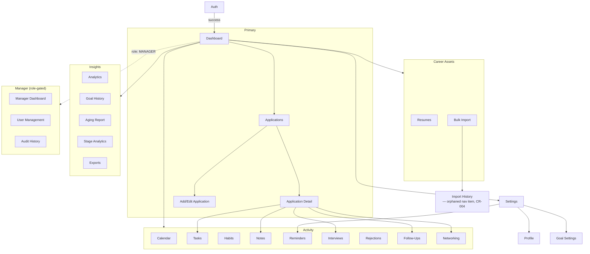

# Application Flow Diagram

The full navigation map and all 13 user journeys live in `../docs/APP_FLOW.md` —
this file holds the single top-level navigation diagram for quick reference; see
that document for every journey-specific flowchart.

