# Database ERD

Full table-by-table reference: `../docs/BACKEND_SCHEMA.md`. This is the same ERD
reproduced here per the required diagrams/ structure, for standalone reference.

```mermaid
erDiagram
    USERS ||--o{ APPLICATIONS : owns
    USERS ||--o{ SESSIONS : has
    USERS ||--o{ EXTENSION_TOKENS : has
    USERS ||--o{ RESUMES : owns
    USERS ||--o{ TASKS : owns
    USERS ||--o{ HABITS : owns
    USERS ||--o{ NOTES : owns
    USERS ||--o{ REMINDERS : owns
    USERS ||--o{ NETWORKING_CONTACTS : owns
    USERS ||--o{ IMPORT_BATCHES : owns
    USERS ||--o{ TAGS : owns
    USERS ||--o{ SAVED_VIEWS : owns
    USERS ||--o{ DASHBOARD_PREFERENCES : owns
    USERS ||--o{ GOAL_SETTINGS : owns
    USERS ||--o{ DAILY_GOALS : owns
    USERS ||--o{ WEEKLY_GOALS : owns

    APPLICATIONS ||--o{ ACTIVITIES : logs
    APPLICATIONS ||--o{ STAGE_HISTORY : logs
    APPLICATIONS ||--o{ TIMELINE_EVENTS : logs
    APPLICATIONS ||--o{ CHECKLIST_ITEMS : has
    APPLICATIONS ||--o{ APPLICATION_TAGS : tagged_by
    APPLICATIONS ||--o{ INTERVIEWS : has
    APPLICATIONS ||--o{ REJECTIONS : has
    APPLICATIONS ||--o{ FOLLOW_UPS : has
    APPLICATIONS |o--o{ NETWORKING_CONTACTS : "linked (optional)"
    APPLICATIONS |o--o{ TASKS : "linked (optional)"
    APPLICATIONS |o--o{ NOTES : "linked (optional)"
    APPLICATIONS |o--|| RESUMES : "uses (optional, resume_id)"
    APPLICATIONS ||--o{ IMPORT_ROWS : "resulted from (optional)"

    RESUMES ||--o{ RESUME_HISTORY : versions
    RESUMES |o--o{ RESUMES : "parent_resume_id (revision of)"

    TAGS ||--o{ APPLICATION_TAGS : applied_as

    INTERVIEWS |o--o{ FOLLOW_UPS : "linked (optional)"
    NETWORKING_CONTACTS |o--o{ FOLLOW_UPS : "linked (optional)"

    REMINDER_CATEGORIES ||--o{ REMINDERS : categorizes

    IMPORT_BATCHES ||--o{ IMPORT_ROWS : contains

    HABITS ||--o{ HABIT_LOGS : tracks

    GOAL_SETTINGS ||--o{ GOAL_SNAPSHOTS : "computed into (by category/period)"
```

23 tables total. See `../docs/BACKEND_SCHEMA.md` for every column, constraint,
index, and the proposed Supabase RLS policy per table. The three genuinely
net-new domains (Tasks, Habits, Notes — migrations 009-011) are structurally
independent of each other and of the pre-existing Reminders/Goals domains; see
`../BUSINESS_LOGIC_CATALOG.md` BL-011/BL-012/BL-013 and `../brain/DECISIONS.md`
for why they were kept separate rather than merged.
