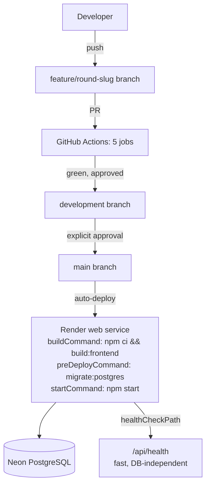
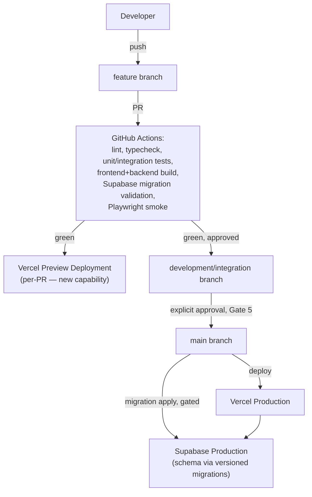

# Deployment Architecture

Full narrative: `../CI_CD_DEPLOYMENT.md`.

## Current (Render)

Single service, single environment (no preview/staging tier exists today — see
`../ENVIRONMENT_MATRIX.md`).

## Target (Vercel + Supabase)

Supabase schema changes must use migrations — never a manual dashboard edit in
any environment past local dev, carrying forward the existing project's
migration-discipline policy verbatim (see `../docs/BACKEND_SCHEMA.md` §Migration
history).
