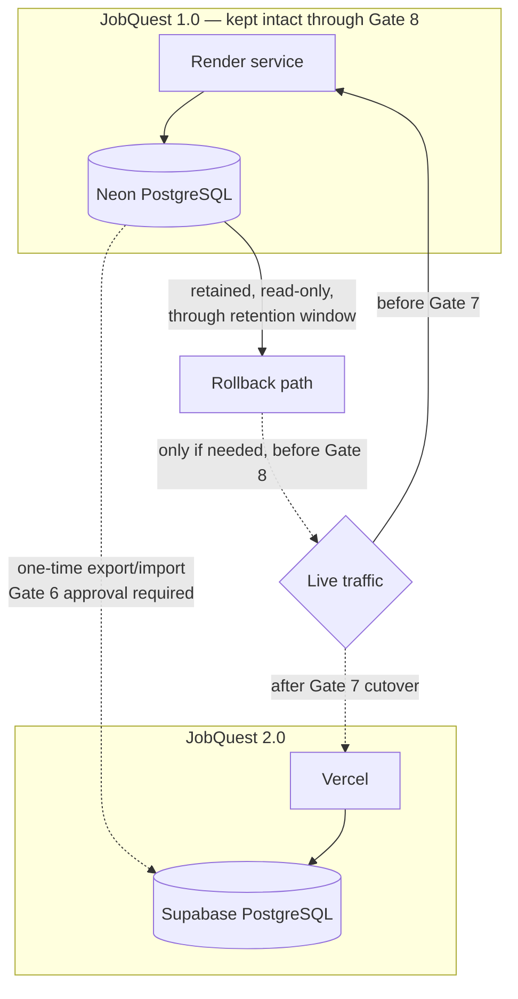

# Migration Architecture

Shows both systems during the transitional period (between Milestone 19 and
Milestone 23 of `../docs/IMPLEMENTATION_PLAN.md`) — plan only, nothing here has
been executed.

## Migration data flow (detail)

```mermaid
flowchart LR
    A["Freeze schema version\n(013, confirmed)"] --> B["pg_dump --schema-only\n(Neon)"]
    B --> C["Author Supabase migrations\n(re-authored, not blind-restored,\nRLS designed in)"]
    C --> D["Apply to staging Supabase project"]
    D --> E["pg_dump --data-only or per-table COPY\n(Neon, never committed)"]
    E --> F["Import into staging Supabase"]
    F --> G["Validate: row counts, FKs,\napplications/contacts/tasks/habits/notes\nspot-checks, analytics formula parity"]
    G -->|fail| C
    G -->|pass| H["Gate 6: explicit approval\nfor production data migration"]
    H --> I["Repeat export/import against production Supabase"]
    I --> J["Post-migration validation (same checks)"]
    J --> K["Gate 7: explicit cutover approval"]
    K --> L["Traffic switch"]
    L --> M["Retention window\n(Neon/Render untouched)"]
    M --> N["Gate 8: legacy retirement approval"]
```

This mirrors the care level `../../docs/NEON_MIGRATION.md` already documented for
the *previous* SQLite→Neon migration — the same discipline (backup before
touching anything, validate before trusting, never destructive without explicit
sign-off) applies here.
