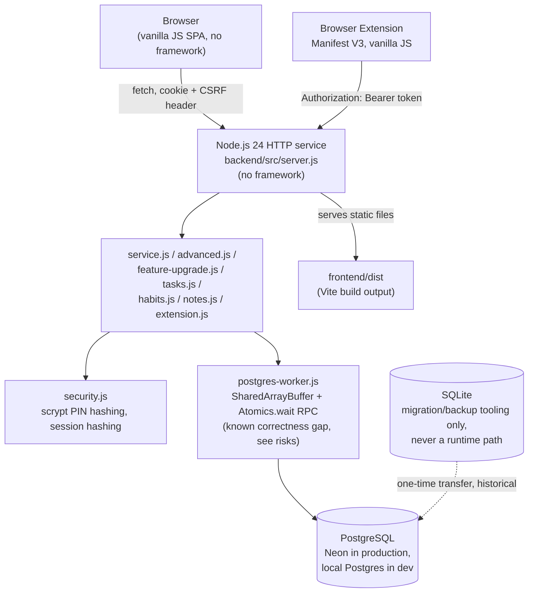
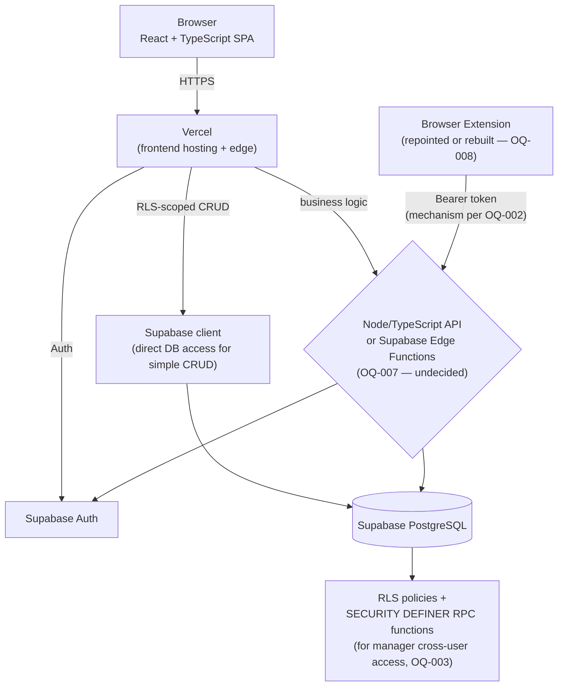

# System Architecture Diagrams

Full narrative in `../docs/TRD.md` §2-3. This file collects the diagrams for quick
reference.

## Current State

One deployable unit (Render `render.yaml`): the Node service serves both the API
and the static frontend files.

## Target State

## Key architectural differences to design deliberately, not accidentally

| Aspect | Current | Target | Decision needed |
|---|---|---|---|
| Deployable units | 1 (Render) | 2+ (Vercel + Supabase) | none — given by the target stack |
| Data access | Raw `pg` via worker-thread RPC | Supabase client + RLS, or typed query layer | OQ-007 |
| Auth | Custom PIN+session | Supabase Auth (+ custom PIN layer?) | OQ-001 |
| Manager cross-user | App-layer explicit-param check | RLS can't express this alone | OQ-003 |
| Extension auth | Custom bearer tokens | Port pattern, or native Supabase equivalent | OQ-002 |
| CSRF | Session-bound token | Likely unnecessary under Bearer-JWT — re-evaluate | part of OQ-001 |
