# Complete Application Flow

Full per-screen detail lives in `../ROUTE_SCREEN_INVENTORY.md` — this document
covers navigation hierarchy and end-to-end user journeys built on top of it.

## Navigation hierarchy (current, from the actual sidebar structure)

```
JobQuest
│
├── Primary
│   ├── Dashboard
│   ├── Applications
│   └── Add Application
│
├── Activity
│   ├── Calendar
│   ├── Tasks
│   ├── Habits
│   ├── Notes (Journal)
│   ├── Reminders
│   ├── Interviews
│   ├── Rejections
│   ├── Follow-Ups
│   └── Networking (Contacts)
│
├── Career Assets
│   ├── Resumes
│   └── Bulk Import
│
├── Insights
│   ├── Analytics
│   ├── Goal History
│   ├── Aging Report
│   ├── Stage Analytics
│   └── Exports
│
├── Settings
│   └── Settings (Appearance, Tags, Extension Tokens; sub-links to Profile,
│       Goal Settings, Reminder Settings, Dashboard Settings)
│
├── (ungrouped — confirmed bug, see CR-004)
│   └── Import History
│
└── Manager (role-gated)
    ├── Manager Dashboard
    ├── User Management
    └── Audit History
```

Two screens have no nav entry (`profile`, `goals`) — reachable only via
in-page buttons, per `ROUTE_SCREEN_INVENTORY.md`.

## Navigation map

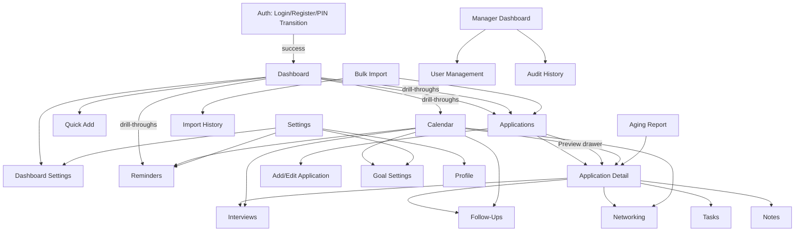

## User Journeys

### Journey 1 — Create an application manually

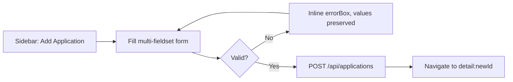

### Journey 2 — Capture an application via the browser extension

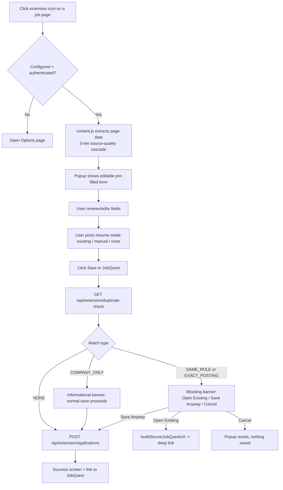

### Journey 3 — Detect a duplicate application (import path)

```mermaid
flowchart TD
    A[Bulk Import: paste/select JSON/CSV/structured text] --> B[POST /api/import/preview]
    B --> C[duplicate() checks owner+company+title+date+URL]
    C --> D[Preview table shows per-row: valid/invalid/duplicate]
    D --> E{User confirms import}
    E --> F[POST /api/import with duplicate_action:\nskip / import_anyway / update_existing]
    F --> G[Transactional or valid-rows-only commit]
    G --> H[import_batches + import_rows written,\nviewable later in Import History]
```

### Journey 4 — Move an application through the workflow/status pipeline

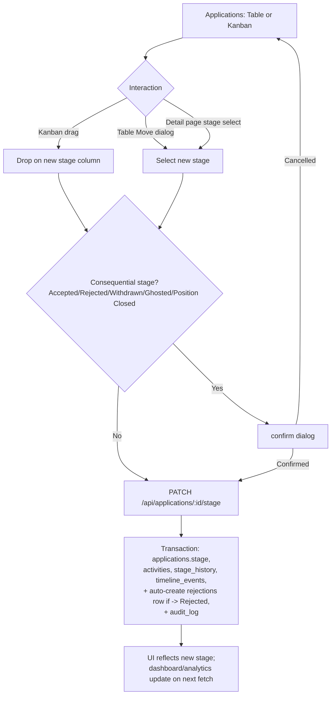

### Journey 5 — Search for existing applications

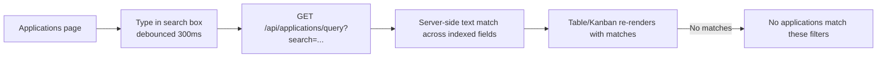

### Journey 6 — Filter and sort applications

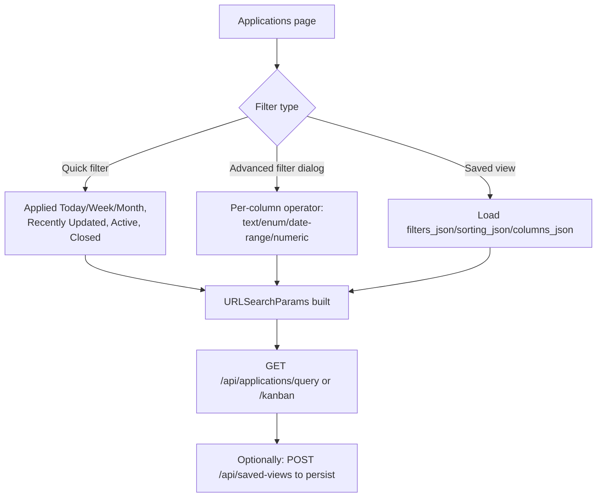

### Journey 7 — Import applications

See Journey 3 (duplicate detection is part of the same flow, not a separate one).
Additional detail: format selection (JSON/CSV/structured text) determines parsing
path; `import_mode` (`valid_rows_only` vs `all_or_nothing`) determines whether a
partial failure commits the valid subset or rolls back everything.

### Journey 8 — Export applications

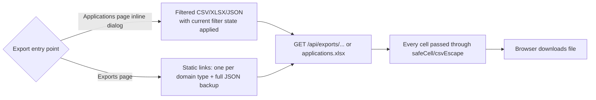

### Journey 9 — Create and manage tasks

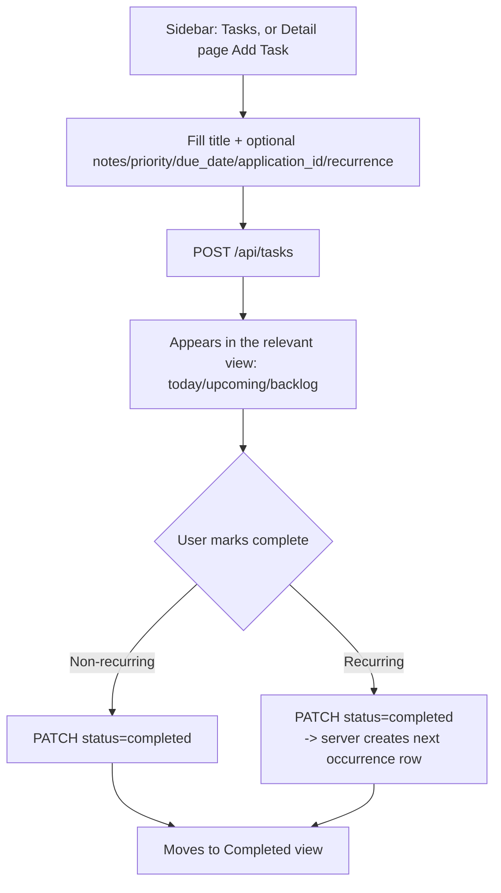

### Journey 10 — Contacts / networking

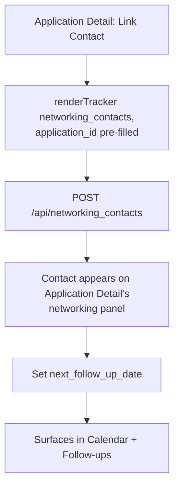

### Journey 11 — Analytics

```mermaid
flowchart TD
    A[Sidebar: Analytics] --> B[Select date range: 30/90/180/365d]
    B --> C[Parallel fetch: funnel, source, resume]
    C --> D[Overview: applications count +\nresponse/interview/offer rate,\nalways shown as n/d pct%]
    C --> E[Pipeline: funnel bar chart]
    C --> F[By Source table]
    C --> G[By Resume Version table]
    D & E & F & G --> H{Sample too small?}
    H -->|Yes| I["Insufficient data" / "No data"\nnever a misleading bare percentage]
    H -->|No| J[Render real values]
```

## Additional journeys worth documenting explicitly

### Journey 12 — Habit tracking (daily check-in)

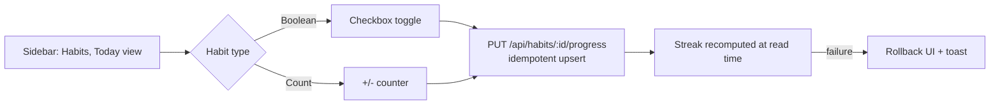

### Journey 13 — Extension deep-link back into JobQuest

```mermaid
flowchart TD
    A[Extension: Open Existing on a duplicate] --> B[buildSecureJobQuestUrl:\norigin-validated /?application=id]
    B --> C{Web session valid?}
    C -->|No| D[authView renders]
    D --> E[User logs in with PIN]
    E --> F[resolveInitialRoute reads ?application=id]
    C -->|Yes| F
    F --> G{Application exists?}
    G -->|Yes| H[renderDetail(id)]
    G -->|No, deleted| I[Redirect to Applications\n+ toast: could not be found]
```

### Journey 14 — Workspace Switching & Member Administration (Gate 02B)

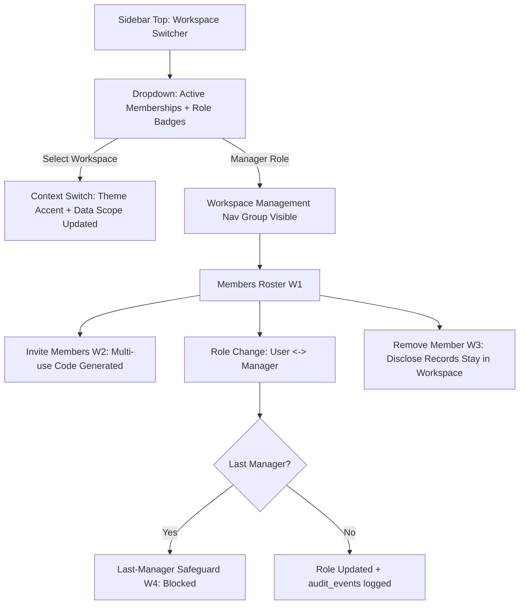

### Journey 15 — Account Recovery via Single-Use Codes (Gate 02B)

```mermaid
flowchart TD
    A[Sign In Screen A1] --> B[Click "Forgot password?"]
    B --> C[Account Recovery Screen A8]
    C --> D[Enter Username + 12-char Single-Use Recovery Code]
    D --> E{Valid Code?}
    E -->|No| F[Generic Error: Invalid or Used Code]
    E -->|Yes| G[Code Burned / Consumed]
    G --> H[Set New Password Form A9]
    H --> I[Password Updated + Fresh Recovery Code Set Issued]
    I --> J[Redirect to Dashboard D1]
```

### Journey 16 — Bulk Import Wizard with Column Matching (Gate 02B)

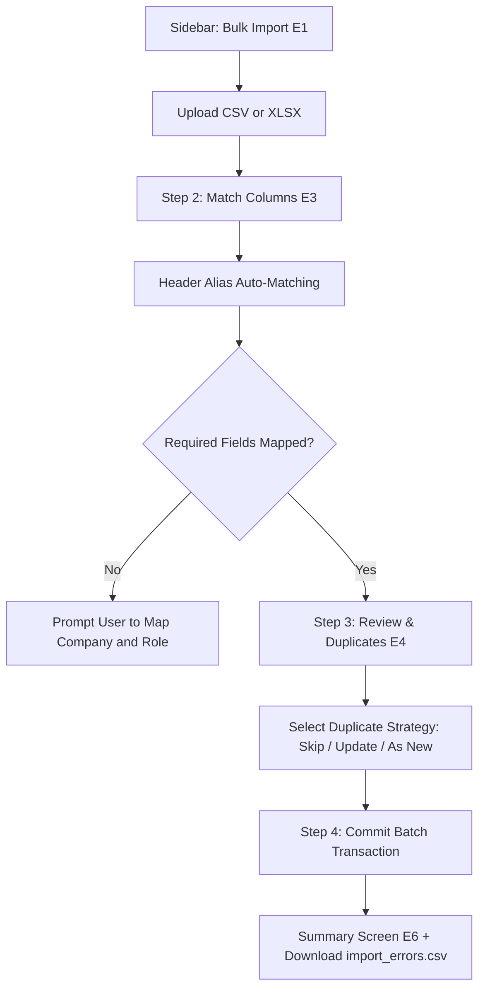

