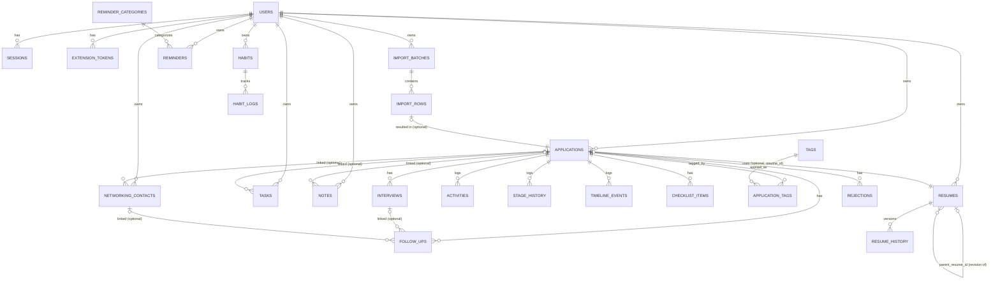

# Backend / Database Schema

CURRENT STATE, transcribed directly from `backend/jobsearch/migrations/001`–`013`
(the SQLite-dialect migration source; the PostgreSQL dialect applied in production via
`postgres-migrate.js` is schema-equivalent — same tables/columns/constraints, with
`INTEGER PRIMARY KEY AUTOINCREMENT` → `SERIAL PRIMARY KEY` and `TEXT` timestamp
columns → native Postgres types at the driver/migration-tool level). All 23 tables,
grouped by domain. STATUS: CONFIRMED for every table below — read directly from the
migration files, not inferred.

## Migration history

| # | File | Adds |
|---|---|---|
| 001 | `001_jobsearch.sql` | `users`, `applications`, `activities`, `interviews`, `rejections`, `networking_contacts`, `follow_ups`, `daily_goals`, `weekly_goals`, `import_batches`, `import_rows`, `audit_log` |
| 002 | `002_sessions.sql` | `sessions` |
| 003 | `003_complete_manager.sql` | `users.theme_preference`/`week_start`/follow-up settings; `applications.resume_id`/`pinned`/`important`/`favorite`/`archived_at`/`next_action_completed_at`; `timeline_events`, `stage_history`, `resumes`, `reminder_categories` (+ 11 builtin rows), `reminders`, `goal_settings`, `goal_snapshots`, `dashboard_preferences`, `saved_views`, `tags`, `application_tags`, `checklist_items`; backfills `stage_history`/`timeline_events` from existing `applications` |
| 004 | `004_followup_completion.sql` | `follow_ups.suggested_date`/`completed_at` + index |
| 005 | `005_four_digit_pin.sql` | `users.pin_hash`, `users.auth_method` |
| 006 | `006_feature_upgrade_one.sql` | `users.preferred_applications_view`/`navigation_collapsed`/`navigation_groups_json`; `applications.board_order` + indexes; `resumes.revision_label`/`parent_resume_id`/`is_active`/`is_default`/`change_summary`; `resume_history`; `application_view_preferences`; `saved_views.board_settings_json`; `export_preferences` |
| 007 | `007_feature_ui_upgrade_1_1.sql` | `application_view_preferences.kanban_grouping`/`collapsed_groups_json`/`table_density`/`cards_per_group`; `users.dashboard_visualization_json` |
| 008 | `008_manual_application_resume_version.sql` | data backfill only: copies `resumes.version_name` into `applications.resume_version` for legacy-linked rows |
| 009 | `009_task_management.sql` | `tasks` |
| 010 | `010_habit_tracker.sql` | `habits`, `habit_logs` |
| 011 | `011_journal_notes.sql` | `notes` |
| 012 | `012_final_performance_indexes.sql` | `idx_import_rows_batch_row` (performance-only, no schema change) |
| 013 | `013_extension_tokens.sql` | `extension_tokens` |

Migrations are **forward-only, additive** (no destructive `ALTER`/`DROP` found in any
of the 13 files). Migration policy already followed by this project — carry into the
migrated system:

- Every schema change is a new, sequentially-numbered migration file.
- No manual production schema changes — everything goes through the migration runner.
- Migrations are transactional and idempotent-checked (`schema_migrations` tracking
  table, confirmed by `brain/AGENT_HANDOFF_LOG.md`'s description of the upgrade-path
  validation: applying 001→008 then 009→012 later applies only the new ones).
- Migrations must be reproducible against a clean database (CI's `migrate:check` job
  exists specifically to catch a migration that only works against an
  already-partially-migrated schema).

## Table reference

Ownership convention used throughout: almost every table carries `user_id` (the
resource owner) and many also carry `actor_user_id`/`created_by`/`updated_by` (who
performed the action — relevant when a `MANAGER` acts on another user's data, so the
owner and the actor can differ). This owner/actor split is a deliberate,
security-relevant pattern — preserve it in any migrated schema (e.g. Postgres RLS
policies keyed on `user_id`, with actor captured separately for audit).

### `users`

Purpose: account identity, auth material, and per-user preference settings (theme,
navigation, dashboard, follow-up defaults, week start).

| Column | Type | Nullable | Default | Notes |
|---|---|---|---|---|
| id | INTEGER PK | no | autoincrement | |
| username | TEXT | no | — | UNIQUE, case-insensitive (`COLLATE NOCASE`) |
| email | TEXT | yes | — | UNIQUE, case-insensitive |
| full_name | TEXT | no | — | |
| phone | TEXT | yes | — | |
| password_hash | TEXT | no | — | legacy password auth (pre-PIN) |
| role | TEXT | no | `'USER'` | CHECK IN (`USER`,`MANAGER`) |
| is_active | INTEGER | no | 1 | CHECK IN (0,1); boolean-as-int (SQLite dialect) |
| failed_login_count | INTEGER | no | 0 | lockout counter |
| locked_until | TEXT | yes | — | lockout expiry timestamp |
| created_at / updated_at | TEXT | no | CURRENT_TIMESTAMP | |
| theme_preference | TEXT | no | `'system'` | CHECK IN (light,dark,system) — migration 003 |
| week_start | INTEGER | no | 1 | CHECK 0–6 — migration 003; **inconsistently honored, see Known Debt** |
| first_follow_up_delay / second_follow_up_delay | INTEGER | no | 5 / 7 | days — migration 003 |
| follow_up_day_type | TEXT | no | `'business'` | CHECK IN (calendar,business) — migration 003 |
| default_reminder_time | TEXT | no | `'09:00'` | — migration 003 |
| auto_create_follow_up_reminder | INTEGER | no | 1 | — migration 003 |
| pin_hash | TEXT | yes | — | scrypt hash — migration 005 |
| auth_method | TEXT | no | `'legacy_password'` | CHECK IN (legacy_password,pin) — migration 005 |
| preferred_applications_view | TEXT | no | `'table'` | CHECK IN (table,kanban) — migration 006 |
| navigation_collapsed | INTEGER | no | 0 | — migration 006 |
| navigation_groups_json | TEXT | no | `'{}'` | — migration 006 |
| dashboard_visualization_json | TEXT | no | `'{}'` | — migration 007 |

No FKs (root identity table). Read: login, session resolution, settings pages, every
`requireAuth` call. Write: register, PIN setup, settings updates, lockout tracking.
Delete: not exposed (no user-delete endpoint found — deactivation via `is_active`
instead). Target Supabase mapping: **`auth.users` (Supabase Auth) for identity/
credentials** + a `public.profiles`/`public.user_settings` table for everything past
row 13 above (role, preferences) — Supabase Auth should own `password_hash`/session
concerns entirely; PIN auth as a *second factor* would need a custom flow (Supabase
Auth doesn't have native "4-digit PIN as primary credential" — this is a genuine
migration design decision, see `OPEN_QUESTIONS.md`).

### `sessions`

Purpose: server-side opaque session tracking (hash-only, matching security posture).

| Column | Type | Nullable | Default | Notes |
|---|---|---|---|---|
| token_hash | TEXT PK | no | — | SHA-256 of the opaque session token |
| user_id | INTEGER FK→users.id | no | — | ON DELETE CASCADE |
| csrf_token | TEXT | no | — | session-bound CSRF value |
| expires_at | TEXT | no | — | 12h from creation |
| created_at | TEXT | no | CURRENT_TIMESTAMP | |

Index: `idx_sessions_expiry(expires_at)`. Target mapping: **superseded by Supabase
Auth's own session/JWT mechanism** — this table would not need to exist in a Supabase
migration; CSRF concerns change shape entirely under a Bearer-JWT model (see
`SECURITY_AUTHORIZATION.md`).

### `extension_tokens`

Purpose: bearer tokens for the browser capture extension (migration 013).

| Column | Type | Nullable | Default | Notes |
|---|---|---|---|---|
| id | INTEGER PK | no | autoincrement | |
| user_id | INTEGER FK→users.id | no | — | ON DELETE CASCADE |
| token_hash | TEXT | no | — | UNIQUE, SHA-256 |
| label | TEXT | no | `'Extension'` | user-facing name |
| created_at | TEXT | no | CURRENT_TIMESTAMP | |
| last_used_at | TEXT | yes | — | updated on each authenticated call |
| revoked_at | TEXT | yes | — | row kept after revocation (audit trail) |

Index: `idx_ext_token_user(user_id, revoked_at)`. Target mapping: a Supabase table
with RLS `user_id = auth.uid()`, or a Supabase Personal Access Token equivalent if
one exists at migration time — otherwise keep this exact pattern (hash-only storage,
revoke-not-delete).

### `applications`

Purpose: the core domain entity — one row per tracked job application.

| Column | Type | Nullable | Default | Notes |
|---|---|---|---|---|
| id | INTEGER PK | no | autoincrement | |
| user_id | INTEGER FK→users.id | no | — | owner |
| company | TEXT | no | — | |
| job_title | TEXT | no | — | |
| date_applied | TEXT | no | — | |
| stage | TEXT | no | `'Applied'` | CHECK IN 13 canonical stages (see below) |
| job_url | TEXT | yes | — | validated http/https only (app-layer) |
| location | TEXT | yes | — | |
| work_arrangement | TEXT | yes | — | CHECK IN (Remote,Hybrid,Onsite) or NULL |
| employment_type | TEXT | yes | — | CHECK IN (Full-time,Part-time,Contract,Internship,Temporary,Other) or NULL |
| date_found | TEXT | yes | — | |
| source | TEXT | yes | — | e.g. "LinkedIn", extension `source` |
| priority | TEXT | no | `'Medium'` | CHECK IN (Low,Medium,High) |
| salary_min / salary_max | REAL | yes | — | |
| salary_currency / salary_range | TEXT | yes | — | |
| resume_version | TEXT | yes | — | free-text tailored-resume label; also written by extension "manual" mode |
| cover_letter_version | TEXT | yes | — | |
| recruiter_name / recruiter_email / recruiter_phone | TEXT | yes | — | |
| job_description | TEXT | yes | — | |
| notes | TEXT | yes | — | |
| next_action / next_action_date | TEXT | yes | — | |
| next_action_completed_at | TEXT | yes | — | migration 003 |
| last_response_date | TEXT | yes | — | used by response-rate analytics |
| external_job_id | TEXT | yes | — | |
| resume_id | INTEGER FK→resumes.id | yes | — | ON DELETE SET NULL — migration 003 |
| pinned / important / favorite | INTEGER | no | 0 | migration 003 |
| archived_at | TEXT | yes | — | migration 003 |
| board_order | INTEGER | no | 0 | Kanban manual ordering — migration 006 |
| created_by / updated_by | INTEGER FK→users.id | no | — | actor tracking |
| created_at / updated_at | TEXT | no | CURRENT_TIMESTAMP | |

**Canonical `stage` values (13, CHECK-enforced at the DB layer and re-validated in
`service.js`)**: `Saved`, `Preparing`, `Applied`, `Assessment`, `Recruiter Screen`,
`Interview`, `Final Interview`, `Offer`, `Rejected`, `Withdrawn`, `Ghosted`,
`Position Closed`, `Accepted`. This is the single source of truth consumed by both
the web UI and the browser extension (`GET /api/extension/stages`) — **do not invent
a second stage enum anywhere in a migrated system**.

Indexes: `idx_app_owner_date(user_id,date_applied)`,
`idx_app_owner_stage(user_id,stage)`,
`idx_app_owner_identity(user_id,company,job_title)`,
`idx_app_owner_board(user_id,stage,board_order,updated_at)`,
`idx_app_owner_updated(user_id,updated_at)`,
`idx_app_owner_resume(user_id,resume_id)`.

Read: virtually every screen. Write: create/update/import/extension-capture.
Delete: supported (hard delete cascades to `activities`, `interviews`, `rejections`,
`follow_ups`, `stage_history`, `timeline_events`, `checklist_items`,
`application_tags`; `SET NULL` on `networking_contacts.application_id`,
`tasks.application_id`, `notes.application_id`). Business rules: see
`BUSINESS_LOGIC_CATALOG.md` (duplicate detection, stage transitions, dashboard rate
formulas). Target Supabase mapping: `public.applications`, RLS `user_id =
auth.uid()` for regular users, a manager bypass policy scoped to an explicit
`target_user_id` parameter pattern (RLS can't easily express "manager view of an
explicitly chosen other user" without a security-definer function — see
`OPEN_QUESTIONS.md`).

### `activities`

Purpose: free-form activity log per application (distinct from `stage_history`/
`timeline_events`, which are more structured).

| Column | Type | Nullable | Notes |
|---|---|---|---|
| id | INTEGER PK | no | |
| application_id | INTEGER FK→applications.id | no | ON DELETE CASCADE |
| user_id | INTEGER FK→users.id | no | owner |
| actor_user_id | INTEGER FK→users.id | no | who performed it |
| activity_type | TEXT | no | |
| previous_stage / new_stage | TEXT | yes | |
| note | TEXT | yes | |
| created_at | TEXT | no | |

Index: `idx_activity_app(application_id,created_at)`.

### `stage_history`

Purpose: structured stage-transition log (entered/left timestamps) — powers
stage-duration/transition analytics.

| Column | Type | Nullable | Notes |
|---|---|---|---|
| id | INTEGER PK | no | |
| application_id | INTEGER FK→applications.id | no | CASCADE |
| user_id / actor_user_id | INTEGER FK→users.id | no | |
| previous_stage | TEXT | yes | |
| new_stage | TEXT | no | |
| entered_at | TEXT | no | |
| left_at | TEXT | yes | set when superseded by the next transition |
| reason / note | TEXT | yes | |
| created_at | TEXT | no | |

Indexes: `idx_stage_history_owner_stage(user_id,new_stage,entered_at)`,
`idx_stage_history_app(application_id,entered_at)`. Backfilled from `applications` at
migration time (one synthetic row per existing application).

### `timeline_events`

Purpose: the unified, user-facing activity timeline shown on the application detail
page (distinct from the two tables above — this one is display-oriented, with a
`category`/`title`/`description` shape and an explicit `source` of `automatic` vs
`manual`).

| Column | Type | Nullable | Notes |
|---|---|---|---|
| id | INTEGER PK | no | |
| application_id | INTEGER FK→applications.id | no | CASCADE |
| user_id / actor_user_id | INTEGER FK→users.id | no | |
| event_date | TEXT | no | |
| event_time | TEXT | yes | |
| category | TEXT | no | |
| event_type | TEXT | no | |
| stage | TEXT | yes | |
| title | TEXT | no | |
| description | TEXT | yes | |
| contact_person | TEXT | yes | |
| source | TEXT | no | CHECK IN (automatic,manual) |
| related_record_type / related_record_id | TEXT/INTEGER | yes | polymorphic link, no FK constraint (app-layer only) |
| created_at / updated_at | TEXT | no | |

Indexes: `idx_timeline_owner_date`, `idx_timeline_application_date`. Backfilled with
one `application_created` event per existing application.

### `interviews`

| Column | Type | Notes |
|---|---|---|
| id, user_id, application_id (CASCADE) | | |
| interview_round, interview_type | TEXT NOT NULL | |
| scheduled_at | TEXT NOT NULL | |
| time_zone, format, meeting_link, interviewer_names, interviewer_contact | TEXT | |
| preparation_notes, questions_expected, questions_asked, performance_notes | TEXT | |
| thank_you_status, follow_up_date, result, next_step, notes | TEXT | |
| created_at / updated_at | TEXT | |

Index: `idx_interview_owner_date(user_id,scheduled_at)`.

### `rejections`

| Column | Type | Notes |
|---|---|---|
| id, user_id, application_id (CASCADE) | | |
| rejection_date | TEXT NOT NULL | |
| stage_at_rejection | TEXT NOT NULL | |
| rejection_reason, feedback_received, recruiter_feedback, lessons_learned | TEXT | |
| eligible_for_reapplication | INTEGER NOT NULL DEFAULT 0 | |
| reapplication_date, notes | TEXT | |
| created_at / updated_at | TEXT | |

Constraint: `UNIQUE(application_id, rejection_date)`.

### `networking_contacts`

| Column | Type | Notes |
|---|---|---|
| id, user_id | | |
| application_id | INTEGER FK→applications.id ON DELETE SET NULL | optional link |
| contact_name | TEXT NOT NULL | |
| company, job_title, linkedin_url, email, phone, relationship_type | TEXT | |
| connection_request_date, last_contact_date, next_follow_up_date | TEXT | |
| connection_accepted, first_message_sent, response_received, referral_requested, referral_received | INTEGER DEFAULT 0 | booleans-as-int |
| networking_stage | TEXT NOT NULL DEFAULT `'Identified'` | |
| notes | TEXT | |
| created_at / updated_at | TEXT | |

Index: `idx_network_owner_followup(user_id,next_follow_up_date)`.

### `follow_ups`

| Column | Type | Notes |
|---|---|---|
| id, user_id | | |
| application_id, interview_id, networking_contact_id | nullable FKs (CASCADE), at least one required | `CHECK (application_id IS NOT NULL OR interview_id IS NOT NULL OR networking_contact_id IS NOT NULL)` — polymorphic parent |
| follow_up_type, contact_name, communication_channel | TEXT | |
| due_date | TEXT NOT NULL | |
| sent_date | TEXT | |
| status | TEXT NOT NULL DEFAULT `'Due'` | CHECK IN (Due,Sent,Waiting,Responded,No Response,Completed,Cancelled) |
| response_status, next_follow_up_date, notes | TEXT | |
| suggested_date, completed_at | TEXT | migration 004 |
| created_at / updated_at | TEXT | |

Indexes: `idx_followup_owner_due`, `idx_followup_owner_suggested`.

### `resumes`

| Column | Type | Notes |
|---|---|---|
| id, user_id | | |
| version_name | TEXT NOT NULL | UNIQUE per (user_id, version_name) |
| target_role, job_category, file_name, secure_file_reference | TEXT | |
| resume_date | TEXT | |
| is_archived | INTEGER NOT NULL DEFAULT 0 | |
| notes | TEXT | |
| revision_label, parent_resume_id (FK→resumes.id SET NULL), is_active, is_default, change_summary | migration 006 | revision/versioning support |
| created_at / updated_at | TEXT | |

Index: `idx_resume_owner_active`, `idx_resume_parent`.

### `resume_history`

Migration 006 — immutable audit trail of resume create/edit/revision actions.

| Column | Type | Notes |
|---|---|---|
| id, resume_id (CASCADE), user_id, actor_user_id | | |
| action | TEXT NOT NULL | |
| version_name | TEXT NOT NULL | |
| parent_resume_id | FK→resumes.id SET NULL | |
| change_summary | TEXT | |
| details_json | TEXT NOT NULL DEFAULT `'{}'` | |
| created_at | TEXT | |

Index: `idx_resume_history_owner`.

### `reminder_categories`

| Column | Type | Notes |
|---|---|---|
| id | | |
| user_id | FK→users.id, nullable | NULL for builtin/global categories |
| stable_key | TEXT | UNIQUE, stable identifier for builtins |
| name | TEXT NOT NULL | UNIQUE per (user_id, name) |
| color, icon | TEXT NOT NULL | |
| is_builtin, is_default | INTEGER | |
| archived_at | TEXT | |
| created_at / updated_at | TEXT | |

Seeded with 11 builtin rows (`application-follow-up`, `interview`,
`interview-preparation`, `thank-you-note`, `networking`, `recruiter-contact`,
`resume`, `goal`, `reapplication`, `next-action`, `custom`).

### `reminders`

| Column | Type | Notes |
|---|---|---|
| id, user_id | | |
| category_id | FK→reminder_categories.id NOT NULL | |
| related_record_type, related_record_id | | polymorphic link, app-layer only |
| title | TEXT NOT NULL | |
| description | TEXT | |
| due_date | TEXT NOT NULL | **not nullable — this is why Tasks (Round 7) is a separate table**, see Business Logic Catalog |
| due_time | TEXT | |
| priority | TEXT NOT NULL DEFAULT `'Medium'` | CHECK Low/Medium/High |
| status | TEXT NOT NULL DEFAULT `'Upcoming'` | CHECK Upcoming/Snoozed/Completed/Cancelled |
| snoozed_until, completed_at | TEXT | |
| created_at / updated_at | TEXT | |

Indexes: `idx_reminder_owner_due`, `idx_reminder_category`.

### `daily_goals`

Fixed KPI-target row per user per day: `applications_target`,
`jobs_researched_target`, `resumes_target`, `recruiter_messages_target`,
`connections_target`, `follow_ups_target`, `interview_prep_minutes_target`,
`interview_prep_minutes_actual`. `UNIQUE(user_id, goal_date)`.

### `weekly_goals`

Fixed KPI-target row per user per week: `application_target`, `networking_target`,
`follow_up_target`, `interview_prep_target`, plus a free-form
`custom_goal_label`/`custom_goal_target`/`custom_goal_completed`, and reflective
fields `main_accomplishment`, `main_challenge`,
`applications_generating_responses`, `priorities_next_week`, `notes`.
`UNIQUE(user_id, week_start)`.

### `goal_settings`

Migration 003 — a more general, extensible goal-target system layered alongside the
older `daily_goals`/`weekly_goals`: one row per (user, period_type, category,
effective_date), with an optional `end_date` for superseding a target.
`period_type` CHECK (daily,weekly); `category` CHECK (applications, follow_ups,
connections, recruiter_messages, interview_prep_minutes). Actuals are **never
stored here** — computed live from other tables (`applications`, `follow_ups`,
etc.) by `actualFor()` in the business logic. `UNIQUE(user_id, period_type,
category, effective_date)`.

### `goal_snapshots`

Point-in-time computed snapshot of target vs. actual, written once per completed
period (immutable historical record — the Dashboard's "target vs actual" chart
compares live current-period data against these frozen past snapshots, not against
a mutable target). `period_type` CHECK (daily,weekly,monthly). `UNIQUE(user_id,
period_type, period_start, category)`.

### `dashboard_preferences`

Per-widget layout state: `dashboard_type` CHECK (user,manager), `widget_id`,
`enabled`, `position`, `width`/`height` (1–3 grid units), `settings_json`.
`UNIQUE(user_id, dashboard_type, widget_id)`.

### `saved_views`

Named, reusable filter/sort/column presets: `view_type` (default
`'applications'`), `filters_json`, `sorting_json`, `columns_json`, `is_default`,
plus `board_settings_json` (migration 006, Kanban-specific settings).
`UNIQUE(user_id, view_type, name)`.

### `tags` / `application_tags`

Free-form user-scoped tags (`tags`: `UNIQUE(user_id, name)`) and a many-to-many
join to applications (`application_tags`: composite PK `(application_id, tag_id)`,
denormalized `user_id` for ownership-check convenience).

### `checklist_items`

Per-application checklist, freely orderable: `label`, `is_custom` (system-default
vs user-added), `completed`/`completed_at`, `note`, `position` (int, used for
adjacent-swap reordering — see Business Logic Catalog). Index:
`idx_checklist_app_order(application_id,position)`.

### `import_batches` / `import_rows`

`import_batches`: one row per import attempt — `input_format`, `import_mode`,
`duplicate_action`, and full per-outcome counters (`total_rows`, `valid_rows`,
`invalid_rows`, `duplicate_rows`, `created_rows`, `updated_rows`, `skipped_rows`,
`rejected_rows`), `status`, `completed_at`.
`import_rows`: one row per input row — `row_number`, `status`, `messages_json`
(validation/outcome messages), `application_id` (if the row resulted in a created/
updated application). Index (migration 012): `idx_import_rows_batch_row(batch_id,
row_number)`.

### `export_preferences`

One row per user (`user_id` is the PK): `format` (csv/json/xlsx), `date_field`,
`date_preset`, `include_archived`.

### `application_view_preferences`

Per-user, per-dashboard-type view state for the Applications page: `preferred_view`
(table/kanban), `visible_columns_json`, `collapsed_columns_json`, `board_sort`,
`filters_json`, plus (migration 007) `kanban_grouping` (CHECK: date_applied_day/
week/month, last_updated_day, next_action_day, none), `collapsed_groups_json`,
`table_density` (compact/comfortable), `cards_per_group` (CHECK 10–20).
`UNIQUE(user_id, dashboard_type)`.

### `audit_log`

Append-only: `action`, `entity_type`, `entity_id`, `details`, `actor_user_id`,
`user_id` (the affected record's owner). No update/delete path exposed.

### `tasks` (migration 009 — genuinely net-new, Round 7)

| Column | Type | Notes |
|---|---|---|
| id, user_id | | |
| application_id | FK→applications.id SET NULL | optional link |
| title | TEXT NOT NULL | |
| notes | TEXT | |
| status | TEXT NOT NULL DEFAULT `'open'` | CHECK (open,completed) |
| priority | TEXT NOT NULL DEFAULT `'Medium'` | CHECK Low/Medium/High |
| due_date | TEXT | **nullable** — this is the structural reason Tasks exists separately from Reminders (`reminders.due_date` is `NOT NULL`) |
| completed_at | TEXT | |
| recurrence | TEXT | CHECK (daily,weekdays,weekly,monthly) or NULL; advances to a new row on completion, no per-row history |
| created_at / updated_at | TEXT | |

Indexes: `idx_task_owner_due`, `idx_task_owner_status`, `idx_task_application`.

### `habits` / `habit_logs` (migration 010 — genuinely net-new, Round 8)

`habits`: `name`, `description`, `frequency` (CHECK daily/weekdays/weekly),
`target_count` (CHECK >0), `active`.

`habit_logs`: **one row per (habit, calendar date) storing an absolute count**, not
one row per completion action — this is what makes `PUT .../progress` idempotent
under retry (`UNIQUE(habit_id, completion_date)`, upserted via `ON CONFLICT ... DO
UPDATE`). Covers both boolean habits (`target_count=1`, value 0/1) and count habits
(`target_count=5`, value incrementing toward 5) with one model. Streaks are
**derived at read time**, not stored.

### `notes` (migration 011 — genuinely net-new, Round 9)

| Column | Type | Notes |
|---|---|---|
| id, user_id | | |
| application_id | FK→applications.id SET NULL | optional link |
| title | TEXT, nullable | a note is valid with just a body |
| body | TEXT NOT NULL DEFAULT `''` | plain text only, no Markdown/HTML |
| note_type | TEXT NOT NULL DEFAULT `'general'` | CHECK (general, daily_journal, interview, company_research, reflection) |
| entry_date | TEXT, nullable | |
| pinned | INTEGER NOT NULL DEFAULT 0 | |
| created_at / updated_at | TEXT | |

Indexes: `idx_note_owner_updated`, `idx_note_owner_application`,
`idx_note_owner_type`. **Deliberately independent** from the 8 other notes-like
free-text fields already embedded on `applications`/`interviews`/`rejections`/
`networking_contacts`/`follow_ups`/`resumes`/`weekly_goals`/`tasks` — none of those
were touched or consolidated into this table; see `BUSINESS_LOGIC_CATALOG.md`
"Domain Boundaries" for the full reasoning trail.

## ER Diagram

## Index audit

Every index in the schema supports a specific, identifiable query — none were added
speculatively:

| Index | Supports |
|---|---|
| `idx_app_owner_date/stage/identity/board/updated/resume` | Applications list/filter/sort by each dimension; duplicate-identity lookup |
| `idx_activity_app`, `idx_timeline_*`, `idx_stage_history_*` | Application detail page's timeline/history panels |
| `idx_interview_owner_date`, `idx_network_owner_followup`, `idx_followup_owner_due/suggested` | Calendar/reminders/due-date list views |
| `idx_resume_owner_active`, `idx_resume_parent` | Resume list + revision-chain lookup |
| `idx_daily_owner_date`, `idx_weekly_owner_start`, `idx_goal_setting_owner_effective`, `idx_goal_snapshot_owner_period` | Goal history/trends |
| `idx_dashboard_owner_order` | Dashboard widget rendering order |
| `idx_checklist_app_order` | Checklist rendering order |
| `idx_import_owner_created`, `idx_import_rows_batch_row` | Import history list + row detail (added in migration 012 specifically to close a documented N+1/missing-index gap) |
| `idx_reminder_owner_due`, `idx_reminder_category` | Reminder Center list + category filter |
| `idx_ext_token_user` | Extension token list/lookup |
| `idx_task_owner_due/status`, `idx_task_application` | Tasks views (Today/Upcoming/Backlog/Completed) + application-linked task panel |
| `idx_habit_owner_active`, `idx_habit_log_habit_date/owner_date` | Habits list + streak calculation |
| `idx_note_owner_updated/application/type` | Notes list, filters, and application-linked panel |

TARGET MIGRATION STATE: re-create every index above verbatim in the Supabase/
Postgres schema (they are already Postgres-compatible column-order composite
indexes); do not drop any without first confirming (via `pg_stat_user_indexes` or
equivalent) that the query it supports has actually changed or been removed.

## Supabase RLS (target — proposed, not implemented)

Conceptual policy per table, to be implemented as real `CREATE POLICY` statements
during the migration's Supabase-foundation milestone:

- **Owner tables** (`applications`, `interviews`, `rejections`, `follow_ups`,
  `networking_contacts`, `resumes`, `resume_history`, `tasks`, `habits`,
  `habit_logs`, `notes`, `reminders`, `daily_goals`, `weekly_goals`,
  `goal_settings`, `goal_snapshots`, `dashboard_preferences`, `saved_views`, `tags`,
  `application_tags`, `checklist_items`, `application_view_preferences`,
  `export_preferences`, `extension_tokens`): `SELECT`/`INSERT`/`UPDATE`/`DELETE` all
  gated on `user_id = auth.uid()`. Insert policies must also validate that any
  denormalized FK (e.g. `application_tags.user_id`, `checklist_items.user_id`)
  matches the parent row's owner — RLS alone can't express "this app's owner",
  so either mirror the owner column (current design already does this) or use a
  `SECURITY DEFINER` function.
- **`reminder_categories`**: `SELECT` allowed for rows where `user_id = auth.uid()
  OR user_id IS NULL` (builtins); `INSERT`/`UPDATE`/`DELETE` only on the caller's
  own rows.
- **Manager cross-user access** (`applications` list/detail for oversight, goal
  rollups, etc.): cannot be expressed as a simple RLS predicate without either (a) a
  `SECURITY DEFINER` RPC function that checks the caller's role and an explicit
  `target_user_id` argument, or (b) a `manager_access` policy keyed off a
  `role = 'MANAGER'` claim in the JWT plus explicit application-layer scoping (the
  current model deliberately never grants a manager blanket row access without a
  chosen target — replicate that, don't broaden it).
- **`import_rows`**: scoped indirectly via `batch_id`'s owning `import_batches.user_id`
  — needs a policy with a subquery or a denormalized `user_id` (already present).
- **`audit_log`**: `SELECT` for the affected user's own rows; no `INSERT`/`UPDATE`/
  `DELETE` from the client at all (server/RPC-only, service-role write).

Authorization split to preserve exactly as today:

- **Authentication**: "who are you" — Supabase Auth (session/JWT) for the web app;
  a still-to-be-designed bearer-token-equivalent for the browser extension (Supabase
  doesn't have a first-class "long-lived scoped API token per external client"
  primitive out of the box — see `OPEN_QUESTIONS.md`).
- **Authorization**: "what can you do" — RLS policies above, plus (for anything RLS
  can't cleanly express, like the manager cross-user case) server-side/RPC checks,
  never trusting client-supplied ownership fields, exactly as `service.js` does
  today.
- **Row-Level Security**: the RLS policies themselves.
- **Server-side validation**: field-level validation (stage enum, URL protocol,
  string length/charset limits, mass-assignment rejection) must be re-implemented at
  the new API layer or as Postgres `CHECK` constraints + triggers — RLS does not
  replace input validation.

## Data migration (Neon → Supabase) — plan only, not executed

STATUS: plan only; no data has been moved, no schema has been created in any target
system, no production system was touched to produce this document.

1. Freeze the schema version (record the exact `schema_migrations` state / last
   applied migration number — `013` as of this audit).
2. Export the current Neon schema (`pg_dump --schema-only`) for a byte-level diff
   against the new Supabase migration set once written.
3. Export production data (`pg_dump --data-only`, or per-table `COPY`) — never
   commit this output; treat exactly like the existing SQLite-backup handling
   (`sqlite-backup.js`'s pattern: SHA-256 + per-table counts, no plaintext secrets,
   never committed).
4. Create the Supabase schema through versioned Supabase migrations (mirroring
   `001`–`013` above, translated to native Postgres types/RLS — not a blind
   `pg_dump | psql` restore, since RLS and Supabase Auth integration need to be
   designed in, not bolted on after).
5. Import into a staging Supabase project/branch first (Supabase branching or a
   throwaway project) — never directly into the production Supabase project.
6. Validate row counts per table against the source export.
7. Validate every foreign key (no orphaned `application_id`/`user_id`/etc.).
8. Validate application records specifically: spot-check `stage` values are all
   within the 13-value canonical set, `resume_id` links resolve, `pinned`/
   `important`/`favorite`/`archived_at` survived as booleans/timestamps correctly.
9. Validate contacts (`networking_contacts`): spot-check `application_id` links.
10. Validate tasks: spot-check `application_id` links and `recurrence` values.
11. Validate habits: spot-check `habit_logs` uniqueness per (habit_id,
    completion_date) survived, streak recomputation matches pre-migration values
    for a sample of habits.
12. Validate journal/notes: spot-check `application_id` links, plain-text bodies
    render identically (no encoding corruption).
13. Validate analytics dependencies: re-run the funnel/source/stage-duration/
    resume-performance calculations against the migrated data and diff against the
    pre-migration values for a fixed date range — these are pure read-side
    aggregates, so a mismatch means data loss/corruption, not a formula change.
14. Validate extension/API functionality end-to-end against the migrated data
    (token auth, duplicate-check, stage list) before considering migration complete.
15. Run the full automated parity test suite (`TESTING_STRATEGY.md`) against the
    migrated system.
16. Perform the production migration (freeze writes on the old system, final delta
    export/import, cutover) — only after every step above has passed on staging.
17. Run post-migration checks (steps 6–14 again, against production).
18. Maintain rollback capability: keep the Neon database intact and untouched for a
    defined retention window after cutover; do not decommission Neon until the
    owner explicitly signs off, exactly as `docs/NEON_MIGRATION.md`'s existing
    SQLite retention policy already requires for the *previous* migration.
