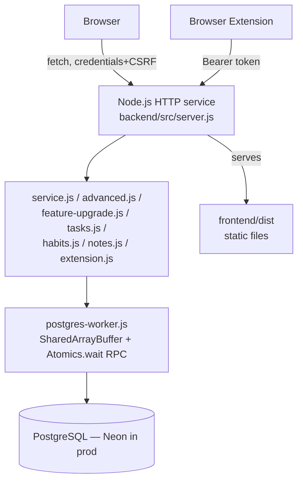
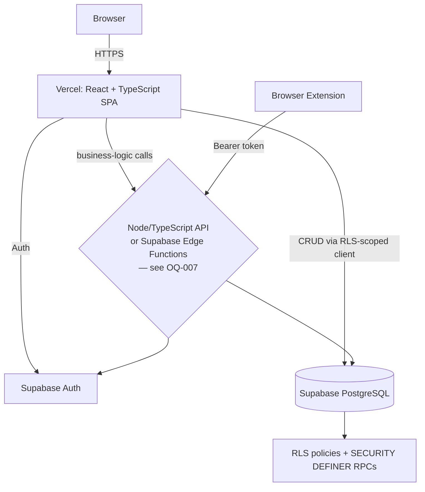

# Technical Requirements Document

## 1. Existing Technology Stack (CONFIRMED, repository evidence)

| Layer | Current Technology | Version | Location | Purpose |
|---|---|---|---|---|
| Backend runtime | Node.js | ≥24 (`engines.node`) | `backend/` | HTTP service, no framework |
| Backend HTTP | Hand-rolled routing | n/a | `backend/src/server.js` | Manual path/method dispatch |
| Database driver | `pg` (node-postgres) | `^8.22.0` | `backend/package.json` | Raw parameterized SQL |
| Database | PostgreSQL (Neon) | 17 (matches CI's `postgres:17-alpine`) | Neon (prod), local Postgres (dev) | System of record |
| ORM | None | — | — | Raw SQL throughout |
| Export library | `exceljs` | `^4.4.0` | `backend/package.json` | XLSX generation |
| Frontend framework | None (vanilla JS) | — | `frontend/src/` | DOM manipulation directly |
| Frontend build | Vite | `^8.3.0` | `frontend/package.json` | Bundles `frontend/src` → `frontend/dist` |
| Testing (unit/integration) | Node built-in `node --test` | Node ≥24 | `backend/test/`, `extension/tests/` | All non-browser tests |
| Testing (E2E/browser) | Playwright + `@axe-core/playwright` | `^1.62.1` / `^4.12.1` | `backend/e2e/` | Functional/a11y/visual/responsive |
| Testing utility | `linkedom` | `^0.18.13` | `backend/package.json` (devDep) | DOM parsing for extractor unit tests |
| CI | GitHub Actions | — | `.github/workflows/ci.yml` | 5-job pipeline |
| Hosting | Render | — | `render.yaml` | Single web service |
| Browser extension | Manifest V3, vanilla JS | — | `extension/` | Chrome/Edge capture tool |
| Package management | npm | — | 3 independent lockfiles (backend/frontend; extension has none) | |

No TypeScript anywhere in the current codebase. No React/Vue/Svelte. No
container/Dockerfile. No CDN, load balancer, or cache layer (evaluated and
explicitly rejected at current scale per `docs/FEATURE_UPGRADE_10_FINAL.md`'s
Performance Audit).

## 2. Existing Architecture



One deployable unit (Render). SQLite exists only as historical
migration/backup tooling, never a runtime path.

## 3. Target Architecture



Recommend simple architecture over microservices — the current app is a single
cohesive domain (job-search tracking) with no independent scaling needs between
its "modules"; splitting into services would add operational overhead with no
identified benefit. The one real architectural question (OQ-007) is whether a
thin server layer sits in front of Supabase for logic-bearing endpoints
(analytics, import/export, manager RPCs, extension endpoints) or whether those
become Supabase Edge Functions / Postgres functions directly — not whether to
adopt microservices (that option is not recommended at this scale).

## 4. Frontend Architecture (target)

```
frontend/src/
  app/            # app shell, providers, router setup
  pages/          # one file per ROUTE_SCREEN_INVENTORY.md screen
  components/     # shared UI primitives (button, table, dialog, drawer, toast)
  features/       # ported from features/*/format.js — pure logic, typed
    applications/
    analytics/
    checklist/
    contacts/
    dashboard/
    habits/
    import-export/
    notes/
    tasks/
  hooks/          # data-fetching hooks (React Query/SWR wrapping the Supabase client / API)
  lib/            # Supabase client init, API client, auth helpers
  services/       # thin wrappers per domain (applications, extension tokens, etc.)
  types/          # generated Supabase types + hand-written DTOs for API-layer responses
  utils/          # date/format helpers not already covered by features/*
```

Component boundaries: one page component per `ROUTE_SCREEN_INVENTORY.md` row;
shared components for patterns used across ≥2 pages (the generic tracker CRUD
UI, the dashboard widget shell, the preview drawer). Preserve the existing
`features/*/format.js` pure-function boundary exactly — these need typing, not
rewriting.

## 5. Backend Architecture (target, if a Node/TypeScript API layer is used per OQ-007)

```
server/
  routes/         # one file per API_INVENTORY.md domain group
  controllers/    # request/response handling
  services/       # ported business logic (BUSINESS_LOGIC_CATALOG.md rules)
  repositories/   # typed query layer (Supabase client or a query builder)
  middleware/     # auth, CSRF-equivalent (if still needed), error handling
  validators/     # per-domain field validation (schema-based, e.g. Zod)
  types/          # shared request/response types
```

If OQ-007 resolves toward "mostly direct Supabase client + RLS, thin
Edge-Functions for logic," this structure shrinks to just the routes/services
needed for analytics, import/export, manager RPCs, and extension endpoints —
decide before scaffolding either way.

## 6. API Requirements

Full inventory: `../API_INVENTORY.md` (80+ endpoints across 17 domain groups).
For every endpoint, port: method, path, purpose, auth model, request/response
shape, validation rules, error responses, affected tables, and — critically —
any documented business-logic side effect (`BUSINESS_LOGIC_CATALOG.md`). Do not
treat any endpoint as "just CRUD" without checking its `API_INVENTORY.md` row
for hidden side effects (e.g. the stage-change endpoint's transaction and
auto-rejection-row behavior).

## 7. Environment Variables

See `../ENVIRONMENT_MATRIX.md` for the full current + target table. Never copy
secret values — names only.

## 8. External Integrations

None beyond the platform itself — no third-party payment, email, or analytics
SaaS integration exists in JobQuest 1.0 today (confirmed: no such dependency in
either `package.json`). The only "external" actors are: (1) arbitrary job-board/
ATS pages the extension extracts from (read-only, client-side, no API
integration with those sites), and (2) the browser extension itself as a
first-party client of the JobQuest API.

## 9. Build System

Current: Vite (frontend only) + `node --check` (backend/extension syntax
validation, not real type-checking). Target: Vite (or Next.js's build) for the
frontend with real `tsc` type-checking; a TypeScript build step for any
Node/TypeScript API layer.

## 10. Testing System

See `../TESTING_STRATEGY.md` in full.

## 11. Logging

Current: `console.*` only, no external log aggregation; 500-level errors log
server-side detail, clients always get a generic message (see
`SECURITY_AUTHORIZATION.md`). Target: same discipline, plus whatever structured
logging Vercel/Supabase provide natively (both platforms have their own log
viewers) — no need to add a third-party logging SaaS unless a specific
observability gap is identified post-migration.

## 12. Error Handling

Current: per-request try/catch in `server.js`'s dispatcher, generic client-facing
messages for 5xx, specific validation messages for 4xx (`{errors: [...]}`
shape). Frontend: `go()`'s try/catch as a page-level boundary, per-form inline
error boxes, `toast()` for transient action failures with optimistic-UI
rollback. Target: preserve the same layered model — a page-level error boundary,
form-level inline errors, and toast-based transient-action feedback — using
React's error boundary primitive for the first layer.

## 13. Performance Requirements

No N+1 query patterns (confirmed absent today via direct audit — maintain this
bar). Bundle size: current production build is ~136KB JS (~38KB gzipped) — treat
any React rewrite's bundle size as worth measuring against this baseline, not
because a hard budget was set, but because it's a useful sanity check that a
component-framework migration hasn't introduced unexpected bloat.

## 14. Security Requirements

See `../SECURITY_AUTHORIZATION.md` in full — this is the authoritative security
requirements document for this migration.

## 15. Accessibility Requirements

WCAG 2.2 AA, zero-violation bar (matching current state) across every migrated
page, at every one of the 5 existing Playwright viewport projects.

## 16. Browser Compatibility

Modern evergreen browsers for the web app (no confirmed narrower ceiling exists
today). Chrome/Edge (Chromium, Manifest V3) for the extension — no Firefox/
Safari support exists or is in scope (explicitly out of scope per the original
Round 11 brief).

## 17. Data Migration Requirements

See `../docs/BACKEND_SCHEMA.md` §Data migration for the full step-by-step plan.

## 18. Deployment Requirements

Vercel (frontend), Supabase (DB/backend platform). Preview deployments per PR
(a genuinely new capability vs. today's single-environment Render setup). Gated
production deploy per `../APPROVAL_GATES.md` Gate 7.

## 19. Rollback Requirements

Neon database and Render service retained, untouched, through an agreed
retention window post-cutover (see `../APPROVAL_GATES.md` Gate 7/8,
`../MIGRATION_CHECKLIST.md` §Rollback). No destructive action against the legacy
system until Gate 8.

## 20. Observability Requirements

At minimum, carry forward the existing health-check pattern (`/api/health`,
`/api/ready` — fast, DB-independent liveness vs. DB-dependent readiness, a
deliberate distinction worth preserving since it's what let the current app
avoid false-failing during a Neon-suspend/reconnect cycle). Evaluate Vercel/
Supabase's native observability tooling before adding any third-party APM.

## 21. Non-Functional Requirements

- **NFR-001**: No regression in Playwright accessibility scan results (zero
  violations) across any migrated page.
- **NFR-002**: No regression in production bundle size beyond a 25% increase
  without an explicit, reviewed justification.
- **NFR-003**: Every RLS policy has both a positive and negative automated test
  before any real user data is migrated behind it.
- **NFR-004**: The migrated system's health/readiness endpoints must not
  false-fail during a Supabase connection-pool cold-start/reconnect event,
  mirroring the deliberate design already in place for Neon's autosuspend
  behavior.
- **NFR-005**: No secret value is ever logged, screenshotted, or committed —
  carry forward the existing CI secret-scanning gate.

## 22. Gate 01 Target Architecture (PROPOSED, 2026-09-23)

§3 (Target Architecture), §4 (Frontend) and §5 (Backend) above are the
pre-Gate-01 baseline. The Gate 01 proposal refines them. It resolves OQ-007
(hybrid boundary), chooses concrete libraries, and adds workspaces, the
username/password façade, the canonical workflow package and the event model.
See [`../GATE_01_ARCHITECTURE_PROPOSAL.md`](../GATE_01_ARCHITECTURE_PROPOSAL.md)
§1–§18. None of it is approved yet.

## 23. Gate 02B Frontend Component & State Architecture (PROPOSED, 2026-09-24)

Based on the completed Gate 02B UI/UX specifications (`../ui-design/gate-02b/`):

- **Component Layering:** Standardized on React 19 + TypeScript + Radix UI primitives (`@radix-ui/*`) styled via semantic Tailwind v4 tokens (`assets/jq.css`).
- **State Architecture:**
  - *Server State:* Managed by `@tanstack/react-query` with optimistic cache updates for rapid feedback (e.g. stage moves, task check-off).
  - *URL State:* Managed by `@tanstack/react-router` binding all table filters, sorts, saved views, and detail drawer IDs directly to URL query parameters.
  - *Local Form State:* Managed by `react-hook-form` + `zod` for zero-re-render typing performance and immediate client-side validation.
  - *No Global Store:* Global stores (Redux, Zustand) remain explicitly omitted; server state + router query state handle all cross-cutting data needs.
- **Accessibility & CSS Architecture:**
  - Zero inline styles in production React bundle.
  - Full WCAG 2.2 AA keyboard parity and focus-visible styling (`ACCESSIBILITY_MATRIX.md`).
  - Strict formula-injection sanitization for CSV/XLSX export generation via `@jobquest/export-utils`.
- **Extension Architecture:** Vanilla JS / Manifest V3 calling `/api/ext/v1` with scoped, expiring, pepper-hashed tokens and live workflow synchronization.

## 24. Gate 03 Database, Auth & RLS Architecture (APPROVED WITH REQUIRED CORRECTIONS, 2026-09-24)

Based on the completed and approved Gate 03 architecture and specifications (`../gate-03/`):

- **Database Engine & Primary Keys:** Supabase PostgreSQL with canonical UUIDv4 (`gen_random_uuid()`) primary keys across all 25 permanent target tables plus 2 migration tracking tables (27 total), backed by compound unique keys for multi-tenancy (`TARGET_SCHEMA.md`).
- **Engine-Level Multi-Tenancy:** Composite foreign keys `(id, workspace_id)` across child tables guarantee cross-workspace data isolation at the engine level where they materially prevent tenant leakage (`GATE_03_ARCHITECTURE.md` §4).
- **Authentication Strategy (Option A):** Node-controlled username/password login layered over Supabase Auth via internal synthetic identities (`id_<uuid>@auth.jobquest.internal`). Strict zero client leakage invariant; any browser-visible leak triggers immediate failure of Option A and activates the Option B architectural fallback protocol (`AUTHENTICATION_DESIGN.md` §2–3).
- **Session Transport & Security:** 4-tier CSRF defense-in-depth model; secure HttpOnly cookies managed via `@supabase/ssr`; rotating refresh tokens; 10 single-use recovery codes with >=128 bits CSPRNG entropy each; 30-day default claim code validity (`AUTHENTICATION_DESIGN.md` §5–7).
- **Row Level Security (RLS):** 6-tier classification taxonomy covering all 25 permanent tables; helper functions `is_workspace_member()` and `is_workspace_manager()`; strict peer isolation across all user activity tables (applications, contacts, interactions, job snapshots, tasks, habits, journals); manager coaching access to journals audited in `audit_events` (`AUTHORIZATION_RLS_DESIGN.md`).
- **Client Routing Contract:** Strict 3-tier boundary: Direct PostgREST (`supabase-js`) for reads/CRUD, Database RPCs for atomic multi-table mutations, Node Façade (`/api/*`) for auth, tokens, and file handling (`RPC_DOMAIN_OPERATIONS.md`).
- **Stored Aging Telemetry:** Persisted `last_activity_at TIMESTAMPTZ` on `applications` updated atomically via domain events and explicit `rpc_keep_application_active` with zero automatic mutations (`RPC_DOMAIN_OPERATIONS.md` §4).
