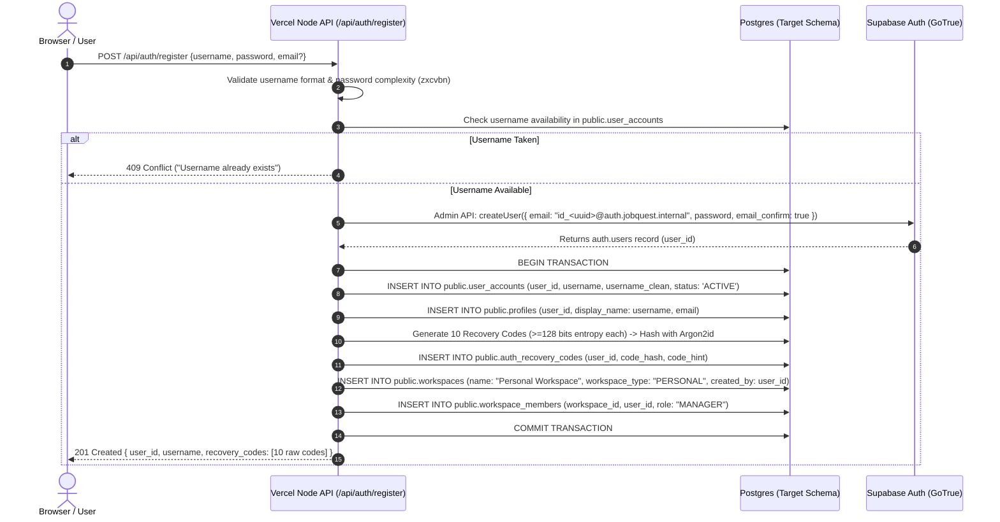

# JOBQUEST 2.0 — AUTHENTICATION DESIGN SPECIFICATION
**Document ID:** `JQ2-GATE03-AUTH-001`  
**Gate:** `Gate 03 — Database + Authentication + Authorization/RLS Design`  
**Status:** `PROVISIONALLY APPROVED SUBJECT TO M1 SPIKE (Post-Review Corrections Applied)`  
**M1 outcome (2026-09-24):** Option A **FAILED** in M1 (T03 synthetic identity leak through `/auth/v1/user`); see `../m1/M1_AUTH_OPTION_A_RESULT.md`. Option A text in this document is kept for history and is **SUPERSEDED**.  
**Related Documents:** [GATE_03_ARCHITECTURE.md](GATE_03_ARCHITECTURE.md), [TARGET_SCHEMA.md](TARGET_SCHEMA.md), [M1_SPIKE_PLAN.md](M1_SPIKE_PLAN.md)

---

## 1. Executive Summary & Approved Auth Constraints

JobQuest 2.0 requires a secure, modern authentication architecture that honors all established product decisions while eliminating the security liabilities of JobQuest 1.0 (plain 4-digit PINs, unauthenticated API access, absence of multi-tenancy).

### Approved Product Decisions Enforced:
1. **Username:** REQUIRED (case-insensitive unique identifier, 3–32 chars, `^[a-zA-Z0-9_.-]+$`).
2. **Password:** REQUIRED (minimum 10 characters, zxcvbn score >= 2 or standard complexity rules).
3. **Email:** OPTIONAL (for notifications/alerts only; not used as primary login credential; verified if supplied).
4. **Phone:** OPTIONAL (for SMS notifications/alerts if configured later).
5. **Self-Registration:** REQUIRED (open registration with rate limiting and automated personal workspace provisioning).
6. **PIN:** RETIRED. Legacy PIN values or hashes MUST NEVER become passwords or be used for authentication.
7. **Multi-Workspace Tenancy:** A user may hold memberships across multiple workspaces (e.g., `USER` in Workspace A, `MANAGER` in Workspace B). Auth identity is decoupled from workspace membership.

---

## 2. Architectural Analysis: Option A vs. Option B

### Option A: Node-Controlled Username/Password Layered Over Supabase Auth (Synthetic Internal Identity)

In Option A, the frontend interacts with a Node.js Auth Façade (`/api/auth/*`) running on Vercel Serverless. The Node backend uses the Supabase Admin Service Role client to map the user's public username to an internal synthetic identity in `auth.users` (e.g., `id_<uuid>@auth.jobquest.internal`).

```
+-----------------------------------------------------------------------------------+
| BROWSER / CLIENT                                                                  |
| (Enters: username + password)                                                     |
+----------------------------------------+------------------------------------------+
                                         | POST /api/auth/login
                                         v
+-----------------------------------------------------------------------------------+
| VERCEL NODE.JS AUTH FAÇADE (Serverless)                                           |
| 1. Rate limit check (IP + username)                                               |
| 2. Resolve username -> auth.users.id via public.user_accounts                      |
| 3. Authenticate with Supabase Auth GoTrue using internal synthetic email:        |
|    "id_<uuid>@auth.jobquest.internal" + user password                             |
| 4. Issue standard Supabase Session JWT & Refresh Token via HttpOnly Secure Cookie |
+----------------------------------------+------------------------------------------+
                                         | Returns Set-Cookie (sb-access-token, etc.)
                                         v
+-----------------------------------------------------------------------------------+
| DIRECT SUPABASE CLIENT (Browser)                                                  |
| - Uses native supabase-js client with access token from session                   |
| - auth.uid() resolves directly to the user's UUID in Postgres                     |
| - Native RLS policies execute without custom JWT signing overhead                |
+-----------------------------------------------------------------------------------+
```

#### Detailed Evaluation of Option A:
* **`auth.uid()` & Native RLS:** 100% native compatibility. Postgres RLS `auth.uid()` immediately returns the authenticated user's UUID.
* **Internal Identity Isolation:**
  * The synthetic email (e.g., `id_<uuid>@auth.jobquest.internal`) exists exclusively in `auth.users`.
  * The public mapping table (`public.user_accounts`) stores the public username and account status. It **MUST NOT** store duplicate password hashes (passwords are owned strictly by Supabase Auth).
  * The user profile table (`public.profiles`) stores user presentation data and optional notification email.
  * Supabase project email confirmations and template dispatching are disabled via GoTrue configuration (`ENABLE_EMAIL_AUTOCONFIRM=true`, `MAILER_AUTOCONFIRM=true`).
* **Session Lifecycle & Refresh:** Managed natively by Supabase Auth (`supabase-js` and `@supabase/ssr`). Tokens refresh automatically via Supabase GoTrue token endpoint or Node proxy.
* **Revocation & Logout:** Global revocation supported natively via `supabase.auth.admin.signOut(uid, 'global')`.
* **Direct Browser Queries:** Enabled. Read operations and standard CRUD can go directly from browser `supabase-js` to PostgREST with full RLS enforcement.

---

### Option B: Custom Node.js Auth Façade (Independent JWTs / Supported Integrations)

In Option B, Supabase Auth GoTrue is bypassed for credential validation. The Node.js backend handles password verification (Argon2id) and establishes sessions.

#### Supported Evaluation Paths for Option B (Evaluated at M1 if triggered):
Rather than prematurely locking Option B into a single custom symmetric-JWT secret architecture, the project will evaluate the safest and most maintainable currently supported Supabase mechanisms, including:
1. **Externally Minted JWTs:** Node signs asymmetric JWTs (RS256 / EdDSA) with JWKS verification in Supabase PostgREST.
2. **Imported Signing Keys:** Providing PostgREST with custom claims mapping.
3. **Supabase-JS `accessToken` Injection:** Passing externally issued tokens to browser clients for direct PostgREST RLS evaluation.
4. **Native PostgREST/RLS Compatibility:** Ensuring `auth.uid()` or `request.jwt.claims` binds cleanly to tenancy functions.

---

## 3. Recommendation & Decision: Option A (Provisional) with Option B Architectural Fallback

### Status: PROVISIONALLY APPROVED SUBJECT TO M1 SPIKE
**Option A** is provisionally approved. It is **NOT** considered proven until demonstrated in the Milestone 1 (M1) Spike.

### Critical Zero-Identity-Leakage Requirement:
If the internal/synthetic Supabase email or identity (`id_<uuid>@auth.jobquest.internal`) appears anywhere accessible to the browser or user, including:
1. Supabase session user object (`supabase.auth.getSession()` or `getUser()`)
2. Decoded JWT claims accessible in client
3. API responses or payload bodies
4. React state or memory stores
5. Browser LocalStorage or SessionStorage
6. Client-visible error stacks or debug output
7. Browser-visible HTTP network headers or responses

Then the **"zero identity leakage" requirement FAILS**. This failure triggers immediate rejection of Option A. The project will **NOT** attempt to hide synthetic identities cosmetically.

### Architectural Fallback Protocol (Not Runtime Failover):
* **Clarification:** Option B is an **architectural fallback decision**, NOT an automatic production runtime failover.
* **Protocol:** If Option A fails the M1 acceptance tests, the project architecture decision officially changes to **Option B** before product implementation continues. No application code will be built upon an unverified or leaky auth foundation.

---

## 4. Account Provisioning & Registration Flow



---

## 5. Session Management & CSRF Defense-in-Depth

Session transport employs a comprehensive defense-in-depth model configured via `@supabase/ssr` and Node serverless middleware:

1. **Secure Cookie Transport:**
   * `sb-access-token`: HttpOnly, Secure, SameSite=Lax, Path=/, Domain-scoped. Lifespan: 1 hour.
   * `sb-refresh-token`: HttpOnly, Secure, SameSite=Strict, Path=/api/auth, Domain-scoped. Lifespan: 30 days (sliding).
2. **CSRF Defense-in-Depth (Multi-Layered):**
   * *Layer 1 (Cookie Isolation):* `SameSite=Lax` on session cookies ensures ambient cookies are not sent on cross-site sub-resource requests or cross-site form submissions.
   * *Layer 2 (Origin & Referer Verification):* Node middleware strictly verifies that incoming mutation requests (`POST`, `PUT`, `PATCH`, `DELETE`) possess `Origin` or `Referer` headers matching the application's trusted production/preview domain.
   * *Layer 3 (Custom Header & Anti-CSRF Token):* Mutation endpoints require custom request header `X-Requested-With: XMLHttpRequest` or a cryptographically verified synchronizer Anti-CSRF token.
   * *Layer 4 (Content-Type Enforcement):* API routes require and enforce `Content-Type: application/json`, preventing simple HTML `<form>` submission bypasses.
3. **Multi-Tab Synchronization:**
   * Browser tabs synchronize auth state changes using the `BroadcastChannel('jobquest-auth')` API. Emits session renewal and logout signals across tabs without ever placing raw JWTs into `localStorage`.

---

## 6. Recovery Codes Specification (10 Single-Use Codes, >=128-bit Entropy)

Every user account is provisioned with 10 single-use emergency recovery codes upon registration:

* **Entropy & Generation Requirement:**
  * Each recovery code is generated with **>= 128 bits of cryptographically secure random entropy** (`crypto.randomBytes(16)` or higher).
  * Raw codes are encoded using human-safe, unambiguous Crockford Base32 characters or formatted character blocks (e.g., `7K9M-X2P4-W8V1-N6Q3`), precluding ambiguous characters (`0`, `O`, `1`, `I`, `L`).
  * The system **never** generates random bytes and truncates them into weak short codes.
* **Storage Security:** Raw codes are displayed to the user **exactly once** during account creation or explicit code regeneration. The database stores strictly the Argon2id salted hash of each code in `public.auth_recovery_codes`.
* **Consumption Model:**
  * When a recovery code is used to reset credentials, its database record is updated: `is_used = TRUE`, `used_at = NOW()`, `used_ip = client_ip`.
  * The code is immediately consumed and cannot be replayed.
  * Password reset via recovery code automatically revokes all existing active sessions.
* **Regeneration:**
  * A user may regenerate a fresh set of 10 recovery codes from Account Settings (requiring current password re-authentication).
  * Regeneration invalidates all existing unused codes (`DELETE FROM public.auth_recovery_codes WHERE user_id = $1`).
  * Emits an `auth.recovery_codes_regenerated` security audit event.

---

## 7. Legacy Account Claim Architecture (30-Day Default Expiry)

Legacy JobQuest 1.0 accounts (which utilized 4-digit PINs) must transition to modern username/password credentials. Legacy PIN hashes are **strictly retired and never reused**.

```
+-----------------------------------------------------------------------------------+
| 1. ADMIN / MIGRATION SETUP                                                        |
| - Legacy users migrated to target database in STAGED status                       |
| - Secure high-entropy claim token generated: "jqc_live_<48 random base64 chars>"  |
| - SHA-256 hash stored in public.legacy_claim_codes                                |
| - Default expiration = 30 DAYS (reissuable by operator upon expiration)           |
+----------------------------------------+------------------------------------------+
                                         | Secure claim link delivered to legacy user
                                         v
+-----------------------------------------------------------------------------------+
| 2. USER CLAIM REDEMPTION (/claim-account?token=...)                               |
| - User enters claim token                                                         |
| - Verifier hashes token and matches unexpired, unused record (expires_at > NOW()) |
| - Rate limited to 5 attempts per IP per hour                                      |
+----------------------------------------+------------------------------------------+
                                         | Valid token
                                         v
+-----------------------------------------------------------------------------------+
| 3. IDENTITY CREATION & PASSWORD PROVISIONING                                      |
| - User chooses new Username + strong Password (PIN is NEVER requested or used)    |
| - Supabase Auth identity provisioned                                              |
| - public.legacy_claim_codes marked: claimed_at = NOW(), claimed_by = new_user_id  |
| - Migrated applications, contacts, and notes bound to newly activated user_id     |
| - 10 new Recovery Codes (>=128 bits entropy each) generated and displayed         |
+-----------------------------------------------------------------------------------+
```

---

## 8. Extension Authentication Architecture

The JobQuest Chrome Extension interacts with JobQuest 2.0 via dedicated, revocable API tokens rather than user passwords or interactive web session cookies.

### Token Characteristics:
* **Token Format:** `jqe_live_<40-random-hex-chars>` (provides >160 bits of cryptographic entropy).
* **Storage:**
  * **Database:** `public.extension_tokens` stores the deterministic **SHA-256 hash** of the raw token (`token_hash = encode(sha256(raw_token), 'hex')`). Raw tokens are NEVER stored in the database.
  * **Client:** The extension stores the raw token in `chrome.storage.local` (encrypted at rest by the operating system user profile).
* **Token Scope & Workspace Binding:**
  * Each extension token is explicitly bound to a single `(user_id, workspace_id)`.
  * Scopes are restricted: `applications:capture`, `jobs:snapshot`. Tokens cannot perform user management, workspace administration, or cross-workspace mutations.
* **Verification Flow:**
  1. Extension includes header: `Authorization: Bearer jqe_live_...`.
  2. Node Façade computes `sha256(raw_token)`.
  3. Queries `public.extension_tokens WHERE token_hash = $hash AND revoked_at IS NULL AND expires_at > NOW()`.
  4. Updates `last_used_at = NOW()`.
  5. Authorizes capture strictly within the token's bound `workspace_id`.
* **Revocation:** Users can view active extension tokens (with device label and last active timestamp) in Web Settings and click "Revoke" at any time.

---

## 9. Comprehensive Rate Limiting Specification

Rate limiting is enforced defensively across three tiers:
```
[ Tier 1: Cloudflare / Vercel Edge WAF ] -> DDoS mitigation, global IP burst rate
                    |
[ Tier 2: Vercel Serverless Middleware ]  -> Upstash Redis / Sliding Window Rate Limiter
                    |
[ Tier 3: Database Security Tables ]     -> Failed attempt lockouts (public.user_accounts)
```

### Rate Limiting Limits by Operation:

| Endpoint / Operation | Rate Limit Window | Max Attempts | Action on Exceeded | Alert / Audit |
| :--- | :--- | :--- | :--- | :--- |
| **User Login (`/api/auth/login`)** | 15 minutes | 5 per IP / Username | 15-min lockout; CAPTCHA required | Audit log `auth.login_locked` |
| **Self-Registration (`/api/auth/register`)** | 1 hour | 3 per IP | 429 Too Many Requests | Monitor for bulk bot creation |
| **Recovery Code Reset (`/api/auth/recover`)** | 1 hour | 3 per account | 1-hour account lockout | High-severity security event |
| **Legacy Claim Attempt (`/api/auth/claim`)** | 1 hour | 5 per IP | 429 Too Many Requests | Audit log `auth.claim_throttled` |
| **Extension Capture (`/api/extension/*`)** | 1 minute | 30 per token | 429 Throttled | Normal API operational limit |
| **Bulk Import / Export** | 1 hour | 5 per workspace | Queued / Throttled | Manager audit log |
| **Password Change (Authenticated)** | 1 hour | 3 per user | Require re-authentication | Security audit log |

---

## 10. Security Boundary & Service Role Isolation

* **Rule 1:** The Supabase `service_role` key **MUST NEVER** be present in client-side code, React components, browser bundles, or extension source code.
* **Rule 2:** The `service_role` key is strictly restricted to serverless Node functions executing inside the Vercel backend (`process.env.SUPABASE_SERVICE_ROLE_KEY`).
* **Rule 3:** Server-side functions using `service_role` must enforce explicit authorization and permission checks in application code before performing any privileged mutation.
* **Rule 4:** The browser extension uses exclusively `jqe_live_...` extension tokens, never web session cookies or service keys.
