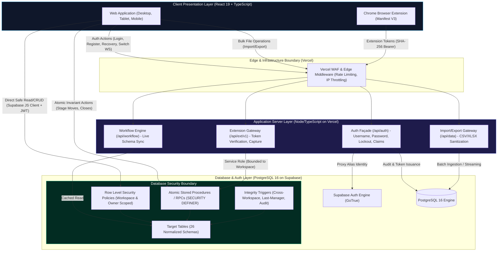
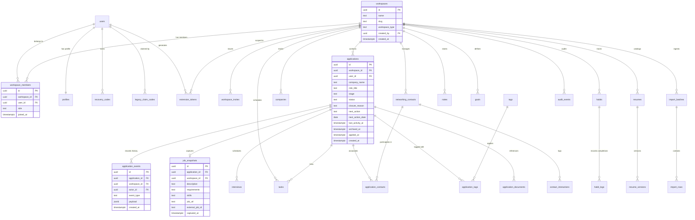

# JobQuest 2.0 · Gate 03: System & Data Architecture

| Metadata | Specification |
|---|---|
| **Author** | Senior Software / Product Architect & Security Engineer |
| **Status** | **PROPOSED** — Awaiting formal user approval |
| **Architectural Milestone** | Gate 03: Database + Authentication + Authorization/RLS Design |
| **Target Infrastructure** | PostgreSQL 16+ (Supabase) + Node.js 20+ TypeScript API (Vercel) |

---

## 1. System Topology & Architecture Overview

JobQuest 2.0 implements a **Hybrid Backend Architecture** (ADR-009, approved in Gate 01). This topology balances development velocity and low latency for routine queries against strict server-side encapsulation for security-critical, state-machine, and integration workflows.



### Three-Tier Boundary Contract
1. **Direct Supabase Access (Client-to-Database):**
   - The React client communicates directly with PostgreSQL via `@supabase/supabase-js` for routine, owner-scoped read and write operations on standard entities (e.g. browsing applications, filtering contacts, toggling habit check-ins, searching notes).
   - Security is **100% enforced by PostgreSQL Row Level Security (RLS)** using `auth.uid()` and verified workspace membership. Client queries cannot breach tenant or user isolation boundaries even if tampered with.
2. **Atomic Database RPCs (Client-to-RPC):**
   - Invariant-heavy workflows that mutate multiple tables simultaneously (moving an application stage, recording terminal outcomes, soft-archiving, restoring, keeping active, or scheduling interviews) are routed to transactional `SECURITY DEFINER` stored procedures.
   - These procedures validate workspace permissions, execute transactional state transitions, update `last_activity_at`, append immutable event records to `application_events`, and record manager audit trails atomically.
3. **Node/TypeScript API Façade (Client-to-Node-to-Database):**
   - Workflows involving external secrets, high-entropy token hashing, complex validation, or infrastructure concerns are routed through a thin Node/TypeScript backend.
   - **Authentication:** Username-to-alias mapping, brute-force lockout, single-use recovery code verification, and legacy account claiming.
   - **Browser Extension Gateway (`/api/ext/v1`):** Extension token verification, duplicate checking, and atomic capture.
   - **Data Portability:** Streaming CSV/XLSX imports with formula-injection neutralization and downloadable `import_errors.csv` generation.

---

## 2. Target Schema Entity-Relationship (ER) Architecture

The target database architecture consolidates the legacy 33-table Neon schema into **25 permanent production tables** plus **2 dedicated migration-tracking tables** (`migration_batches`, `migration_id_mappings`):



---

## 3. Primary Key & Identifier Strategy: UUIDv4 Standard (UUIDv7 Superseded)

### Architectural Evaluation
JobQuest 1.0 utilized auto-incrementing integer primary keys (`INTEGER PRIMARY KEY AUTOINCREMENT` in SQLite; `SERIAL PRIMARY KEY` in Neon). While simple, sequential integer IDs leak business metrics (e.g. application counts, account creation velocity), facilitate scraping attacks via ID enumeration, and complicate multi-workspace data merging.

### Final Approved Decision (ADR-031): **UUIDv4 Standard**
- **Approved Identifier Standard:** **UUIDv4** using PostgreSQL's built-in `gen_random_uuid()` is adopted as the canonical primary identifier standard across all JobQuest 2.0 tables.
- **Rationale for Change:**
  1. **Mature, Native Engine Support:** Fully supported out-of-the-box in PostgreSQL and Supabase without custom PL/pgSQL extensions or external generator functions.
  2. **Operational Simplicity & Portability:** Eliminates runtime extension dependencies and simplifies client-side ID generation.
  3. **Performance Suitability:** For JobQuest's operational scale (single users and small coaching workspaces, thousands of applications), standard UUIDv4 B-tree indexes provide more than adequate performance without measurable index degradation.
- **Status of Previous Proposal:** The initial Gate 03 proposal to adopt UUIDv7 is officially marked **`SUPERSEDED`** (retained in historical records; not deleted).
- **Traceability Guarantee:** Legacy auto-incrementing integer IDs from JobQuest 1.0 are **never converted into UUIDs on the fly**. Instead, every migrated table carries a dedicated, indexed `legacy_id INTEGER NULL` column to guarantee 100% deterministic audit, reconciliation, and rollback traceability.


---

## 4. Multi-Workspace Isolation & Cross-Workspace Integrity

### 4.1 Tenancy Hierarchy
Multi-tenancy in JobQuest 2.0 is enforced at the database row level rather than through separate schemas or databases:
1. `workspaces` represents the security boundary.
2. Every domain entity table (`applications`, `contacts`, `tasks`, `habits`, `notes`, `goals`, `resumes`, `audit_events`, `extension_tokens`) carries an explicit `workspace_id UUID NOT NULL REFERENCES workspaces(id) ON DELETE CASCADE`.
3. An active user may belong to multiple workspaces with independent roles (`workspace_members.role` = `USER` or `MANAGER`).

### 4.2 Cross-Workspace Reference Prevention
A critical security risk in relational multi-tenant systems is cross-workspace reference leakage (e.g. a Task in Workspace A linking to an Application in Workspace B). JobQuest 2.0 enforces cross-workspace integrity through **Compound Foreign Key Constraints**:

```sql
-- Architectural Pattern: Compound Workspace Foreign Key
-- 1. Applications table exposes a unique constraint on (id, workspace_id):
ALTER TABLE applications 
  ADD CONSTRAINT uq_applications_id_workspace UNIQUE (id, workspace_id);

-- 2. Tasks table references BOTH id and workspace_id:
ALTER TABLE tasks 
  ADD CONSTRAINT fk_tasks_application_workspace 
  FOREIGN KEY (application_id, workspace_id) 
  REFERENCES applications (id, workspace_id) 
  ON DELETE SET NULL;
```
By enforcing compound foreign keys across parent-child relationships (`application_events`, `interviews`, `job_snapshots`, `tasks`, `application_contacts`), the PostgreSQL storage engine **physically rejects** any insert or update where the foreign entity belongs to a different workspace, eliminating dependence on application-layer validation.

---

## 5. Active Workspace Context vs. Authorization Authority

A fundamental security principle established in Gate 03:
> **Active Workspace is a UX and session presentation filter — NEVER the authorization authority.**

- **The Danger of Trusting Client Workspace State:** If RLS policies derived permissions from a client-provided JWT claim or HTTP header (e.g. `X-Active-Workspace-ID`), a malicious client could tamper with the header to spoof access to another tenant.
- **The Correct Authorization Model:**
  - Authorization derives strictly from the authenticated identity (`auth.uid()`) and the immutable join table `workspace_members`:
    ```sql
    -- Standard RLS Membership Verification Predicate:
    EXISTS (
      SELECT 1 FROM workspace_members wm
      WHERE wm.workspace_id = target_table.workspace_id
        AND wm.user_id = auth.uid()
        AND (wm.role = 'MANAGER' OR target_table.user_id = auth.uid())
    )
    ```
  - The client's "Active Workspace" is simply passed as an ordinary query filter (`.eq('workspace_id', activeWorkspaceId)`) to focus the view. Even if a user omits or manipulates this filter, RLS guarantees they can only receive rows from workspaces where they hold active membership.

---

## 6. Durable Attribution & Member Removal Semantics

Approved product decision (ADR-010, OQ-020):
> When a member is removed from a shared workspace, their access is immediately revoked, but all records they created (applications, contacts, notes, timeline events) remain in the workspace with full historical attribution.

### Database Realization
1. **Separation of Membership from Ownership:**
   - Record ownership is tracked by `applications.user_id REFERENCES users(id) ON DELETE RESTRICT`.
   - Workspace access is controlled by `workspace_members (workspace_id, user_id)`.
2. **Removal Action:**
   - Removing a member executes `DELETE FROM workspace_members WHERE workspace_id = $1 AND user_id = $2`.
   - The removed user's record rows in `applications`, `tasks`, and `notes` **remain untouched**. Their `user_id` continues to point to the user's profile record.
3. **Post-Removal Authorization Effect:**
   - The removed user instantly fails the RLS membership predicate and can no longer view or query the workspace.
   - The remaining `MANAGER` members can still view and manage all applications created by the departed member. The UI displays the departed member's name with an `Inactive Member` pill (W1).
   - Foreign keys to `users(id)` use `ON DELETE RESTRICT`, preventing accidental hard deletion of user accounts that own active workspace data.

---

## 7. Service-Role Boundary & Privilege Isolation

Supabase provides a powerful `service_role` key that bypasses all PostgreSQL RLS policies. Gate 03 establishes strict architectural boundaries:

1. **Zero Client Exposure:**
   - The `service_role` secret is **strictly restricted to server-side Node.js environments** (Vercel Serverless Functions).
   - It is never compiled, bundled, or transmitted to the React client, browser extension, or mobile views.
2. **Explicit Authorization Checks in Node:**
   - Because `service_role` operations bypass RLS, any Node.js endpoint utilizing this client (e.g. `/api/ext/v1/capture`, `/api/data/import`) **must execute its own explicit authorization and tenant boundary checks** before modifying data.
3. **Least Privilege Principle:**
   - Database RPCs and atomic procedures executed by standard users are invoked using the standard authenticated user JWT (`anon` or `authenticated` role). `SECURITY DEFINER` procedures explicitly check `auth.uid()` and enforce fixed `SET search_path = public, pg_temp;`.
