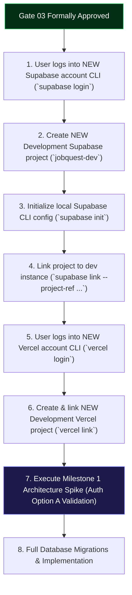

# JobQuest 2.0 · Gate 03: Database + Authentication + Authorization/RLS Design

| Metadata | Specification |
|---|---|
| **Gate** | Gate 03: Database + Authentication + Authorization/RLS Design |
| **Status** | **APPROVED WITH REQUIRED CORRECTIONS** — Formal Gate 03 Review Finalized |
| **Preceding Approved Gates** | Gate 01 (Architecture), Gate 02A (Visual Direction D), Gate 02B (UI/UX Specifications) |
| **Target Engine** | PostgreSQL 16+ on Supabase |
| **Hosting & API Layer** | Hybrid Architecture: Supabase Client (Direct RLS CRUD) + Node/TypeScript API on Vercel |
| **Design Package Root** | [`migration-upgrade/gate-03/`](file:///c:/Users/krapa/Documents/Job%20Search/JobTrackerProjects/JobQuest2.0/migration-upgrade/gate-03/) |

---

## 1. Executive Summary

Gate 03 translates the approved JobQuest 2.0 product requirements, visual system (Direction D · JobQuest Hybrid), and exhaustive Gate 02B UI/UX specifications into a comprehensive, production-ready **data, authentication, and authorization architecture**.

### Core Architectural Invariants Established
1. **Multi-Workspace Tenancy:** Full schema-level multi-tenancy. Users belong to $N$ workspaces with independent roles (`USER` vs. `MANAGER`).
2. **Strict Own-Record Isolation:** Within shared workspaces, `USER` members can view, mutate, and export only permitted **own** records (enforced across applications, contacts, contact interactions, job snapshots, tasks, habits, and journals). `MANAGER` members have workspace-wide oversight with mandatory audit logging for cross-user mutations and journal coaching.
3. **Decoupled Pipeline Architecture:** Complete normalization of the legacy 13-stage monolith into **Stage (8 canonical pipeline positions)**, **Outcome / Status (Open + 5 terminal outcomes)**, and **Scheduled Next Action**.
4. **Structured Closure Reasons:** Outcome `WITHDRAWN` supports structured closure reasons including `OFFER_DECLINED` (displayed in UI as *"Offer declined"*, ADR-028), avoiding status proliferation while preserving analytical fidelity. Employer role cancellations map cleanly to `POSITION_CLOSED`.
5. **Append-Only Event Sourcing:** Unified `application_events` store powers historical funnel analytics ("ever reached") independently of current pipeline state.
6. **Dual Telemetry Aging:** `last_activity_at` indexed timestamp drives the 15–30 day Stale indicator and 31+ day Long Waiting review queue. Actionable review choices (`Keep Active`, `Mark Ghosted`, `Archive`) enforce **zero automatic mutations**.
7. **Username + Password Authentication:** Fully satisfies the product requirement for username-first login with optional email/phone and retired numeric PINs. Evaluates **Auth Option A** (layered Supabase Auth with internal hidden alias) vs. **Auth Option B** (Node auth façade), establishing Option A as **Provisionally Approved Subject to M1 Spike** with zero-leakage hard-fail criteria.
8. **100% Legacy Parity:** Maps **all 33 verified legacy database tables** (Neon/Postgres) into a clean, normalized target schema of **25 permanent target tables** plus **2 dedicated migration tracking tables** (27 total), built on canonical **UUIDv4 (`gen_random_uuid()`)** primary keys with complete migration traceability.

---

## 2. Gate 03 Specification Document Map

The complete Gate 03 architectural suite is organized into 14 modular specifications:

| Document | Purpose & Core Content | Key References |
|---|---|---|
| **[GATE_03_FINAL_APPROVAL_REPORT.md](GATE_03_FINAL_APPROVAL_REPORT.md)** | Canonical comprehensive Gate 03 Approval Report containing all final architectural decisions, review corrections, and audit facts. | §1–§30 |
| **[NEXT_AGENT_HANDOFF.md](NEXT_AGENT_HANDOFF.md)** | Standalone cross-agent transition and continuation guide for resuming in M1 without chat history dependency. | §1–§23 |
| **[GATE_03_ARCHITECTURE.md](GATE_03_ARCHITECTURE.md)** | Master architectural synthesis, system boundaries, Mermaid ER diagram, UUIDv4 strategy, and cross-workspace integrity. | §1–§6 |
| **[TARGET_SCHEMA.md](TARGET_SCHEMA.md)** | Exhaustive target catalog: 25 permanent tables + 2 migration tables, column data types, constraints, foreign key actions, indexes, and retention rules. | §1–§27 |
| **[LEGACY_TABLE_MAPPING.md](LEGACY_TABLE_MAPPING.md)** | Definitive mapping of **all 33 legacy tables** to target tables (Keep, Modify, Split, Merge, Replace, Retire). | All 33 Tables |
| **[AUTHENTICATION_DESIGN.md](AUTHENTICATION_DESIGN.md)** | Deep-dive on Auth Option A vs. Option B, internal alias zero-leakage hard fail, session transport, password policies, >=128-bit recovery codes, 30-day claim codes, 4-tier CSRF defense, and rate limiting. | ADR-030, ADR-038, ADR-039 |
| **[AUTHORIZATION_RLS_DESIGN.md](AUTHORIZATION_RLS_DESIGN.md)** | Tenant authorization model, role matrix, peer-isolation across all Tier-3 tables, complete RLS policy catalog for all tables, and active workspace session context. | ADR-032, ADR-036, ADR-037 |
| **[RPC_DOMAIN_OPERATIONS.md](RPC_DOMAIN_OPERATIONS.md)** | Client access boundaries (Direct Supabase vs. RPC vs. Node API) and catalog of atomic transactional database functions. | ADR-033, ADR-034, ADR-035, ADR-042 |
| **[DATA_MIGRATION_DESIGN.md](DATA_MIGRATION_DESIGN.md)** | Legacy extraction, transformation, and load pipeline; OQ-012 resolution (*"JobQuest (Migrated)"* workspace); verified 13-stage legacy mapping; idempotency. | ADR-041 |
| **[SECURITY_THREAT_MODEL.md](SECURITY_THREAT_MODEL.md)** | Formal threat model analyzing 18 attack vectors (enumeration, brute force, token theft, 4-tier CSRF defense, privilege escalation, cross-workspace leakage). | §1–§18 |
| **[TEST_MATRIX.md](TEST_MATRIX.md)** | Verification strategy, comprehensive RLS test matrix (9 access scenarios per table), RPC atomicity tests, and migration validation checklist. | §1–§7 |
| **[M1_SPIKE_PLAN.md](M1_SPIKE_PLAN.md)** | Focused Milestone 1 architecture spike specification: 7 foundational tables, 12 exact test conditions for Auth Option A, zero-leakage tests, canonical workflow test, and Option B architectural fallback protocol. | ADR-030 |
| **[GATE_03_DECISIONS.md](GATE_03_DECISIONS.md)** | Catalog of 13 approved Gate 03 Architectural Decision Records (ADR-030 through ADR-042). | ADR-030–042 |

---

## 3. Account & Infrastructure Switch Checklist (Post-Approval)

Per user directive, **no infrastructure setup or CLI logins are performed during Gate 03**. Upon formal user approval of Gate 03, the following sequence will govern the initialization of fresh development accounts:

### Execution Steps for Milestone 1 Kickoff
1. **Supabase CLI Authentication:** Run `npx supabase login` with the newly provisioned Supabase account credentials.
2. **Project Provisioning:** Create a fresh project named `jobquest2-dev` in the Supabase Dashboard.
3. **Local CLI Linking:** Execute `npx supabase link --project-ref <dev-ref>` from the `JobQuest2.0` repository root.
4. **Vercel CLI Authentication:** Run `npx vercel login` with the newly provisioned Vercel account.
5. **Project Linking:** Link local development directory to the Vercel project via `npx vercel link`.
6. **M1 Architecture Spike Execution:** Apply M1 spike migrations (`00001_m1_core_identity.sql`) and run the automated test suite in [`M1_SPIKE_PLAN.md`](M1_SPIKE_PLAN.md).
