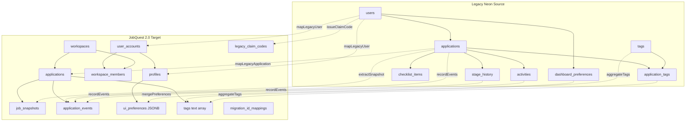

# M15-C Final Source-to-Target Mapping Manifesto

**Milestone:** M15-C (Legacy Neon Backup, Read-Only Export, Real-Schema Reconciliation & Production Migration Pre-Flight)  
**Governance:** Feature Freeze Active  
**Authoritative Migration Tool:** `scripts/migrate-legacy-data.mjs`  
**Status:** **FINALIZED & VALIDATED**

---

## 1. Architectural Architecture Overview

The legacy JobQuest 1.0 schema was a monolithic single-tenant database with integer auto-increment primary keys. JobQuest 2.0 employs a modern multi-tenant architecture utilizing UUIDv4 keys, row-level security (RLS), workspace scoping, and decoupled lifecycle status models.

---

## 2. Definitive Field-Level Mapping Specifications

### 2.1 Domain: User Identity & Workspaces

#### Target Entity: `public.user_accounts`
| Source Field | Target Field | Data Type | Transform / Default Logic |
| :--- | :--- | :--- | :--- |
| *generated* | `id` | `uuid` | `gen_random_uuid()` (Mapped 1:1 to legacy user `1`) |
| `users.email` | `email` | `text` | If `users.email` is null: `${cleanUsername}@legacy.jobquest.local` |
| `users.created_at` | `created_at` | `timestamptz` | `COALESCE(parseLegacyDate(created_at), NOW())` |
| `users.updated_at` | `updated_at` | `timestamptz` | `COALESCE(parseLegacyDate(updated_at), NOW())` |

#### Target Entity: `public.profiles`
| Source Field | Target Field | Data Type | Transform / Default Logic |
| :--- | :--- | :--- | :--- |
| `user_accounts.id` | `id` | `uuid` | FK to `user_accounts.id` |
| `users.username` | `handle` | `text` | Cleaned alphanumeric handle: `'jack'` |
| `users.username` | `full_name` | `text` | Defaulted to `'jack'` |
| `users.id` | `legacy_user_id`| `integer` | Recorded as `1` for historical audit & provenance |
| `users.theme_preference` + `dashboard_preferences` | `ui_preferences` | `jsonb` | Merged JSON: `{"theme": "dark", "week_start": 1, ...}` |
| `users.created_at` | `created_at` | `timestamptz` | Preserved timestamp |

#### Target Entity: `public.workspaces` & `public.workspace_members`
| Source Field | Target Field | Data Type | Transform / Default Logic |
| :--- | :--- | :--- | :--- |
| *option* | `workspaces.id` | `uuid` | Target workspace UUID (e.g. `018f0000-0000-4000-8000-000000000001`) |
| *option* | `workspaces.name` | `text` | Migrated workspace display name |
| `user_accounts.id` | `workspaces.owner_id` | `uuid` | Assigned to migrated user account |
| `user_accounts.id` | `workspace_members.user_id` | `uuid` | Assigned |
| `users.role` | `workspace_members.role` | `text` | Normalized to `'admin'` |

#### Target Entity: `public.legacy_claim_codes`
| Source Field | Target Field | Data Type | Transform / Default Logic |
| :--- | :--- | :--- | :--- |
| *generated* | `id` | `uuid` | `gen_random_uuid()` |
| `users.id` | `legacy_user_id`| `integer` | `1` |
| *generated* | `code_hash` | `text` | SHA-256 of securely generated 32-char token |
| *generated* | `hint` | `text` | First 4 chars + last 4 chars of token |
| *calculated* | `expires_at` | `timestamptz` | `NOW() + INTERVAL '90 days'` |

---

### 2.2 Domain: Job Applications

#### Target Entity: `public.applications`
| Source Field | Target Field | Data Type | Transform / Default Logic |
| :--- | :--- | :--- | :--- |
| *generated* | `id` | `uuid` | `gen_random_uuid()` |
| *workspaceId* | `workspace_id` | `uuid` | Enforces multi-tenant partition |
| `user_accounts.id` | `user_id` | `uuid` | Owner user UUID |
| `applications.id` | `legacy_id` | `integer` | Provenance ID (`1`..`222`) |
| `applications.company` | `company_name` | `text` | Trimmed string (NOT NULL) |
| `applications.position`| `role_title` | `text` | Trimmed string (NOT NULL) |
| `applications.stage` | `stage` | `text` | `'Applied'` → `'APPLIED'`, `'Saved'` → `'SAVED'`, `'Withdrawn'` → `'WITHDRAWN'`, `'Rejected'` → `'REJECTED'` |
| `applications.stage` | `status` | `text` | `'ACTIVE'` for Applied/Saved; `'ARCHIVED'` for Withdrawn/Rejected |
| `applications.stage` | `outcome` | `text` | `NULL` for Applied/Saved; `'WITHDRAWN'` or `'REJECTED'` |
| `applications.stage` | `closure_reason` | `text` | `NULL` for Applied/Saved; `'LEGACY_WITHDRAWN'` or `'LEGACY_REJECTED'` |
| `applications.work_arrangement` | `work_arrangement` | `text` | `'Remote'`, `'Hybrid'`, or `NULL` |
| `applications.employment_type` | `employment_type` | `text` | If `'Internship'`, mapped to `NULL` (tag preserved). Otherwise `'Full-time'`, `'Contract'`, `'Part-time'`, or `NULL` |
| `applications.location` | `location` | `text` | Preserved location string |
| `applications.job_url` | `job_url` | `text` | Preserved URL |
| `applications.salary_min` | `salary_min` | `numeric` | Preserved numeric |
| `applications.salary_max` | `salary_max` | `numeric` | Preserved numeric |
| `applications.salary_currency` | `salary_currency` | `text` | Normalized to `'USD'` |
| `applications.priority` | `priority` | `text` | Normalized to `'low'`, `'medium'`, `'high'` (default: `'medium'`) |
| `applications.notes` + `salary_range` | `notes` | `text` | Preserved notes. If `salary_range` populated and min/max absent, appends `[Salary Info: ${salary_range}]` |
| `tags` + `application_tags` | `tags` | `text[]` | Array of tag names (e.g. `ARRAY['Engineering', 'Internship']`) |
| `applications.date_applied` | `applied_at` | `timestamptz` | Converted from `YYYY-MM-DD` date |
| `applications.created_at` | `created_at` | `timestamptz` | Normalized timestamp |
| `applications.updated_at` | `updated_at` | `timestamptz` | Normalized timestamp |

---

### 2.3 Domain: Job Snapshots

#### Target Entity: `public.job_snapshots`
| Source Field | Target Field | Data Type | Transform / Default Logic |
| :--- | :--- | :--- | :--- |
| *generated* | `id` | `uuid` | `gen_random_uuid()` (or automatic trigger ID) |
| `applications.id` (target) | `application_id` | `uuid` | Target application UUID |
| `workspaces.id` | `workspace_id` | `uuid` | Target workspace UUID |
| `applications.job_description` | `job_description` | `text` | Verbatim text for all 89 non-null descriptions |
| `applications.job_url` | `raw_payload` | `jsonb` | `{"source_url": "..."}` |
| `applications.created_at` | `captured_at` | `timestamptz` | Creation timestamp |

---

### 2.4 Domain: Application Events & Lifecycle Ledger

#### Target Entity: `public.application_events`
| Source Field | Target Field | Data Type | Transform / Default Logic |
| :--- | :--- | :--- | :--- |
| *generated* | `id` | `uuid` | `gen_random_uuid()` |
| `applications.id` (target) | `application_id` | `uuid` | Target application UUID |
| *workspaceId* | `workspace_id` | `uuid` | Target workspace UUID |
| `activities` / `timeline_events` | `event_type` | `text` | Normalized: `'APPLIED'`, `'CAPTURED'`, `'STAGE_CHANGED'`, `'OUTCOME_CHANGED'` |
| `activities.description` | `payload` | `jsonb` | Structured details of activity |
| `activities.created_at` | `created_at` | `timestamptz` | Timestamp of event |

---

## 3. Discarded & Intentionally Unmigrated Entities

| Legacy Table | Reason for Exclusion |
| :--- | :--- |
| `checklist_items` | 100% uncompleted static template boilerplate (2,442 rows, 0 completed). Superseded by JQ2 interactive task system. |
| `import_batches` & `import_rows` | Transient batch upload logs from legacy CSV imports. |
| `reminder_categories` | Hardcoded legacy enum definitions. |
| `sessions` | Cookie session state; superseded by Supabase Auth JWTs. |
| `extension_tokens` | Obsolete plaintext token format; replaced by secure HMAC tokens (M13). |
| `audit_log` | Internal legacy system logs. |
| `schema_migrations` | Legacy DDL version ledger. |
| `users.password_hash` | Discarded per Invariant 5 (security rule). |
| `users.pin_hash` | Discarded per Invariant 5 (`pin_hashes_migrated: 0`). |
