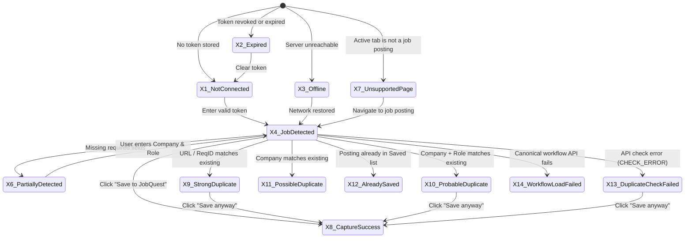

# JobQuest 2.0 · Gate 02B State Specification

| | |
|---|---|
| **Status** | **PROPOSED** — Awaiting user review and approval |
| **Document Purpose** | Comprehensive state machine specification across interactive controls, data views, error boundaries, and extension popups |
| **Verification Reference** | Master Component & State Sheet (`13-search-states.html` Q4/Q5, `Q5-states-sheet-dark.png`) |

---

## 1. Global Interactive States

All interactive elements (buttons, inputs, menu items, table rows, cards) implement standardized, high-contrast states across both Light and Dark themes.

### 1.1 Control States Matrix

| State | Visual Treatment (Light) | Visual Treatment (Dark) | Accessibility & ARIA |
|---|---|---|---|
| **Default** | `--surface` background, `--border` (1px solid), `--fg` text | `--surface` (#0f172a), `--border` (#1e293b), `--fg` (#f8fafc) | Default tabindex (0 or -1 in roving grid) |
| **Hover** | Background tints with `--interactive-hover` (rgba 0,0,0,0.04); border shifts to `--border-strong` | Background tints with rgba 255,255,255,0.05; border shifts to `--border-strong` | Pointer cursor; no layout shift |
| **Focus Visible** | 2px solid `--focus` (#3b82f6) with 2px offset; outline never suppressed on keyboard focus | 2px solid `--focus` (#60a5fa) with 2px offset | Triggered on `:focus-visible` (keyboard tab / programmatic focus) |
| **Active / Pressed** | Scales down slightly (transform `scale(0.985)`); background darkens 4% | Scales down slightly (`scale(0.985)`); background brightens 4% | Announces state change to screen readers |
| **Selected** | Background shifts to `--interactive-selected` (#eff6ff); left accent border (3px solid `--primary`) | Background shifts to `--interactive-selected` (#172554); left accent border (3px solid `--primary`) | `aria-selected="true"` or `aria-current="page"` |
| **Disabled** | Opacity reduced to `0.45`; cursor `not-allowed`; pointer events disabled | Opacity reduced to `0.40`; cursor `not-allowed`; pointer events disabled | `aria-disabled="true"`; removed from keyboard tab order unless focus retention required |

---

## 2. Data & Asynchronous View States

### 2.1 Loading States
- **Virtualized Table Skeleton (`13-search-states.html` Q1):**
  - Renders 12 placeholder skeleton rows with pulsating shimmer animation (`linear-gradient` sweep from surface-1 to surface-2).
  - Maintains exact row height (44px) and column widths to eliminate Cumulative Layout Shift (CLS = 0).
  - Screen reader announcement: `
Loading applications...
`.
- **Card & Chart Skeletons:**
  - Metric cards display gray rectangular wireframe blocks in place of numeric totals.
  - Analytics funnels render muted placeholder bars at 30% opacity.
- **Button In-Flight State:**
  - Button text replaced by a localized spinner icon (`<i class="icon-loader-circle spin"></i>`) and status string: *"Saving..."*, *"Importing..."*, *"Generating export..."*.
  - Button disabled during transit to prevent duplicate submissions.

### 2.2 Empty States
- **True Empty State (Initial User State, Q2):**
  - Displayed when a user or workspace has zero records in an entity domain.
  - Features a clean, welcoming illustration icon, informative heading, explanatory copy, and a primary Call to Action (e.g. *"No applications yet. Track your first job application manually or use the browser extension."* with `+ New application` button).
- **Zero Search / Filter Matches (Filtered Empty State, Q2):**
  - Displayed when records exist, but active filters or search terms yield zero results.
  - Text: *"No applications match your active filters."*.
  - Secondary action button: `Clear all filters` which resets query parameters to default.

### 2.3 Error States
- **Field-Level Validation Error:**
  - Input border colored `--danger`.
  - Icon `<i class="icon-circle-alert danger-t"></i>` and descriptive message rendered below input.
  - Input receives `aria-invalid="true"` and `aria-describedby="[field]-error"`.
- **Form-Level / Action Banner Error:**
  - Rendered at top of form/modal with red alert styling: `
...
`.
  - Used for database constraint violations, duplicate submission rejections, or concurrent edit conflicts.
- **Full-Page System Error (Q3):**
  - **404 Not Found:** *"Page not found. The application or page you requested doesn't exist or was permanently removed."* with `Back to Dashboard` button.
  - **403 Permission Denied (Q3, E9):** *"Access restricted. You're a User in this workspace and can only view your own records. Workspace-wide access requires the Manager role."*.
  - **Network / Offline Disconnected (Q3):** *"Connection lost. You're currently offline. JobQuest will automatically reconnect when your network returns."* with `Retry connection` button.

### 2.4 Warning States
- **Duplicate Warnings (C4, C5, C6):**
  - *Strong Duplicate:* Red danger container detailing exact URL / requisition match. Non-blocking with explicit override.
  - *Probable Duplicate:* Amber warning container detailing Company + Role collision.
  - *Possible Duplicate:* Blue informational notice indicating prior applications at same company.
- **Aging & Inactivity Banners (D1, D3, Y4, ADR-027, OQ-022):**
  - *Stale Indicator (15–30 days):* Amber aging pill on rows and cards indicating a lapse in timeline activity.
  - *Inactivity Review Banner (31+ days):* Actionable banner highlighting applications inactive for 31+ days (Long Waiting band): *"3 applications haven't had activity in 31+ days. Review them to keep, mark ghosted, or archive."* with explicit action buttons and zero automatic mutations.
- **Token Expiration Warning (S7, X2):**
  - Amber warning pill: *"Expiring in 3 days"* on active extension tokens.

### 2.5 Success States
- **Toast Notifications:**
  - Fixed-position toasts appear at bottom center (desktop) or top center (mobile).
  - Dark inverse surface with checkmark icon and affirmative text: *"Application created"*, *"Task completed"*, *"Export downloaded"*.
  - Destructive or archival toasts include an inline action: `Undo (10s)`.
- **Confirmation Banners:**
  - Green success container on modal completion (e.g. Account Recovery complete, Token generated).

### 2.6 Record Lifecycle States
- **Active Record:** Standard surface, fully interactive, participates in all active views, pipeline aggregations, and dashboard queues.
- **Archived Record (V7):**
  - Tagged with subtle `Archived` pill.
  - Excluded from active board, table, calendar, and analytics pipeline.
  - Row displays `Restore` and `Delete permanently` actions.
- **Closed / Terminal Outcome Record:**
  - Remains on `applications` table when filter includes closed statuses.
  - Outcome pill displayed in place of stage progress (`Accepted`, `Rejected`, `Withdrawn`, `Ghosted`, `Position Closed`).
  - Next actions cleared or disabled.

---

## 3. Browser Extension Popup State Machine

The JobQuest Capture browser extension (`10-extension.html` X1–X14, `X-extension-popup-states.png`) operates as a rigorous 14-state machine:

### Detailed Extension State Inventory

| State ID | State Name | Trigger / Condition | Visual Indicators | Available User Actions |
|---|---|---|---|---|
| **X1** | **Not connected** | No extension token found in local storage | Clean setup form; JobQuest URL selector; token input field | Paste token; click `Connect`; link to open web app |
| **X2** | **Connection expired / revoked** | Server returns HTTP 401 Unauthorized | Dark/red banner: *"Connection expired: token expired or was revoked. Nothing was saved."* | Click `Reconnect` (opens token input); `Cancel` |
| **X3** | **API unavailable / offline** | Network error or HTTP 5xx on API call | Red alert banner: *"Can't reach JobQuest. Check your connection and try again."* | Click `Try again`; `Cancel`. Captured data preserved locally |
| **X4 / X5** | **Job detected · ready** | Extractor matched posting; all required fields found | Verified badge: *"Detected from Greenhouse — structured data"*. Shows Company, Role, Location, ReqID, Stage dropdown | Select Stage (`Saved` or `Applied`); select Resume; click `Save to JobQuest` |
| **X6** | **Partially detected** | Page recognized as job posting, but Company or Role missing | Caution banner: *"Some details weren't found. Check them before saving."* Missing fields outlined in amber | User types missing Company or Role; `Save to JobQuest` enables |
| **X7** | **Unsupported page** | Page contains no recognizable job structure | Search icon illustration: *"No job posting found. This page doesn't look like a job posting."* | Click `Enter manually` (opens blank capture form); click `Open JobQuest` |
| **X8** | **Capture success** | Application successfully committed to database | Green checkmark animation: *"Saved to [Workspace Name]. Follow-up reminder set for [Date]."* | Click `Capture another`; click `Open application` (opens tab in web app) |
| **X9** | **Strong duplicate** | Requisition ID or Job URL matches active application | Red warning container: *"Strong duplicate: You already track this posting"*. Card previews existing record | Click `View existing` (opens in web app); click `Cancel`; click `Save anyway` |
| **X10** | **Probable duplicate** | Company name + Role title match active application | Amber warning container: *"Probable duplicate: same company and role"*. Displays existing stage & applied date | Click `View existing`; click `Save anyway` |
| **X11** | **Possible duplicate** | Company matches existing applications with different role | Blue info container: *"Possible: you've applied to [Company] before (2 other roles)"* | Informational only; does not block saving; click `Save to JobQuest` |
| **X12** | **Already saved** | Same job posting already exists in `Saved` stage | Blue bookmark card: *"Already in your Saved list (Saved Sep 20). Applying now?"* | Click `Open in JobQuest` to move stage to Applied; click `Close` |
| **X13** | **Duplicate check failed** | Duplicate endpoint returned HTTP error (`CHECK_ERROR`) | **Honest error banner:** *"Couldn't check for duplicates. This isn't the same as no duplicate."* | Click `Retry check`; click `Save anyway` |
| **X14** | **Workflow load failed** | Failed to fetch canonical stages from `/api/workflow` | Warning banner: *"Couldn't load your stages. Saving is paused so we never send a stage JobQuest doesn't recognize."* | Click `Retry`; Save button disabled to protect stage integrity |
